# 华夏小猪出行 — 乘客端产品需求文档（PRD）

> 文档版本：v1.0.0  
> 适用范围：乘客端全量业务（乘客 App / 微信小程序 / H5）  
> 最后更新：2026-04-21  
> 评审状态：Draft  

---

## 全局约定

### 审计字段约定（全表通用）

| 字段名 | 类型 | 允许空 | 默认值 | 说明 |
|---|---|---|---|---|
| created_at | datetime(3) | 否 | CURRENT_TIMESTAMP(3) | 创建时间 |
| updated_at | datetime(3) | 否 | CURRENT_TIMESTAMP(3) ON UPDATE CURRENT_TIMESTAMP(3) | 最后更新时间 |
| deleted_at | datetime(3) | 是 | NULL | 软删除标记（逻辑删除） |
| creator_id | varchar(64) | 是 | NULL | 创建人 ID（系统生成填 SYSTEM） |
| tenant_id | varchar(64) | 否 | 'default' | 租户 ID（支撑多租户隔离） |

> **注**：本 PRD 所有数据表均默认包含以上审计字段，以下各表字段清单中不再重复列出。

### 全局枚举治理原则
- 所有 `status` / `type` / `level` 字段禁止自由文本，必须引用集中枚举字典。
- 枚举变更遵循“追加不改义”原则，删除值需兼容至少 2 个发布周期。

---

## 1.1 登录注册与身份认证

### 需求元信息（Meta）

| 属性 | 内容 |
|---|---|
| 需求编号 | PAX-001 |
| 优先级 | P0 |
| 所属域 | 乘客域-用户中心 |
| 责任产品 | 乘客端产品经理 |
| 责任研发 | 用户中心研发组 / 网关安全组 |
| 版本 | v1.0.0 |

### ① 需求场景描述

#### 1.1 角色与场景（Who / When / Where）

| 维度 | 描述 |
|---|---|
| Who | 首次注册的新乘客、已注册的老乘客、换设备登录的存量乘客 |
| When | 新用户首次打开 App 时；老用户会话过期或切换设备时；风控触发二次认证时 |
| Where | 乘客 App 启动页 / 登录页；微信小程序授权页；H5 活动页回流入口 |

#### 1.2 用户痛点与业务价值（Why）

- **痛点 1**：注册流程繁琐导致新客流失，行业 benchmark 显示每增加一步转化率下降约 15%。
- **痛点 2**：账号被盗/共享导致司乘纠纷与资损。
- **痛点 3**：多端（App/小程序/H5）登录态不互通，体验割裂。
- **业务价值**：通过一键登录（本机号码校验）+ 社交授权，将新客注册转化率提升至 >= 65%；通过设备指纹与风控拦截降低异常登录率至 <= 0.1%。

#### 1.3 功能范围（What / 边界 / 非目标）

| 类别 | 范围说明 |
|---|---|
| **In Scope** | 手机号+验证码登录、本机号码一键登录、微信/支付宝授权登录、游客模式浏览、实名认证（二要素/三要素）、登录态刷新与多端互踢、异常登录拦截与二次验证 |
| **边界** | 仅覆盖中国大陆手机号；海外手机号走独立流程（本期不展开） |
| **非目标** | 人脸识别活体认证（L3 级实名）、硬件 Key 登录、企业 SSO 对接 |

#### 1.4 验收标准（可度量的成功指标）

| 指标 | 目标值 | 计算口径 |
|---|---|---|
| 新客注册转化率 | >= 65% | 首次打开 App → 完成注册并进入首页的 UV / 首次打开 App 的 UV |
| 登录成功率 | >= 99.5% | `login_status=SUCCESS` 数 / 有效登录请求总数（5min 窗口） |
| 验证码下发成功率 | >= 99.9% | 短信网关回执成功数 / 下发请求总数 |
| 异常登录拦截率 | >= 98% | 被风控拦截的异常登录请求 / 全部异常登录请求（抽样标注） |
| 登录耗时 P95 | <= 2.5s | 客户端发起登录 → 收到 token 的耗时 P95 |

### ② 业务流程

#### 2.1 主流程（mermaid sequenceDiagram）

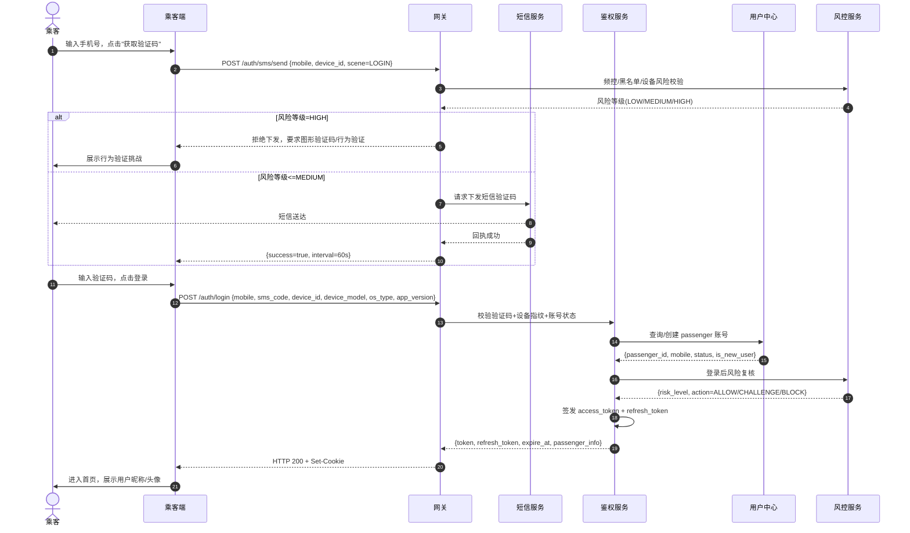
```mermaid
sequenceDiagram
    autonumber
    actor U as 乘客
    participant C as 乘客端
    participant GW as 网关
    participant SMS as 短信服务
    participant AUTH as 鉴权服务
    participant UC as 用户中心
    participant RS as 风控服务

    U->>C: 输入手机号，点击"获取验证码"
    C->>GW: POST /auth/sms/send {mobile, device_id, scene=LOGIN}
    GW->>RS: 频控/黑名单/设备风险校验
    RS-->>GW: 风险等级(LOW/MEDIUM/HIGH)
    alt 风险等级=HIGH
        GW-->>C: 拒绝下发，要求图形验证码/行为验证
        C->>U: 展示行为验证挑战
    else 风险等级<=MEDIUM
        GW->>SMS: 请求下发短信验证码
        SMS-->>U: 短信送达
        SMS-->>GW: 回执成功
        GW-->>C: {success=true, interval=60s}
    end

    U->>C: 输入验证码，点击登录
    C->>GW: POST /auth/login {mobile, sms_code, device_id, device_model, os_type, app_version}
    GW->>AUTH: 校验验证码+设备指纹+账号状态
    AUTH->>UC: 查询/创建 passenger 账号
    UC-->>AUTH: {passenger_id, mobile, status, is_new_user}
    AUTH->>RS: 登录后风险复核
    RS-->>AUTH: {risk_level, action=ALLOW/CHALLENGE/BLOCK}
    AUTH->>AUTH: 签发 access_token + refresh_token
    AUTH-->>GW: {token, refresh_token, expire_at, passenger_info}
    GW-->>C: HTTP 200 + Set-Cookie
    C->>U: 进入首页，展示用户昵称/头像
```

#### 2.2 异常分支与 SOP

| 异常场景 | 触发条件 | 系统行为 | 前端展示 | SOP（运营/客服） |
|---|---|---|---|---|
| 验证码频控 | 同一手机号 60s 内重复请求 | 拒绝下发，返回 `SMS_TOO_FREQUENT` | 展示"请 X 秒后重试"倒计时 | 无需介入，自动恢复 |
| 验证码错误超限 | 连续输错 5 次 | 锁定该手机号 30 分钟，记录风控日志 | 提示"验证码错误过多，请 30 分钟后重试" | 高危账号标记观察 |
| 设备风险拦截 | 设备指纹命中黑名单/模拟器 | 拒绝登录，返回 `DEVICE_RISK_BLOCKED` | 提示"当前设备存在风险，请联系客服" | 风控运营复核设备池 |
| 账号冻结 | `account_status=FROZEN` | 拒绝登录，返回 `ACCOUNT_FROZEN` | 提示"账号已被冻结，请联系客服" | 客服核实后人工解冻 |
| 会话过期 | access_token 过期且 refresh_token 失效 | 返回 `TOKEN_EXPIRED` | 静默刷新失败，跳转登录页 | 无需介入 |

#### 2.3 状态机（乘客账号生命周期）

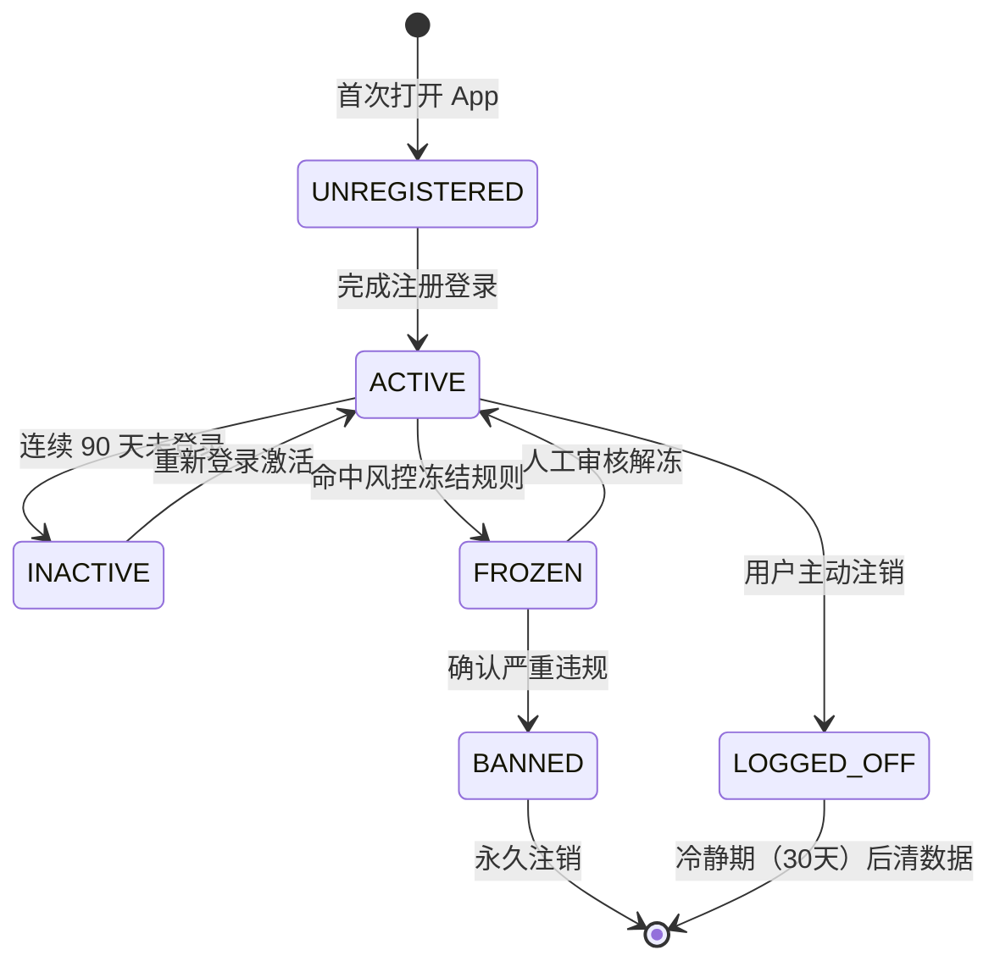
```mermaid
stateDiagram-v2
    [*] --> UNREGISTERED: 首次打开 App
    UNREGISTERED --> ACTIVE: 完成注册登录
    ACTIVE --> INACTIVE: 连续 90 天未登录
    INACTIVE --> ACTIVE: 重新登录激活
    ACTIVE --> FROZEN: 命中风控冻结规则
    FROZEN --> ACTIVE: 人工审核解冻
    FROZEN --> BANNED: 确认严重违规
    BANNED --> [*]: 永久注销
    ACTIVE --> LOGGED_OFF: 用户主动注销
    LOGGED_OFF --> [*]: 冷静期（30天）后清数据
```

#### 2.4 关键规则清单

1. **验证码生命周期**：短信验证码有效期 5 分钟，错误输入最多 5 次，超限锁定 30 分钟。
2. **token 策略**：access_token 有效期 2 小时，refresh_token 有效期 30 天；多端登录互踢策略以 `device_id` 为维度，同一账号最多同时在线 3 个设备。
3. **游客模式**：未登录用户可浏览首页、查看预估价格，但不可下单；下单时强制唤起登录。
4. **实名认证触发时机**：首次叫车下单前必须完成实名（姓名+身份证号二要素校验），通过第三方实名接口实时核验。
5. **幂等约束**：同一 `device_id + mobile + scene` 在 60 秒内只允许 1 次验证码发送请求。

### ③ 数据字典（L3）

#### 3.1 实体关系图（mermaid erDiagram）

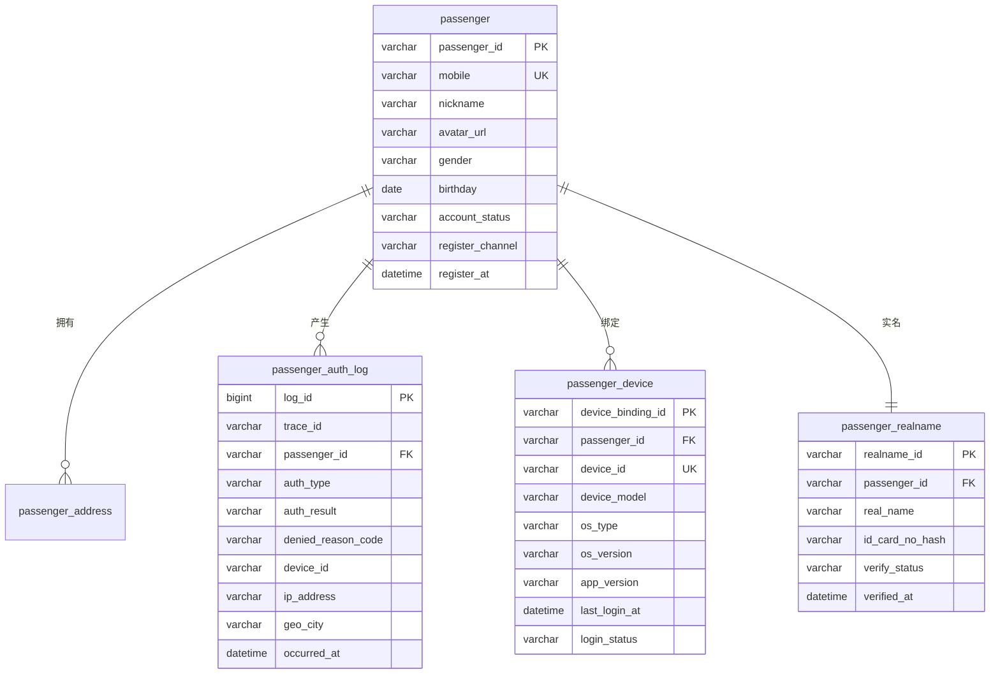
```mermaid
erDiagram
    passenger ||--o{ passenger_address : "拥有"
    passenger ||--o{ passenger_auth_log : "产生"
    passenger ||--o{ passenger_device : "绑定"
    passenger ||--|| passenger_realname : "实名"

    passenger {
        varchar passenger_id PK
        varchar mobile UK
        varchar nickname
        varchar avatar_url
        varchar gender
        date birthday
        varchar account_status
        varchar register_channel
        datetime register_at
    }

    passenger_realname {
        varchar realname_id PK
        varchar passenger_id FK
        varchar real_name
        varchar id_card_no_hash
        varchar verify_status
        datetime verified_at
    }

    passenger_device {
        varchar device_binding_id PK
        varchar passenger_id FK
        varchar device_id UK
        varchar device_model
        varchar os_type
        varchar os_version
        varchar app_version
        datetime last_login_at
        varchar login_status
    }

    passenger_auth_log {
        bigint log_id PK
        varchar trace_id
        varchar passenger_id FK
        varchar auth_type
        varchar auth_result
        varchar denied_reason_code
        varchar device_id
        varchar ip_address
        varchar geo_city
        datetime occurred_at
    }
```

#### 3.2 表结构

##### 表 1：passenger（乘客主表）

- **表名 / 中文名**：`passenger` / 乘客主表
- **业务说明**：存储乘客核心身份信息与账号状态，用户中心唯一主档。
- **分库分表策略**：按 `passenger_id` 哈希分 16 库，每库 64 表；预计单表 500 万行，可支撑 5 亿乘客。
- **预估数据量**：5 亿（3 年），日增约 50 万。

| 字段名 | 中文 | 类型 | 长度 | 允许空 | 默认值 | 索引 | 示例 | 业务说明 |
|---|---|---|---|---|---|---|---|---|
| passenger_id | 乘客 ID | varchar | 32 | 否 | - | PK | p_202604210001 | 全局唯一，格式 p_YYYYMMDD+序号 |
| mobile | 手机号 | varchar | 11 | 否 | - | UK | 13800138000 | 脱敏存储，逻辑唯一 |
| mobile_enc | 手机号密文 | varchar | 255 | 否 | - | - | aes(xxx) | AES-256-GCM 加密 |
| nickname | 昵称 | varchar | 64 | 是 | NULL | - | 小猪用户 | 默认随机生成，可修改 |
| avatar_url | 头像 URL | varchar | 512 | 是 | NULL | - | https://... | CDN 地址 |
| gender | 性别 | varchar | 8 | 是 | UNKNOWN | - | MALE | MALE/FEMALE/UNKNOWN |
| birthday | 生日 | date | - | 是 | NULL | - | 1990-01-01 | 用于生日营销 |
| account_status | 账号状态 | varchar | 16 | 否 | ACTIVE | IDX | ACTIVE | ACTIVE/INACTIVE/FROZEN/BANNED/LOGGED_OFF |
| register_channel | 注册渠道 | varchar | 16 | 否 | APP | IDX | APP | APP/MINI_PROGRAM/H5/IOS/ANDROID |
| register_at | 注册时间 | datetime(3) | - | 否 | CURRENT_TIMESTAMP(3) | IDX | 2026-04-21 10:00:00 | - |
| first_order_at | 首单时间 | datetime(3) | - | 是 | NULL | - | 2026-04-21 10:30:00 | 新客转化标记 |
| invite_code | 邀请码 | varchar | 16 | 是 | NULL | - | A3B9K2 | 邀请裂变使用 |

- **索引清单**
  - 主键：`PRIMARY KEY (passenger_id)`
  - 唯一索引：`UNIQUE KEY uk_mobile (mobile)`
  - 普通索引：`KEY idx_account_status (account_status, register_at)` ——用于运营分群查询
  - 普通索引：`KEY idx_register_channel (register_channel, register_at)` ——渠道转化分析

- **外键与关联**
  - 逻辑外键：`passenger.passenger_id` → `passenger_realname.passenger_id`
  - 逻辑外键：`passenger.passenger_id` → `passenger_device.passenger_id`

##### 表 2：passenger_auth_log（乘客认证日志表）

- **表名 / 中文名**：`passenger_auth_log` / 乘客认证日志表
- **业务说明**：记录登录/注册/实名等全量认证行为，支撑风控审计与问题追溯。
- **分库分表策略**：按 `passenger_id` 哈希分 16 库，每库 128 表；日志类数据，冷热分离，180 天前数据归档至 OSS。
- **预估数据量**：日增 3000 万条，存储 180 天约 54 亿条。

| 字段名 | 中文 | 类型 | 长度 | 允许空 | 默认值 | 索引 | 示例 | 业务说明 |
|---|---|---|---|---|---|---|---|---|
| log_id | 日志 ID | bigint | 20 | 否 | AUTO_INCREMENT | PK | 10000000001 | 分库分表下使用全局发号器 |
| trace_id | 链路追踪 ID | varchar | 64 | 否 | - | IDX | trc_abc123 | 全链路追踪 |
| passenger_id | 乘客 ID | varchar | 32 | 否 | - | IDX | p_001 | - |
| auth_type | 认证类型 | varchar | 16 | 否 | - | IDX | SMS_LOGIN | SMS_LOGIN/WECHAT_LOGIN/AUTO_LOGIN/REALNAME |
| auth_result | 认证结果 | varchar | 16 | 否 | - | - | SUCCESS | SUCCESS/FAILED/BLOCKED/CHALLENGE |
| denied_reason_code | 拒绝原因码 | varchar | 32 | 是 | NULL | - | SMS_CODE_ERROR | 失败时必填 |
| device_id | 设备 ID | varchar | 64 | 否 | - | - | dvc_xyz | - |
| ip_address | IP 地址 | varchar | 64 | 否 | - | - | 10.0.0.1 | IPv4/IPv6 |
| geo_city | 归属城市 | varchar | 32 | 是 | NULL | - | 上海市 | IP 解析城市 |
| user_agent | UA 字符串 | varchar | 512 | 是 | NULL | - | Mozilla/5.0... | 设备识别 |
| occurred_at | 发生时间 | datetime(3) | - | 否 | CURRENT_TIMESTAMP(3) | IDX | 2026-04-21 10:00:00 | - |

- **索引清单**
  - 主键：`PRIMARY KEY (log_id)`
  - 联合索引：`KEY idx_passenger_time (passenger_id, occurred_at)` ——查询个人近期登录记录
  - 普通索引：`KEY idx_auth_type (auth_type, occurred_at)` ——统计各认证类型趋势
  - 普通索引：`KEY idx_trace_id (trace_id)` ——链路追踪

##### 表 3：passenger_realname（乘客实名表）

- **表名 / 中文名**：`passenger_realname` / 乘客实名信息表
- **业务说明**：存储乘客实名认证信息，与 passenger 一对一；身份证号 hash 存储，明文不落库。
- **分库分表策略**：与 passenger 同库同表规则，共 16 库 64 表。
- **预估数据量**：5 亿。

| 字段名 | 中文 | 类型 | 长度 | 允许空 | 默认值 | 索引 | 示例 | 业务说明 |
|---|---|---|---|---|---|---|---|---|
| realname_id | 实名记录 ID | varchar | 32 | 否 | - | PK | rn_001 | - |
| passenger_id | 乘客 ID | varchar | 32 | 否 | - | UK | p_001 | 逻辑一对一 |
| real_name | 真实姓名 | varchar | 32 | 否 | - | - | 张三 | - |
| id_card_no_hash | 身份证哈希 | varchar | 64 | 否 | - | - | sha256(xxx) | SHA-256 加盐哈希 |
| id_card_no_mask | 身份证脱敏 | varchar | 18 | 否 | - | - | 110***********0011 | 展示用 |
| verify_status | 核验状态 | varchar | 16 | 否 | PENDING | - | VERIFIED | PENDING/VERIFIED/FAILED |
| verified_at | 核验时间 | datetime(3) | - | 是 | NULL | - | 2026-04-21 10:05:00 | - |
| verify_channel | 核验渠道 | varchar | 16 | 是 | NULL | - | ALIPAY | ALIPAY/WECHAT/BANK |

- **索引清单**
  - 主键：`PRIMARY KEY (realname_id)`
  - 唯一索引：`UNIQUE KEY uk_passenger_id (passenger_id)`

#### 3.3 枚举字典

| 枚举名 | 取值集合 | 所属字段 | Owner | 变更策略 |
|---|---|---|---|---|
| account_status_enum | ACTIVE/INACTIVE/FROZEN/BANNED/LOGGED_OFF | passenger.account_status | 用户中心 | 新值追加；删除需兼容 2 个周期 |
| auth_type_enum | SMS_LOGIN/WECHAT_LOGIN/ALIPAY_LOGIN/AUTO_LOGIN/REALNAME/LOGOUT | passenger_auth_log.auth_type | 网关安全组 | 新增渠道需同步鉴权服务 |
| auth_result_enum | SUCCESS/FAILED/BLOCKED/CHALLENGE/TIMEOUT | passenger_auth_log.auth_result | 网关安全组 | 禁止改义 |
| gender_enum | MALE/FEMALE/UNKNOWN | passenger.gender | 用户中心 | 固定 |
| verify_status_enum | PENDING/VERIFIED/FAILED | passenger_realname.verify_status | 用户中心 | 固定 |

#### 3.4 接口出入参示例

**接口**：`POST /api/v1/auth/login`（手机号验证码登录）

**Request Header**：
```json
{
  "X-Request-Id": "req_20260421100001",
  "X-Device-Id": "dvc_a1b2c3d4",
  "X-App-Version": "5.2.1",
  "Content-Type": "application/json"
}
```

**Request Body**：
```json
{
  "mobile": "13800138000",
  "sms_code": "382945",
  "scene": "LOGIN",
  "device_model": "iPhone15,2",
  "os_type": "IOS",
  "os_version": "17.0",
  "idempotency_key": "idem_a1b2c3d4e5f6"
}
```

**Response Body（成功）**：
```json
{
  "code": 0,
  "message": "success",
  "data": {
    "passenger_id": "p_202604210001",
    "nickname": "小猪用户3842",
    "avatar_url": "https://cdn.huaxiaozhu.com/avatar/default.png",
    "is_new_user": false,
    "token": "eyJhbGciOiJIUzI1NiIs...",
    "refresh_token": "rt_eyJhbGciOiJIUzI1NiIs...",
    "token_expire_at": "2026-04-21T12:00:00+08:00",
    "risk_level": "LOW",
    "login_status": "SUCCESS"
  }
}
```

**Response Body（失败-验证码错误）**：
```json
{
  "code": 10003,
  "message": "验证码错误或已过期",
  "data": {
    "retry_left": 3,
    "lock_seconds": 0
  }
}
```

### ④ 关联模块

#### 4.1 上游依赖

| 依赖模块 | 提供内容 | 接口/事件 |
|---|---|---|
| 短信网关 | 短信验证码下发能力 | HTTP /sms/send |
| 设备指纹服务 | 设备风险评分 | HTTP /device/risk/evaluate |
| 实名核验服务（支付宝/微信） | 二要素/三要素实名核验 | HTTP /identity/verify |
| 风控中台 | 登录风险规则决策 | HTTP /risk/decision |

#### 4.2 下游被依赖

| 消费方 | 消费内容 | 方式 |
|---|---|---|
| 订单服务 | 乘客身份与状态校验 | RPC / HTTP |
| 营销服务 | 新客判定、发券触发 | 消息总线 event |
| 乘客画像服务 | 注册/登录行为数据 | Kafka topic |
| 客服系统 | 登录问题溯源 | 查询日志/数据库 |

#### 4.3 同级协作

| 协作模块 | 协作内容 |
|---|---|
| 司机端用户中心 | 账号体系隔离但鉴权服务共享，需保持 token 格式与密钥隔离 |
| 运营后台-IAM | 运营人员账号独立体系，但审计日志格式统一 |
| 数据中台 | 登录转化漏斗数据上报口径对齐 |

#### 4.4 外部系统

| 外部系统 | 用途 | 交互方式 |
|---|---|---|
| 运营商（移动/联通/电信） | 本机号码校验（一键登录） | 运营商 SDK / 网关接口 |
| 微信开放平台 | 微信授权登录、UnionID 获取 | OAuth2.0 |
| 支付宝开放平台 | 支付宝授权登录、实名信息 | OAuth2.0 + 芝麻信用接口 |
| 短信服务商（阿里云/腾讯云） | 短信验证码下发 | HTTP API |

---

## 1.2 地址管理与智能推荐

### 需求元信息（Meta）

| 属性 | 内容 |
|---|---|
| 需求编号 | PAX-002 |
| 优先级 | P0 |
| 所属域 | 乘客域-订单中心 |
| 责任产品 | 乘客端产品经理 |
| 责任研发 | 订单中心研发组 / LBS 服务组 |
| 版本 | v1.0.0 |

### ① 需求场景描述

#### 1.1 角色与场景（Who / When / Where）

| 维度 | 描述 |
|---|---|
| Who | 常用通勤乘客（家/公司）、差旅乘客（酒店/机场）、本地生活乘客（商圈/医院） |
| When | 打开 App 进入首页时；下单前选择起终点时；历史订单一键再叫车时 |
| Where | 乘客 App 首页地图页、下单确认页、地址管理页 |

#### 1.2 用户痛点与业务价值（Why）

- **痛点 1**：每次打车需重新输入地址，高频通勤场景操作冗余。
- **痛点 2**：地址名称不标准（如“老地方”）导致司机接驾困难。
- **痛点 3**：跨城出行时地址库不互通，需重新搜索。
- **业务价值**：通过常用地址+智能推荐，减少下单步长 30% 以上；地址标准化降低接驾沟通成本，提升接驾成功率 2%+。

#### 1.3 功能范围（What / 边界 / 非目标）

| 类别 | 范围说明 |
|---|---|
| **In Scope** | 常用地址增删改查（家/公司/自定义）、地址智能推荐（基于时间/位置/历史）、地图选点与 POI 检索、地址标准化与坐标纠偏、跨设备地址同步 |
| **边界** | 仅支持国内地址；POI 数据依赖第三方地图 |
| **非目标** | 室内定位精确到楼层、海外地址管理、地址社交分享（本期不展开） |

#### 1.4 验收标准

| 指标 | 目标值 | 计算口径 |
|---|---|---|
| 地址选用率 | >= 40% | 使用常用地址/推荐地址下单的订单数 / 总下单数 |
| POI 检索准确率 | >= 95% | 用户点击第一条 POI 结果的次数 / 总检索次数 |
| 地址新增成功率 | >= 99.9% | 地址新增成功落库数 / 新增请求总数 |
| 坐标解析完整率 | >= 99.99% | lat/lng/city_id 均有效的地址记录 / 总地址记录 |

### ② 业务流程

#### 2.1 主流程（mermaid flowchart）

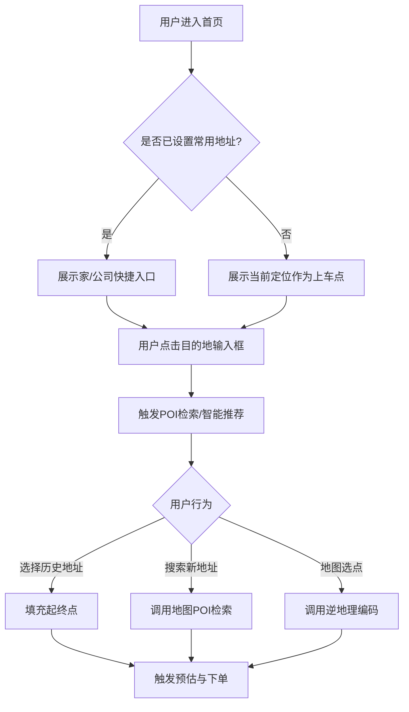
```mermaid
flowchart TD
    A[用户进入首页] --> B{是否已设置常用地址?}
    B -->|是| C[展示家/公司快捷入口]
    B -->|否| D[展示当前定位作为上车点]
    C --> E[用户点击目的地输入框]
    D --> E
    E --> F[触发POI检索/智能推荐]
    F --> G{用户行为}
    G -->|选择历史地址| H[填充起终点]
    G -->|搜索新地址| I[调用地图POI检索]
    G -->|地图选点| J[调用逆地理编码]
    H --> K[触发预估与下单]
    I --> K
    J --> K
```

#### 2.2 异常分支与 SOP

| 异常场景 | 触发条件 | 系统行为 | 前端展示 | SOP |
|---|---|---|---|---|
| 定位失败 | GPS 关闭/室内无信号 |  fallback 到 IP 定位，精度降级 | 提示"定位不准，请手动选择上车点" | - |
| POI 检索无结果 | 关键词无匹配 | 推荐附近相似 POI 或引导地图选点 | 展示"未找到地址，试试地图选点" | - |
| 坐标越界 | lat/lng 不在中国大陆范围 | 拒绝保存，返回参数错误 | 提示"地址坐标异常，请重新选择" | - |
| 地址重复 | 同一 passenger_id 下坐标距离 < 100m | 合并为同一地址，提示用户 | 展示"该地址已存在" | - |
| 地图服务超时 | 第三方地图接口超时 | 返回缓存数据或降级提示 | 展示"网络不稳定，结果可能不准确" | 监控告警，联系地图服务商 |

#### 2.3 状态机（地址状态）

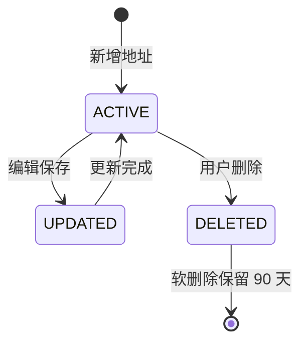
```mermaid
stateDiagram-v2
    [*] --> ACTIVE: 新增地址
    ACTIVE --> UPDATED: 编辑保存
    UPDATED --> ACTIVE: 更新完成
    ACTIVE --> DELETED: 用户删除
    DELETED --> [*]: 软删除保留 90 天
```

#### 2.4 关键规则清单

1. **常用地址上限**：每个乘客最多保存 10 个常用地址（家+公司占 2 个，自定义 8 个）。
2. **智能推荐策略**：基于时间（早晚通勤高峰推荐家/公司）、位置（当前位置 500m 内历史目的地）、订单频率（近 30 天 TOP3 目的地）三维加权推荐。
3. **坐标精度**：地图选点精度要求 <= 10m；POI 检索返回结果包含门牌号级别地址。
4. **地址去重**：同一乘客下，新地址与已有地址坐标距离 < 100m 且 POI ID 相同则视为重复，禁止新增。
5. **跨设备同步**：地址变更后通过消息总线实时同步到该乘客所有在线设备，延迟 P95 <= 500ms。

### ③ 数据字典（L3）

#### 3.1 实体关系图

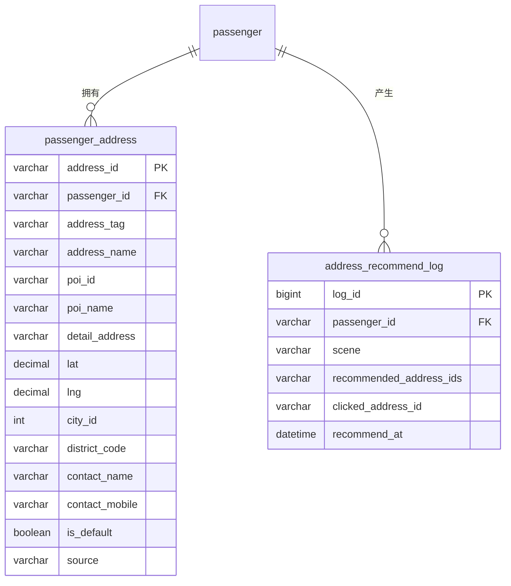
```mermaid
erDiagram
    passenger ||--o{ passenger_address : "拥有"
    passenger ||--o{ address_recommend_log : "产生"

    passenger_address {
        varchar address_id PK
        varchar passenger_id FK
        varchar address_tag
        varchar address_name
        varchar poi_id
        varchar poi_name
        varchar detail_address
        decimal lat
        decimal lng
        int city_id
        varchar district_code
        varchar contact_name
        varchar contact_mobile
        boolean is_default
        varchar source
    }

    address_recommend_log {
        bigint log_id PK
        varchar passenger_id FK
        varchar scene
        varchar recommended_address_ids
        varchar clicked_address_id
        datetime recommend_at
    }
```

#### 3.2 表结构

##### 表 1：passenger_address（乘客地址表）

- **表名 / 中文名**：`passenger_address` / 乘客地址表
- **业务说明**：存储乘客常用地址与历史地址，支撑一键下单与智能推荐。
- **分库分表策略**：按 `passenger_id` 哈希分 16 库，每库 64 表。
- **预估数据量**：人均 4 条地址，5 亿乘客约 20 亿条。

| 字段名 | 中文 | 类型 | 长度 | 允许空 | 默认值 | 索引 | 示例 | 业务说明 |
|---|---|---|---|---|---|---|---|---|
| address_id | 地址 ID | varchar | 32 | 否 | - | PK | addr_001 | - |
| passenger_id | 乘客 ID | varchar | 32 | 否 | - | FK | p_001 | 逻辑外键 |
| address_tag | 地址标签 | varchar | 16 | 否 | CUSTOM | IDX | HOME | HOME/COMPANY/CUSTOM |
| address_name | 地址别名 | varchar | 64 | 否 | - | - | 我家 | 用户自定义名称 |
| poi_id | POI 唯一 ID | varchar | 32 | 否 | - | - | B0FFH0001 | 地图 POI ID |
| poi_name | POI 标准名称 | varchar | 128 | 否 | - | - | 环球港购物中心 | 地图返回标准名称 |
| detail_address | 详细地址 | varchar | 255 | 是 | NULL | - | 1号楼301室 | 门牌号补充 |
| lat | 纬度 | decimal | 10,7 | 否 | - | - | 31.2304167 | WGS-84 坐标系 |
| lng | 经度 | decimal | 10,7 | 否 | - | - | 121.4737010 | WGS-84 坐标系 |
| city_id | 城市编码 | int | 10 | 否 | - | IDX | 310100 | 国标城市编码 |
| district_code | 行政区编码 | varchar | 16 | 是 | NULL | - | 310107 | 国标区县编码 |
| contact_name | 联系人姓名 | varchar | 32 | 是 | NULL | - | 张三 | - |
| contact_mobile | 联系人手机 | varchar | 11 | 是 | NULL | - | 13800138000 | 脱敏存储 |
| is_default | 是否默认 | tinyint | 1 | 否 | 0 | - | 1 | 1=默认，0=非默认 |
| source | 来源 | varchar | 16 | 否 | MANUAL | - | MANUAL | MANUAL/HISTORY/RECOMMEND |
| used_count | 使用次数 | int | 10 | 否 | 0 | - | 15 | 用于推荐排序 |
| last_used_at | 最后使用时间 | datetime(3) | - | 是 | NULL | - | 2026-04-21 09:00:00 | 用于推荐排序 |

- **索引清单**
  - 主键：`PRIMARY KEY (address_id)`
  - 联合索引：`KEY idx_passenger_tag (passenger_id, address_tag)` ——快速查询家/公司地址
  - 联合索引：`KEY idx_passenger_used (passenger_id, used_count DESC, last_used_at DESC)` ——推荐排序

##### 表 2：address_recommend_log（地址推荐日志表）

- **表名 / 中文名**：`address_recommend_log` / 地址推荐日志表
- **业务说明**：记录推荐场景、推荐结果与用户点击行为，用于推荐模型迭代。
- **分库分表策略**：按 `passenger_id` 哈希分 8 库，每库 128 表；日志类，90 天归档。
- **预估数据量**：日增 1000 万条。

| 字段名 | 中文 | 类型 | 长度 | 允许空 | 默认值 | 索引 | 示例 | 业务说明 |
|---|---|---|---|---|---|---|---|---|
| log_id | 日志 ID | bigint | 20 | 否 | AUTO_INCREMENT | PK | 1 | - |
| passenger_id | 乘客 ID | varchar | 32 | 否 | - | IDX | p_001 | - |
| scene | 推荐场景 | varchar | 16 | 否 | - | IDX | HOME_PAGE | HOME_PAGE/ORDER_PAGE |
| context_lat | 上下文纬度 | decimal | 10,7 | 是 | NULL | - | 31.23 | 推荐时用户位置 |
| context_lng | 上下文经度 | decimal | 10,7 | 是 | NULL | - | 121.47 | - |
| context_time | 上下文时间 | time | - | 否 | - | - | 08:30:00 | 用于时段分析 |
| recommended_address_ids | 推荐地址 ID 列表 | varchar | 255 | 否 | - | - | addr_1,addr_2,addr_3 | 逗号分隔 |
| clicked_address_id | 点击地址 ID | varchar | 32 | 是 | NULL | - | addr_1 | 用户实际选择 |
| recommend_at | 推荐时间 | datetime(3) | - | 否 | - | IDX | 2026-04-21 08:30:00 | - |

#### 3.3 枚举字典

| 枚举名 | 取值集合 | 所属字段 | Owner | 变更策略 |
|---|---|---|---|---|
| address_tag_enum | HOME/COMPANY/CUSTOM | passenger_address.address_tag | 订单中心 | 固定 |
| address_source_enum | MANUAL/HISTORY/RECOMMEND/IMPORT | passenger_address.source | 订单中心 | 新增需同步推荐服务 |
| recommend_scene_enum | HOME_PAGE/ORDER_PAGE/TRIP_END | address_recommend_log.scene | 推荐算法组 | 新增需同步埋点 |

#### 3.4 接口出入参示例

**接口**：`POST /api/v1/address/save`（保存常用地址）

**Request Body**：
```json
{
  "address_tag": "HOME",
  "address_name": "我家",
  "poi_id": "B0FFH0001",
  "poi_name": "万科城市花园",
  "detail_address": "3期12栋1502",
  "lat": 31.2304167,
  "lng": 121.4737010,
  "city_id": 310100,
  "district_code": "310107",
  "contact_name": "张三",
  "contact_mobile": "13800138000",
  "is_default": true,
  "idempotency_key": "idem_save_001"
}
```

**Response Body**：
```json
{
  "code": 0,
  "message": "success",
  "data": {
    "address_id": "addr_202604210001",
    "passenger_id": "p_202604210001",
    "address_tag": "HOME",
    "sync_device_count": 3,
    "sync_status": "SUCCESS"
  }
}
```

### ④ 关联模块

#### 4.1 上游依赖

| 依赖模块 | 提供内容 |
|---|---|
| 地图服务（高德/腾讯） | POI 检索、逆地理编码、坐标系转换 |
| 定位服务 | GPS/Wi-Fi/IP 多源融合定位 |
| 用户中心 | passenger_id 有效性校验 |

#### 4.2 下游被依赖

| 消费方 | 消费内容 |
|---|---|
| 订单草稿服务 | 起终点地址信息 |
| 预估计价服务 | 起终点坐标计算里程与价格 |
| 推荐算法服务 | 地址使用行为日志 |

#### 4.3 同级协作

| 协作模块 | 协作内容 |
|---|---|
| 乘客端首页 | 地址快捷入口展示与交互 |
| 消息中心 | 跨设备地址同步推送 |

#### 4.4 外部系统

| 外部系统 | 用途 |
|---|---|
| 高德地图 API | POI 搜索、地理编码、逆地理编码 |
| 腾讯地图 API | 备用路径规划与坐标纠偏 |

---

## 1.3 叫车下单与智能预估

### 需求元信息（Meta）

| 属性 | 内容 |
|---|---|
| 需求编号 | PAX-003 |
| 优先级 | P0 |
| 所属域 | 乘客域-交易核心 |
| 责任产品 | 乘客端产品经理 / 交易产品经理 |
| 责任研发 | 订单中心 / 计价中心 / 调度中心 |
| 版本 | v1.0.0 |

### ① 需求场景描述

#### 1.1 角色与场景（Who / When / Where）

| 维度 | 描述 |
|---|---|
| Who | 已登录且有出行需求的乘客 |
| When | 即时用车（现在出发）、预约用车（未来 15 分钟~7 天） |
| Where | 乘客 App 首页叫车页、小程序叫车页 |

#### 1.2 用户痛点与业务价值（Why）

- **痛点 1**：价格不透明，用户担心实际费用远超预估。
- **痛点 2**：高峰时段叫车难，用户不知道要等多久。
- **痛点 3**：误操作或网络抖动导致重复下单，产生投诉。
- **业务价值**：一口价模式（花小猪核心特色）消除价格焦虑，提升下单转化率；智能预估让用户对等待时间有合理预期；幂等机制 100% 杜绝重复下单。

#### 1.3 功能范围（What / 边界 / 非目标）

| 类别 | 范围说明 |
|---|---|
| **In Scope** | 即时叫车、预约叫车、车型选择（经济型/舒适型/商务型）、一口价/实时计价展示、预估里程/时长/价格、动态调价展示、下单幂等、订单草稿自动保存、代叫车（帮他人叫车） |
| **边界** | 仅支持平台自有运力；聚合第三方运力本期不展开 |
| **非目标** | 顺风车、拼车（独立业务线）、企业用车（B 端）、包车服务 |

#### 1.4 验收标准

| 指标 | 目标值 | 计算口径 |
|---|---|---|
| 下单转化率 | >= 55% | 进入叫车页 → 成功创建订单的 UV / 进入叫车页 UV |
| 预估接口成功率 | >= 99.5% | 预估成功返回次数 / 预估请求总数 |
| 计价超时率 | <= 0.3% | 计价超时次数 / 计价请求总数 |
| 幂等一致率 | >= 99.99% | 同幂等键仅产生 1 个有效订单 / 总下单请求数 |
| 重复下单率 | <= 0.01% | 重复订单数 / 总订单数 |

### ② 业务流程

#### 2.1 主流程（mermaid sequenceDiagram）

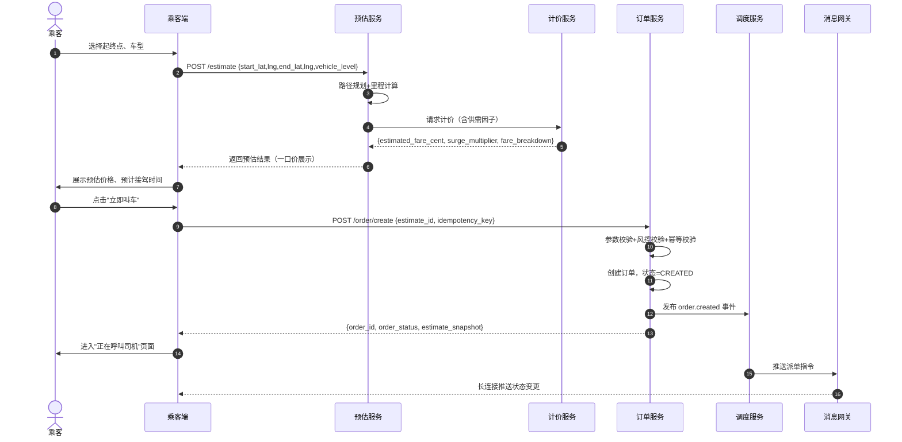
```mermaid
sequenceDiagram
    autonumber
    actor U as 乘客
    participant C as 乘客端
    participant EST as 预估服务
    participant PRICE as 计价服务
    participant ORD as 订单服务
    participant DIS as 调度服务
    participant MSG as 消息网关

    U->>C: 选择起终点、车型
    C->>EST: POST /estimate {start_lat,lng,end_lat,lng,vehicle_level}
    EST->>EST: 路径规划+里程计算
    EST->>PRICE: 请求计价（含供需因子）
    PRICE-->>EST: {estimated_fare_cent, surge_multiplier, fare_breakdown}
    EST-->>C: 返回预估结果（一口价展示）
    C->>U: 展示预估价格、预计接驾时间

    U->>C: 点击"立即叫车"
    C->>ORD: POST /order/create {estimate_id, idempotency_key}
    ORD->>ORD: 参数校验+风控校验+幂等校验
    ORD->>ORD: 创建订单，状态=CREATED
    ORD->>DIS: 发布 order.created 事件
    ORD-->>C: {order_id, order_status, estimate_snapshot}
    C->>U: 进入"正在呼叫司机"页面
    DIS->>MSG: 推送派单指令
    MSG-->>C: 长连接推送状态变更
```

#### 2.2 异常分支与 SOP

| 异常场景 | 触发条件 | 系统行为 | 前端展示 | SOP |
|---|---|---|---|---|
| 起终点不可用 | 起点或终点在运营围栏外 | 拒绝下单，返回 `OUT_OF_SERVICE_AREA` | 提示"当前区域暂未开通服务" | 运营拓展城市围栏 |
| 车型不可用 | 所选车型当前城市未上线 | 拒绝下单，返回 `VEHICLE_LEVEL_NOT_AVAILABLE` | 提示"该车型暂不可用"，推荐可用车型 | - |
| 余额不足（预付） | 预付订单且乘客余额不足 | 拒绝下单，引导充值或更换支付方式 | 提示"余额不足，请先充值" | - |
| 风控拦截 | 命中刷单/异常叫车规则 | 拒绝下单，记录风控日志 | 提示"下单异常，请联系客服" | 风控运营复核 |
| 派单超时 | 120 秒内无司机接单 | 自动取消或引导加价/更换车型 | 提示"附近暂无可用司机，建议加价叫车" | 调度运营关注供需 |
| 重复下单 | 同幂等键在 24h 内再次请求 | 返回已有订单信息 | 展示已有订单，禁止重复创建 | - |

#### 2.3 状态机（订单生命周期）

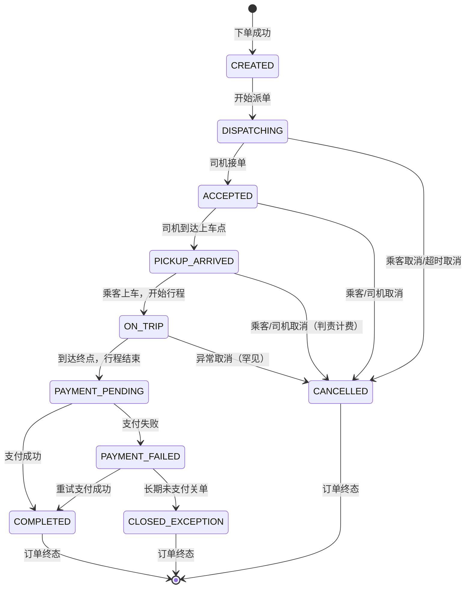
```mermaid
stateDiagram-v2
    [*] --> CREATED: 下单成功
    CREATED --> DISPATCHING: 开始派单
    DISPATCHING --> ACCEPTED: 司机接单
    DISPATCHING --> CANCELLED: 乘客取消/超时取消
    ACCEPTED --> PICKUP_ARRIVED: 司机到达上车点
    ACCEPTED --> CANCELLED: 乘客/司机取消
    PICKUP_ARRIVED --> ON_TRIP: 乘客上车，开始行程
    PICKUP_ARRIVED --> CANCELLED: 乘客/司机取消（判责计费）
    ON_TRIP --> PAYMENT_PENDING: 到达终点，行程结束
    ON_TRIP --> CANCELLED: 异常取消（罕见）
    PAYMENT_PENDING --> COMPLETED: 支付成功
    PAYMENT_PENDING --> PAYMENT_FAILED: 支付失败
    PAYMENT_FAILED --> COMPLETED: 重试支付成功
    PAYMENT_FAILED --> CLOSED_EXCEPTION: 长期未支付关单
    COMPLETED --> [*]: 订单终态
    CANCELLED --> [*]: 订单终态
    CLOSED_EXCEPTION --> [*]: 订单终态
```

#### 2.4 关键规则清单

1. **一口价规则**：花小猪核心模式。下单时锁定价格，行程中不因里程/时长/堵车变化而加价（除乘客变更目的地外）。一口价计算公式：`base_fare + distance_fare + time_fare + dynamic_adjustment`，一次性计算并锁定。
2. **动态调价**：供需失衡时（如早高峰、恶劣天气），在预估阶段展示调价倍数（如 1.2x），用户确认后生效。
3. **预约单规则**：预约时间最早为当前时间+15 分钟，最晚为当前时间+7 天；预约单提前 15 分钟进入派单队列。
4. **代叫车规则**：代叫人需填写被叫人手机号，被叫人收到短信提醒；被叫人无需安装 App，可短信查看司机信息。
5. **幂等规则**：`idempotency_key` 由客户端生成（`passenger_id + uuid`），服务端 24 小时内同一 key 仅允许创建 1 个有效订单。
6. **取消规则**：
   - 派单前取消：免费。
   - 司机接单后取消：按阶段判责，有责方收取取消费（通常 3~10 元）。
   - 司机到达后取消：乘客有责取消费上浮。

### ③ 数据字典（L3）

#### 3.1 实体关系图

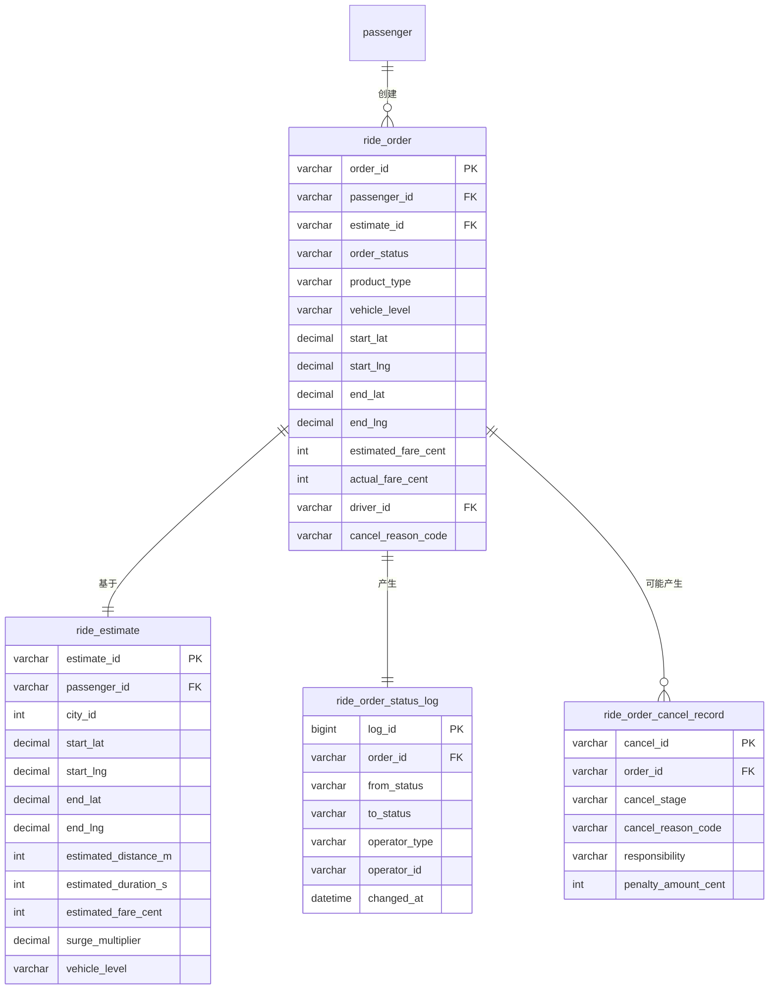
```mermaid
erDiagram
    passenger ||--o{ ride_order : "创建"
    ride_order ||--|| ride_estimate : "基于"
    ride_order ||--|| ride_order_status_log : "产生"
    ride_order ||--o{ ride_order_cancel_record : "可能产生"

    ride_order {
        varchar order_id PK
        varchar passenger_id FK
        varchar estimate_id FK
        varchar order_status
        varchar product_type
        varchar vehicle_level
        decimal start_lat
        decimal start_lng
        decimal end_lat
        decimal end_lng
        int estimated_fare_cent
        int actual_fare_cent
        varchar driver_id FK
        varchar cancel_reason_code
    }

    ride_estimate {
        varchar estimate_id PK
        varchar passenger_id FK
        int city_id
        decimal start_lat
        decimal start_lng
        decimal end_lat
        decimal end_lng
        int estimated_distance_m
        int estimated_duration_s
        int estimated_fare_cent
        decimal surge_multiplier
        varchar vehicle_level
    }

    ride_order_status_log {
        bigint log_id PK
        varchar order_id FK
        varchar from_status
        varchar to_status
        varchar operator_type
        varchar operator_id
        datetime changed_at
    }

    ride_order_cancel_record {
        varchar cancel_id PK
        varchar order_id FK
        varchar cancel_stage
        varchar cancel_reason_code
        varchar responsibility
        int penalty_amount_cent
    }
```

#### 3.2 表结构

##### 表 1：ride_order（订单主表）

- **表名 / 中文名**：`ride_order` / 订单主表
- **业务说明**：交易核心表，存储订单全生命周期信息。
- **分库分表策略**：按 `order_id` 哈希分 32 库，每库 128 表；订单 ID 包含分库分表位，支持基因法路由。
- **预估数据量**：日增 500 万单，3 年约 54 亿单。

| 字段名 | 中文 | 类型 | 长度 | 允许空 | 默认值 | 索引 | 示例 | 业务说明 |
|---|---|---|---|---|---|---|---|---|
| order_id | 订单 ID | varchar | 32 | 否 | - | PK | ord_202604210001 | 包含分库基因 |
| passenger_id | 乘客 ID | varchar | 32 | 否 | - | FK | p_001 | 逻辑外键 |
| estimate_id | 预估 ID | varchar | 32 | 否 | - | FK | est_001 | 逻辑外键 |
| order_status | 订单状态 | varchar | 32 | 否 | CREATED | IDX | CREATED | 见状态机 |
| product_type | 产品类型 | varchar | 16 | 否 | INSTANT | - | INSTANT | INSTANT/RESERVE/REPLACE |
| vehicle_level | 车型等级 | varchar | 16 | 否 | ECONOMY | - | ECONOMY | ECONOMY/COMFORT/BUSINESS |
| city_id | 城市编码 | int | 10 | 否 | - | IDX | 310100 | - |
| start_poi_name | 起点 POI 名 | varchar | 128 | 否 | - | - | 环球港 | - |
| start_lat | 起点纬度 | decimal | 10,7 | 否 | - | - | 31.2304167 | - |
| start_lng | 起点经度 | decimal | 10,7 | 否 | - | - | 121.4737010 | - |
| end_poi_name | 终点 POI 名 | varchar | 128 | 否 | - | - | 浦东机场T2 | - |
| end_lat | 终点纬度 | decimal | 10,7 | 否 | - | - | 31.1443439 | - |
| end_lng | 终点经度 | decimal | 10,7 | 否 | - | - | 121.8082730 | - |
| estimated_distance_m | 预估里程 | int | 10 | 否 | - | - | 12500 | 米 |
| estimated_duration_s | 预估时长 | int | 10 | 否 | - | - | 1800 | 秒 |
| estimated_fare_cent | 预估费用 | int | 10 | 否 | - | - | 3560 | 分 |
| actual_distance_m | 实际里程 | int | 10 | 是 | NULL | - | 12800 | 米 |
| actual_duration_s | 实际时长 | int | 10 | 是 | NULL | - | 1920 | 秒 |
| actual_fare_cent | 实际费用 | int | 10 | 是 | NULL | - | 3560 | 分（一口价=预估） |
| surge_multiplier | 动态调价系数 | decimal | 4,2 | 否 | 1.00 | - | 1.20 | 1.00 表示无调价 |
| driver_id | 司机 ID | varchar | 32 | 是 | NULL | FK | d_001 | 逻辑外键 |
| vehicle_id | 车辆 ID | varchar | 32 | 是 | NULL | - | v_001 | - |
| passenger_mobile_mask | 乘客手机脱敏 | varchar | 11 | 否 | - | - | 138****8000 | - |
| driver_mobile_mask | 司机手机脱敏 | varchar | 11 | 是 | NULL | - | 139****9000 | - |
| vehicle_plate_mask | 车牌脱敏 | varchar | 16 | 是 | NULL | - | 沪A****12 | - |
| reserve_time | 预约时间 | datetime(3) | - | 是 | NULL | - | 2026-04-21 11:00:00 | 预约单必填 |
| dispatch_deadline_at | 派单截止 | datetime(3) | - | 是 | NULL | - | 2026-04-21 10:02:00 | 120秒派单窗口 |
| accept_time | 接单时间 | datetime(3) | - | 是 | NULL | - | 2026-04-21 10:00:15 | - |
| pickup_arrive_time | 到达时间 | datetime(3) | - | 是 | NULL | - | 2026-04-21 10:05:00 | - |
| trip_start_time | 行程开始 | datetime(3) | - | 是 | NULL | - | 2026-04-21 10:06:00 | - |
| trip_end_time | 行程结束 | datetime(3) | - | 是 | NULL | - | 2026-04-21 10:35:00 | - |
| pay_time | 支付时间 | datetime(3) | - | 是 | NULL | - | 2026-04-21 10:36:00 | - |
| cancel_reason_code | 取消原因码 | varchar | 32 | 是 | NULL | - | PASSENGER_NO_SHOW | - |
| cancel_time | 取消时间 | datetime(3) | - | 是 | NULL | - | 2026-04-21 10:01:00 | - |
| final_status | 终态标记 | varchar | 16 | 是 | NULL | IDX | COMPLETED | 终态缓存字段 |
| fare_locked | 价格是否锁定 | tinyint | 1 | 否 | 1 | - | 1 | 一口价=1 |
| idempotency_key | 幂等键 | varchar | 64 | 否 | - | UK | idem_001 | - |

- **索引清单**
  - 主键：`PRIMARY KEY (order_id)`
  - 唯一索引：`UNIQUE KEY uk_idempotency (idempotency_key)`
  - 联合索引：`KEY idx_passenger_status (passenger_id, order_status, created_at)` ——乘客订单列表
  - 联合索引：`KEY idx_driver_status (driver_id, order_status, created_at)` ——司机订单列表
  - 联合索引：`KEY idx_city_created (city_id, created_at)` ——城市运营统计
  - 普通索引：`KEY idx_final_status (final_status, created_at)` ——终态归档查询

##### 表 2：ride_estimate（预估记录表）

- **表名 / 中文名**：`ride_estimate` / 预估记录表
- **业务说明**：存储每次叫车前的预估结果，用于订单创建时快照与后续对账。
- **分库分表策略**：按 `estimate_id` 哈希分 16 库，每库 128 表。
- **预估数据量**：日增 800 万次预估，存储 90 天。

| 字段名 | 中文 | 类型 | 长度 | 允许空 | 默认值 | 索引 | 示例 | 业务说明 |
|---|---|---|---|---|---|---|---|---|
| estimate_id | 预估 ID | varchar | 32 | 否 | - | PK | est_001 | - |
| passenger_id | 乘客 ID | varchar | 32 | 否 | - | FK | p_001 | - |
| city_id | 城市编码 | int | 10 | 否 | - | - | 310100 | - |
| start_lat | 起点纬度 | decimal | 10,7 | 否 | - | - | 31.23 | - |
| start_lng | 起点经度 | decimal | 10,7 | 否 | - | - | 121.47 | - |
| end_lat | 终点纬度 | decimal | 10,7 | 否 | - | - | 31.14 | - |
| end_lng | 终点经度 | decimal | 10,7 | 否 | - | - | 121.80 | - |
| estimated_distance_m | 预估里程 | int | 10 | 否 | - | - | 12500 | - |
| estimated_duration_s | 预估时长 | int | 10 | 否 | - | - | 1800 | - |
| estimated_fare_cent | 预估费用 | int | 10 | 否 | - | - | 3560 | - |
| fare_breakdown_json | 费用明细 JSON | json | - | 是 | NULL | - | {...} | 起步价+里程价+时长价 |
| surge_multiplier | 动态调价系数 | decimal | 4,2 | 否 | 1.00 | - | 1.20 | - |
| vehicle_level | 车型等级 | varchar | 16 | 否 | ECONOMY | - | ECONOMY | - |
| supply_demand_score | 供需分数 | decimal | 5,2 | 是 | NULL | - | 3.50 | 调度算法输出 |
| expire_at | 预估过期时间 | datetime(3) | - | 否 | - | - | 2026-04-21 10:05:00 | 默认5分钟 |

##### 表 3：ride_order_status_log（订单状态变更日志表）

- **表名 / 中文名**：`ride_order_status_log` / 订单状态变更日志表
- **业务说明**：记录订单全生命周期状态流转，用于审计、客服溯源、状态机校验。
- **分库分表策略**：与 ride_order 同库同表规则（32 库 128 表），按 order_id 基因路由。
- **预估数据量**：单订单平均 8 次状态变更，日增 4000 万条。

| 字段名 | 中文 | 类型 | 长度 | 允许空 | 默认值 | 索引 | 示例 | 业务说明 |
|---|---|---|---|---|---|---|---|---|
| log_id | 日志 ID | bigint | 20 | 否 | AUTO_INCREMENT | PK | 1 | - |
| order_id | 订单 ID | varchar | 32 | 否 | - | FK | ord_001 | - |
| from_status | 原状态 | varchar | 32 | 是 | NULL | - | CREATED | - |
| to_status | 新状态 | varchar | 32 | 否 | - | - | DISPATCHING | - |
| operator_type | 操作者类型 | varchar | 16 | 否 | SYSTEM | - | PASSENGER | PASSENGER/DRIVER/SYSTEM/OPS |
| operator_id | 操作者 ID | varchar | 32 | 是 | NULL | - | p_001 | - |
| change_reason_code | 变更原因码 | varchar | 32 | 是 | NULL | - | USER_CLICK | - |
| snapshot_json | 变更快照 | json | - | 是 | NULL | - | {...} | 关键字段镜像 |
| changed_at | 变更时间 | datetime(3) | - | 否 | - | IDX | 2026-04-21 10:00:00 | - |

- **索引清单**
  - 主键：`PRIMARY KEY (log_id)`
  - 联合索引：`KEY idx_order_time (order_id, changed_at)` ——查询单订单状态历史

##### 表 4：ride_order_cancel_record（订单取消记录表）

- **表名 / 中文名**：`ride_order_cancel_record` / 订单取消记录表
- **业务说明**：记录取消详情与判责结果，支撑取消费计算与客诉。
- **分库分表策略**：与 ride_order 同库同表规则。

| 字段名 | 中文 | 类型 | 长度 | 允许空 | 默认值 | 索引 | 示例 | 业务说明 |
|---|---|---|---|---|---|---|---|---|
| cancel_id | 取消记录 ID | varchar | 32 | 否 | - | PK | can_001 | - |
| order_id | 订单 ID | varchar | 32 | 否 | - | FK | ord_001 | - |
| cancel_stage | 取消阶段 | varchar | 32 | 否 | - | - | BEFORE_PICKUP | BEFORE_PICKUP/AFTER_ACCEPT/PICKUP_ARRIVED |
| cancel_reason_code | 取消原因码 | varchar | 32 | 否 | - | - | PASSENGER_NO_SHOW | - |
| cancel_reason_desc | 取消原因描述 | varchar | 255 | 是 | NULL | - | 乘客不需要用车了 | - |
| operator_type | 取消方 | varchar | 16 | 否 | - | - | PASSENGER | PASSENGER/DRIVER/SYSTEM |
| operator_id | 操作者 ID | varchar | 32 | 否 | - | - | p_001 | - |
| responsibility | 责任方 | varchar | 16 | 是 | NULL | - | PASSENGER | PASSENGER/DRIVER/NOBODY |
| penalty_amount_cent | 取消费 | int | 10 | 是 | 0 | - | 500 | 分 |
| penalty_paid | 取消费是否已支付 | tinyint | 1 | 否 | 0 | - | 1 | - |
| rule_hit_code | 命中规则编码 | varchar | 32 | 是 | NULL | - | cancel_r_01 | - |
| created_at | 创建时间 | datetime(3) | - | 否 | - | - | 2026-04-21 10:01:00 | - |

#### 3.3 枚举字典

| 枚举名 | 取值集合 | 所属字段 | Owner | 变更策略 |
|---|---|---|---|---|
| order_status_enum | CREATED/DISPATCHING/ACCEPTED/PICKUP_ARRIVED/ON_TRIP/PAYMENT_PENDING/PAYMENT_FAILED/COMPLETED/CANCELLED/CLOSED_EXCEPTION | ride_order.order_status | 订单中心 | 状态机变更需走评审 |
| product_type_enum | INSTANT/RESERVE/REPLACE | ride_order.product_type | 订单中心 | 新增产品需同步调度 |
| vehicle_level_enum | ECONOMY/COMFORT/BUSINESS | ride_order.vehicle_level | 计价中心 | 新增车型需同步计价 |
| operator_type_enum | PASSENGER/DRIVER/SYSTEM/OPS | 多表.operator_type | 订单中心 | 固定 |
| cancel_stage_enum | BEFORE_PICKUP/AFTER_ACCEPT/PICKUP_ARRIVED/ON_TRIP | ride_order_cancel_record.cancel_stage | 订单中心 | 固定 |
| responsibility_enum | PASSENGER/DRIVER/NOBODY/PLATFORM | ride_order_cancel_record.responsibility | 订单中心 | 固定 |

#### 3.4 接口出入参示例

**接口**：`POST /api/v1/order/create`（创建订单）

**Request Body**：
```json
{
  "estimate_id": "est_20260421100001",
  "idempotency_key": "idem_p001_20260421100001",
  "passenger_remark": "请开到北门，我在星巴克门口",
  "contact_name": "张三",
  "contact_mobile": "13800138000",
  "replace_order": false,
  "replace_passenger": null
}
```

**Response Body（成功）**：
```json
{
  "code": 0,
  "message": "success",
  "data": {
    "order_id": "ord_202604210001",
    "order_status": "CREATED",
    "passenger_id": "p_001",
    "estimated_fare_cent": 3560,
    "estimated_fare_yuan": "35.60",
    "fare_type": "FIXED",
    "vehicle_level": "ECONOMY",
    "dispatch_deadline_at": "2026-04-21T10:02:00+08:00",
    "created_at": "2026-04-21T10:00:00+08:00"
  }
}
```

### ④ 关联模块

#### 4.1 上游依赖

| 依赖模块 | 提供内容 |
|---|---|
| 路径规划服务 | 起终点路径、里程、ETA |
| 计价服务 | 价格计算、动态调价 |
| 风控服务 | 下单风险校验 |
| 调度服务 | 派单能力、供需数据 |

#### 4.2 下游被依赖

| 消费方 | 消费内容 |
|---|---|
| 调度中心 | 订单事件驱动派单 |
| 乘客端 | 订单状态展示与推送 |
| 司机端 | 接单后订单详情 |
| 结算中心 | 完单后账单结算 |
| 数据仓库 | 交易数据离线分析 |

#### 4.3 同级协作

| 协作模块 | 协作内容 |
|---|---|
| 营销中台 | 优惠券核销、活动命中 |
| 客服系统 | 取消/投诉订单查询 |
| 运营后台 | 订单干预、强制取消 |

#### 4.4 外部系统

| 外部系统 | 用途 |
|---|---|
| 高德/腾讯地图 | 路径规划、ETA、里程计算 |
| 阿里云短信 | 预约单提醒短信 |

---

## 1.4 订单状态跟踪与实时消息

### 需求元信息（Meta）

| 属性 | 内容 |
|---|---|
| 需求编号 | PAX-004 |
| 优先级 | P0 |
| 所属域 | 乘客域-消息中心 |
| 责任产品 | 乘客端产品经理 |
| 责任研发 | 消息网关 / 推送服务 / 订单中心 |
| 版本 | v1.0.0 |

### ① 需求场景描述

#### 1.1 角色与场景（Who / When / Where）

| 维度 | 描述 |
|---|---|
| Who | 已下单等待接驾或行程中的乘客 |
| When | 订单状态变更时、司机位置更新时、关键节点提醒时 |
| Where | 乘客 App 订单详情页、系统通知栏、锁屏推送、短信兜底 |

#### 1.2 用户痛点与业务价值（Why）

- **痛点 1**：不知道司机到哪里了，焦虑等待。
- **痛点 2**：App 切后台后收不到状态变更，错过上车。
- **痛点 3**：弱网环境下状态不同步，导致乘客与司机信息不一致。
- **业务价值**：实时轨迹与状态推送将乘客等待焦虑降低 40%+；弱网补偿机制确保状态一致率 >= 99.9%。

#### 1.3 功能范围

| 类别 | 范围说明 |
|---|---|
| **In Scope** | 订单状态实时推送（WebSocket/长连接）、司机位置实时刷新（2-5秒）、接驾 ETA 动态更新、关键节点消息（接单/到达/开始/结束）、弱网状态补拉、行程分享（给亲友）、一键报警入口 |
| **边界** | 仅推送乘客当前进行中的订单 |
| **非目标** | 语音通话（走隐私号）、车内监控直播 |

#### 1.4 验收标准

| 指标 | 目标值 | 计算口径 |
|---|---|---|
| 关键状态消息送达率 | >= 99.7% | 收到客户端 ACK 的关键消息 / 服务端发出的关键消息 |
| 状态一致率 | >= 99.9% | 客户端最终状态=服务端终态的订单 / 当日完结订单 |
| 司机位置刷新间隔 P95 | <= 3s | 客户端相邻位置渲染时间差 P95 |
| 弱网补拉成功率 | >= 99.5% | 弱网恢复后补拉成功并完成 UI 同步 / 触发补拉总数 |

### ② 业务流程

#### 2.1 主流程（mermaid sequenceDiagram）

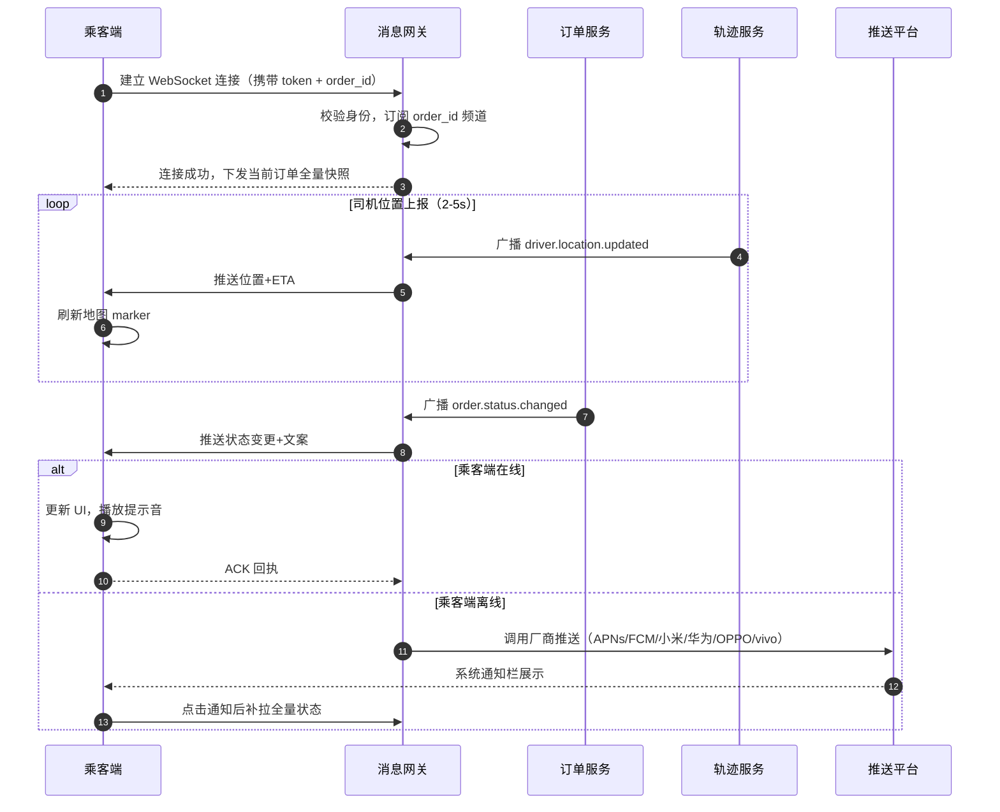
```mermaid
sequenceDiagram
    autonumber
    participant C as 乘客端
    participant GW as 消息网关
    participant OS as 订单服务
    participant TS as 轨迹服务
    participant PUSH as 推送平台

    C->>GW: 建立 WebSocket 连接（携带 token + order_id）
    GW->>GW: 校验身份，订阅 order_id 频道
    GW-->>C: 连接成功，下发当前订单全量快照

    loop 司机位置上报（2-5s）
        TS->>GW: 广播 driver.location.updated
        GW->>C: 推送位置+ETA
        C->>C: 刷新地图 marker
    end

    OS->>GW: 广播 order.status.changed
    GW->>C: 推送状态变更+文案
    alt 乘客端在线
        C->>C: 更新 UI，播放提示音
        C-->>GW: ACK 回执
    else 乘客端离线
        GW->>PUSH: 调用厂商推送（APNs/FCM/小米/华为/OPPO/vivo）
        PUSH-->>C: 系统通知栏展示
        C->>GW: 点击通知后补拉全量状态
    end
```

#### 2.2 异常分支与 SOP

| 异常场景 | 触发条件 | 系统行为 | 前端展示 | SOP |
|---|---|---|---|---|
| 长连接断开 | 网络切换/App 杀进程 | 5 秒内自动重连，重连失败转轮询 | 展示"连接中..."，失败提示"网络异常，点击刷新" | - |
| 消息丢失 | 客户端 ACK 超时 | 服务端标记未送达，推送降级到短信 | 短信提醒"您的司机已到达" | 监控告警 |
| 状态不一致 | 补拉后发现客户端状态滞后 | 强制覆盖客户端状态，弹出状态刷新提示 | 提示"订单状态已更新" | - |
| 推送厂商失败 | APNs/FCM 返回失败 | 换备用通道，记录失败日志 | - | 推送平台运维处理 |

#### 2.3 状态机（消息推送生命周期）

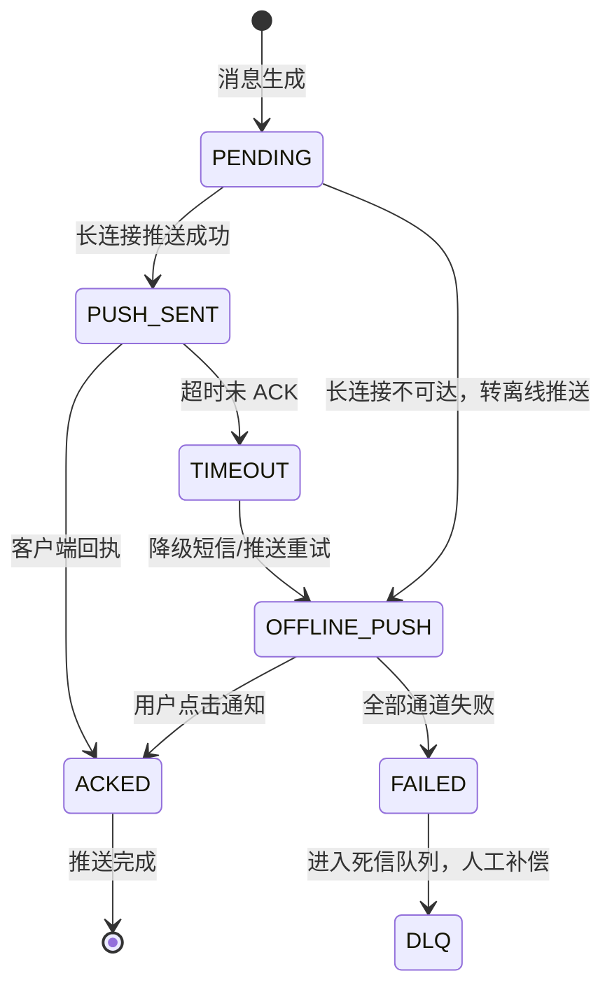
```mermaid
stateDiagram-v2
    [*] --> PENDING: 消息生成
    PENDING --> PUSH_SENT: 长连接推送成功
    PENDING --> OFFLINE_PUSH: 长连接不可达，转离线推送
    PUSH_SENT --> ACKED: 客户端回执
    OFFLINE_PUSH --> ACKED: 用户点击通知
    PUSH_SENT --> TIMEOUT: 超时未 ACK
    TIMEOUT --> OFFLINE_PUSH: 降级短信/推送重试
    ACKED --> [*]: 推送完成
    OFFLINE_PUSH --> FAILED: 全部通道失败
    FAILED --> DLQ: 进入死信队列，人工补偿
```

#### 2.4 关键规则清单

1. **消息分级**：
   - P0（关键）：接单成功、司机到达、行程开始、行程结束、支付成功 ——必须送达，失败降级短信。
   - P1（重要）：ETA 大幅变化、司机偏航提醒、取消通知 ——推送+通知栏。
   - P2（普通）：营销活动、评价提醒 ——仅通知栏，不保证实时。
2. **心跳机制**：WebSocket 每 30 秒一次心跳，连续 3 次无响应判定断开。
3. **补拉规则**：客户端重连后或从后台切前台时，主动查询当前订单最新状态；若本地状态与服务端不一致，以服务端为准强制刷新。
4. **行程分享**：乘客可将行程实时链接通过微信分享给亲友，链接包含脱敏后的司机信息、实时位置、ETA；链接有效期至行程结束。
5. **隐私号保护**：乘客与司机通话通过隐私号中转，双方真实号码互不可见；订单完结 24 小时后隐私号失效。

### ③ 数据字典（L3）

#### 3.1 实体关系图

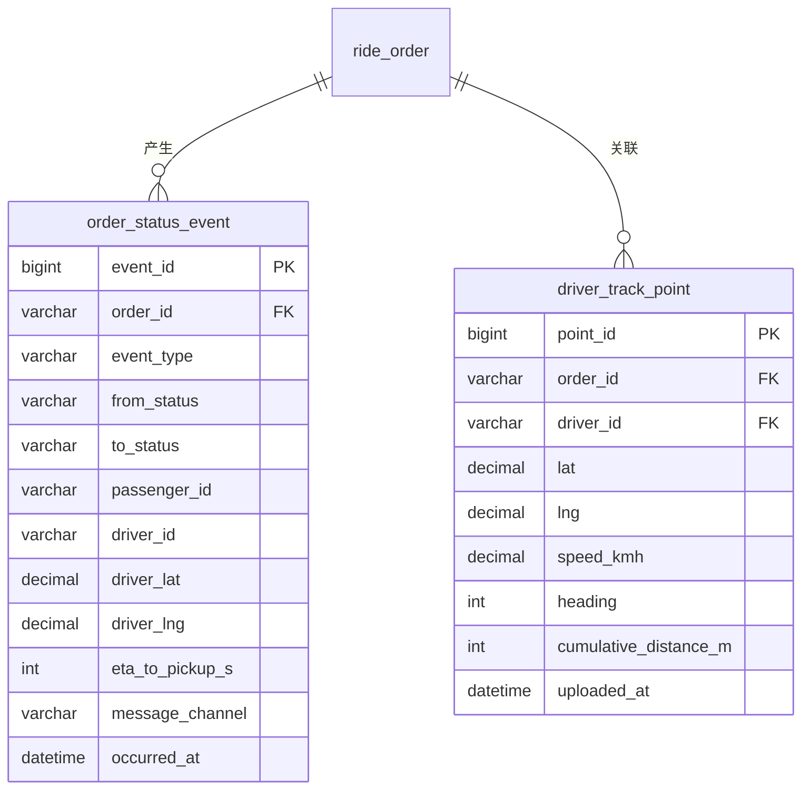
```mermaid
erDiagram
    ride_order ||--o{ order_status_event : "产生"
    ride_order ||--o{ driver_track_point : "关联"

    order_status_event {
        bigint event_id PK
        varchar order_id FK
        varchar event_type
        varchar from_status
        varchar to_status
        varchar passenger_id
        varchar driver_id
        decimal driver_lat
        decimal driver_lng
        int eta_to_pickup_s
        varchar message_channel
        datetime occurred_at
    }

    driver_track_point {
        bigint point_id PK
        varchar order_id FK
        varchar driver_id FK
        decimal lat
        decimal lng
        decimal speed_kmh
        int heading
        int cumulative_distance_m
        datetime uploaded_at
    }
```

#### 3.2 表结构

##### 表 1：order_status_event（订单状态事件表）

- **表名 / 中文名**：`order_status_event` / 订单状态事件表
- **业务说明**：记录订单全量状态变更事件，用于消息推送、审计、回放。
- **分库分表策略**：按 `order_id` 哈希分 32 库，每库 128 表。
- **预估数据量**：日增 4000 万条，存储 90 天。

| 字段名 | 中文 | 类型 | 长度 | 允许空 | 默认值 | 索引 | 示例 | 业务说明 |
|---|---|---|---|---|---|---|---|---|
| event_id | 事件 ID | bigint | 20 | 否 | AUTO_INCREMENT | PK | 1 | - |
| order_id | 订单 ID | varchar | 32 | 否 | - | FK | ord_001 | - |
| event_type | 事件类型 | varchar | 32 | 否 | - | IDX | ORDER_STATUS_CHANGED | ORDER_STATUS_CHANGED/DRIVER_LOCATION_UPDATED/ETA_UPDATED |
| from_status | 原状态 | varchar | 32 | 是 | NULL | - | CREATED | - |
| to_status | 新状态 | varchar | 32 | 是 | NULL | - | ACCEPTED | - |
| passenger_id | 乘客 ID | varchar | 32 | 否 | - | - | p_001 | - |
| driver_id | 司机 ID | varchar | 32 | 是 | NULL | - | d_001 | - |
| driver_name_mask | 司机姓名脱敏 | varchar | 8 | 是 | NULL | - | 张师傅 | - |
| driver_mobile_mask | 司机手机脱敏 | varchar | 11 | 是 | NULL | - | 139****9000 | - |
| vehicle_plate_mask | 车牌脱敏 | varchar | 16 | 是 | NULL | - | 沪A****12 | - |
| driver_lat | 司机纬度 | decimal | 10,7 | 是 | NULL | - | 31.23 | - |
| driver_lng | 司机经度 | decimal | 10,7 | 是 | NULL | - | 121.47 | - |
| eta_to_pickup_s | 接驾 ETA | int | 10 | 是 | NULL | - | 240 | 秒 |
| eta_to_dest_s | 到终点 ETA | int | 10 | 是 | NULL | - | 1200 | 秒 |
| message_channel | 通知渠道 | varchar | 16 | 是 | NULL | - | WEBSOCKET | WEBSOCKET/PUSH/SMS/ALL |
| push_ack_status | 推送 ACK 状态 | varchar | 16 | 是 | NULL | - | ACKED | PENDING/ACKED/TIMEOUT/FAILED |
| occurred_at | 事件发生时间 | datetime(3) | - | 否 | - | IDX | 2026-04-21 10:00:00 | - |

- **索引清单**
  - 主键：`PRIMARY KEY (event_id)`
  - 联合索引：`KEY idx_order_time (order_id, occurred_at)`

##### 表 2：driver_track_point（司机轨迹点表）

- **表名 / 中文名**：`driver_track_point` / 司机轨迹点表
- **业务说明**：存储行程中司机 GPS 轨迹点，用于乘客端地图展示、里程计算、偏航识别、客服回放。
- **分库分表策略**：按 `order_id` 哈希分 32 库，每库 256 表。
- **预估数据量**：单订单平均 300 个点，日增 15 亿点；存储 30 天后压缩归档至 OSS。

| 字段名 | 中文 | 类型 | 长度 | 允许空 | 默认值 | 索引 | 示例 | 业务说明 |
|---|---|---|---|---|---|---|---|---|
| point_id | 轨迹点 ID | bigint | 20 | 否 | AUTO_INCREMENT | PK | 1 | 全局发号器 |
| order_id | 订单 ID | varchar | 32 | 否 | - | FK | ord_001 | - |
| driver_id | 司机 ID | varchar | 32 | 否 | - | - | d_001 | - |
| lat | 纬度 | decimal | 10,7 | 否 | - | - | 31.2304 | - |
| lng | 经度 | decimal | 10,7 | 否 | - | - | 121.4737 | - |
| speed_kmh | 速度 | decimal | 5,2 | 是 | NULL | - | 38.50 | km/h |
| heading | 航向角 | int | 10 | 是 | NULL | - | 185 | 0-359 度 |
| altitude | 海拔 | decimal | 8,2 | 是 | NULL | - | 15.50 | 米 |
| accuracy | 定位精度 | decimal | 6,2 | 是 | NULL | - | 5.00 | 米 |
| cumulative_distance_m | 累计里程 | int | 10 | 否 | 0 | - | 5200 | 相对行程起点 |
| point_index | 点序号 | int | 10 | 否 | - | - | 42 | 用于丢包检测 |
| uploaded_at | 上报时间 | datetime(3) | - | 否 | - | IDX | 2026-04-21 10:12:05 | - |
| gps_time | GPS 原始时间 | datetime(3) | - | 是 | NULL | - | 2026-04-21 10:12:04 | 防延迟上报作弊 |
| network_type | 网络类型 | varchar | 8 | 是 | NULL | - | 4G | WIFI/4G/5G/3G |

- **索引清单**
  - 主键：`PRIMARY KEY (point_id)`
  - 联合索引：`KEY idx_order_uploaded (order_id, uploaded_at)` ——查询单订单轨迹

#### 3.3 枚举字典

| 枚举名 | 取值集合 | 所属字段 | Owner |
|---|---|---|---|
| event_type_enum | ORDER_STATUS_CHANGED/DRIVER_LOCATION_UPDATED/ETA_UPDATED/DRIVER_ARRIVED/TRIP_STARTED/TRIP_ENDED/PAYMENT_COMPLETED | order_status_event.event_type | 消息中心 |
| message_channel_enum | WEBSOCKET/PUSH/SMS/IN_APP/ALL | order_status_event.message_channel | 消息中心 |
| push_ack_status_enum | PENDING/ACKED/TIMEOUT/FAILED/RETRYING | order_status_event.push_ack_status | 推送服务 |

#### 3.4 接口出入参示例

**接口**：`GET /api/v1/order/{order_id}/status`（查询订单当前状态）

**Response Body**：
```json
{
  "code": 0,
  "message": "success",
  "data": {
    "order_id": "ord_202604210001",
    "order_status": "ACCEPTED",
    "driver_info": {
      "driver_id": "d_001",
      "driver_name": "张师傅",
      "driver_avatar": "https://cdn.../driver.png",
      "vehicle_model": "比亚迪秦",
      "vehicle_color": "白色",
      "vehicle_plate": "沪A****12",
      "driver_rating": 4.9,
      "trip_count": 3256
    },
    "location": {
      "lat": 31.2304,
      "lng": 121.4737,
      "heading": 185
    },
    "eta": {
      "eta_to_pickup_s": 240,
      "eta_to_pickup_text": "约4分钟",
      "distance_to_pickup_m": 1200
    },
    "status_timeline": [
      {"status": "CREATED", "time": "2026-04-21T10:00:00+08:00", "desc": "订单已创建"},
      {"status": "ACCEPTED", "time": "2026-04-21T10:00:15+08:00", "desc": "司机已接单"}
    ],
    "server_time": "2026-04-21T10:01:00+08:00"
  }
}
```

### ④ 关联模块

#### 4.1 上游依赖

| 依赖模块 | 提供内容 |
|---|---|
| 订单服务 | 订单状态变更事件 |
| 轨迹服务 | 司机 GPS 轨迹点 |
| 推送平台 | APNs/FCM/厂商通道 |
| 短信网关 | 兜底短信通知 |

#### 4.2 下游被依赖

| 消费方 | 消费内容 |
|---|---|
| 乘客端 App | 状态展示、地图渲染 |
| 小程序/H5 | 状态同步 |
| 客服系统 | 状态回放、问题溯源 |

#### 4.3 同级协作

| 协作模块 | 协作内容 |
|---|---|
| 调度中心 | 派单状态同步 |
| 司机端 | 司机位置上报 |

#### 4.4 外部系统

| 外部系统 | 用途 |
|---|---|
| 苹果 APNs | iOS 离线推送 |
| 谷歌 FCM | Android 离线推送 |
| 小米/华为/OPPO/vivo 推送 | 国内安卓厂商通道 |

---

## 1.5 行程支付与电子发票

### 需求元信息（Meta）

| 属性 | 内容 |
|---|---|
| 需求编号 | PAX-005 |
| 优先级 | P0 |
| 所属域 | 乘客域-支付中心 |
| 责任产品 | 支付产品经理 / 乘客端产品经理 |
| 责任研发 | 支付中心 / 结算中心 |
| 版本 | v1.0.0 |

### ① 需求场景描述

#### 1.1 角色与场景（Who / When / Where）

| 维度 | 描述 |
|---|---|
| Who | 已完成行程需支付车费的乘客；需报销开具发票的乘客 |
| When | 行程结束后自动触发支付；或乘客主动点击支付；完单后 30 天内可申请发票 |
| Where | 乘客 App 支付页、行程详情页、钱包页 |

#### 1.2 用户痛点与业务价值（Why）

- **痛点 1**：支付方式单一，不支持企业报销常用的公务卡。
- **痛点 2**：发票开具流程繁琐，等待时间长。
- **痛点 3**：支付失败无明确提示，重复扣款引发投诉。
- **业务价值**：支持多渠道支付提升支付成功率至 99.4%+；电子发票自动开具提升报销效率，减少客服发票咨询量 50%+。

#### 1.3 功能范围

| 类别 | 范围说明 |
|---|---|
| **In Scope** | 微信支付、支付宝支付、银行卡快捷支付、余额支付、组合支付（券+现金）、免密支付开通/关闭、支付失败重试、账单明细展示、电子发票申请（普票/专票）、发票推送邮箱、开票记录查询 |
| **边界** | 仅支持人民币支付；跨境支付本期不展开 |
| **非目标** | 分期付款、花呗分期、信用卡积分抵扣、纸质发票邮寄 |

#### 1.4 验收标准

| 指标 | 目标值 | 计算口径 |
|---|---|---|
| 支付成功率 | >= 99.4% | 支付成功数 / 支付发起总数 |
| 支付失败重试恢复率 | >= 98% | 首次失败后 10 分钟内重试成功 / 首次失败总数 |
| 电子发票开具成功率 | >= 99.9% | 成功开具发票数 / 发票申请总数 |
| 支付回调幂等重复记账率 | = 0 | 重复回调导致重复记账次数 / 总回调次数 |

### ② 业务流程

#### 2.1 主流程（mermaid sequenceDiagram）

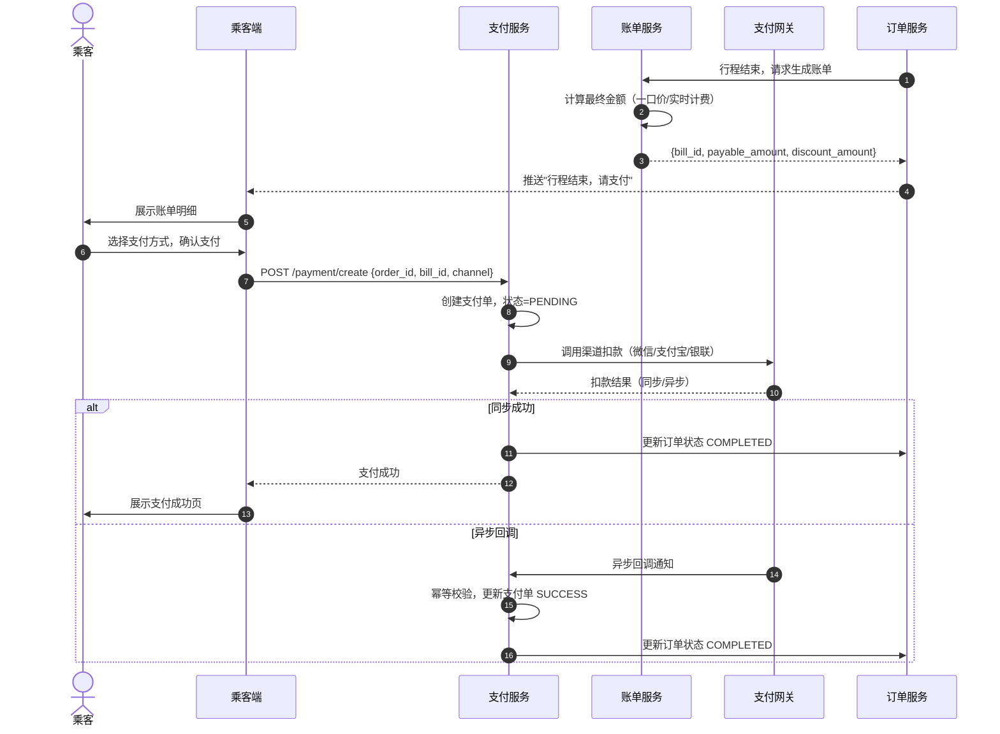
```mermaid
sequenceDiagram
    autonumber
    actor U as 乘客
    participant C as 乘客端
    participant PAY as 支付服务
    participant BILL as 账单服务
    participant GATE as 支付网关
    participant ORD as 订单服务

    ORD->>BILL: 行程结束，请求生成账单
    BILL->>BILL: 计算最终金额（一口价/实时计费）
    BILL-->>ORD: {bill_id, payable_amount, discount_amount}
    ORD-->>C: 推送"行程结束，请支付"
    C->>U: 展示账单明细
    U->>C: 选择支付方式，确认支付
    C->>PAY: POST /payment/create {order_id, bill_id, channel}
    PAY->>PAY: 创建支付单，状态=PENDING
    PAY->>GATE: 调用渠道扣款（微信/支付宝/银联）
    GATE-->>PAY: 扣款结果（同步/异步）
    alt 同步成功
        PAY->>ORD: 更新订单状态 COMPLETED
        PAY-->>C: 支付成功
        C->>U: 展示支付成功页
    else 异步回调
        GATE->>PAY: 异步回调通知
        PAY->>PAY: 幂等校验，更新支付单 SUCCESS
        PAY->>ORD: 更新订单状态 COMPLETED
    end
```

#### 2.2 异常分支与 SOP

| 异常场景 | 触发条件 | 系统行为 | 前端展示 | SOP |
|---|---|---|---|---|
| 余额不足 | 余额支付时账户余额<应付金额 | 拒绝支付，引导更换支付方式 | 提示"余额不足，建议更换支付方式" | - |
| 渠道超时 | 支付网关未在 10s 内返回 | 标记支付单为 PROCESSING，等待回调 | 提示"支付处理中，请稍候" | 回调补偿任务兜底 |
| 重复支付 | 同一订单产生多笔成功支付 | 幂等拦截，后续支付自动原路退款 | 提示"该订单已支付" | 财务对账系统自动退款 |
| 支付回调丢失 | 渠道回调失败且无查询结果 | 主动查询渠道订单状态，人工补偿 | - | 支付运营每日对账 |
| 发票申请超限 | 超过 30 天开票有效期 | 拒绝申请 | 提示"已超过开票有效期" | - |

#### 2.3 状态机（支付单生命周期）

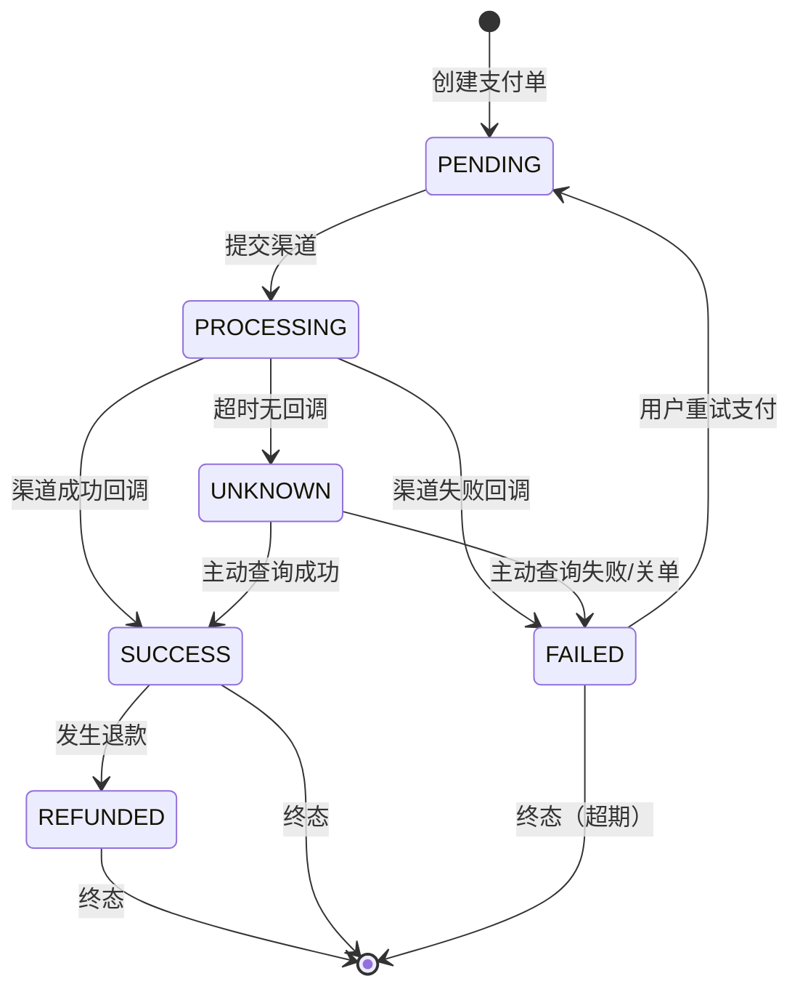
```mermaid
stateDiagram-v2
    [*] --> PENDING: 创建支付单
    PENDING --> PROCESSING: 提交渠道
    PROCESSING --> SUCCESS: 渠道成功回调
    PROCESSING --> FAILED: 渠道失败回调
    PROCESSING --> UNKNOWN: 超时无回调
    UNKNOWN --> SUCCESS: 主动查询成功
    UNKNOWN --> FAILED: 主动查询失败/关单
    FAILED --> PENDING: 用户重试支付
    SUCCESS --> REFUNDED: 发生退款
    REFUNDED --> [*]: 终态
    SUCCESS --> [*]: 终态
    FAILED --> [*]: 终态（超期）
```

#### 2.4 关键规则清单

1. **支付渠道优先级**：免密支付 > 余额 > 微信支付 > 支付宝 > 银行卡快捷。
2. **免密支付规则**：乘客开通后，行程结束自动扣款，无需确认；单笔限额 200 元，日累计限额 1000 元；扣款失败自动降级到需确认支付。
3. **优惠券核销**：支付时自动命中可用优惠券，按最优策略组合；优惠券不可找零，差额不补。
4. **发票规则**：
   - 申请时效：完单后 30 天内。
   - 发票类型：增值税普通电子发票（个人/企业）、增值税专用发票（企业，需资质审核）。
   - 开票内容：运输服务*客运服务。
   - 推送方式：邮件 + App 内下载。
5. **对账规则**：T+1 日与渠道对账，差异率 <= 0.05%；差异订单自动进入异常处理队列。

### ③ 数据字典（L3）

#### 3.1 实体关系图

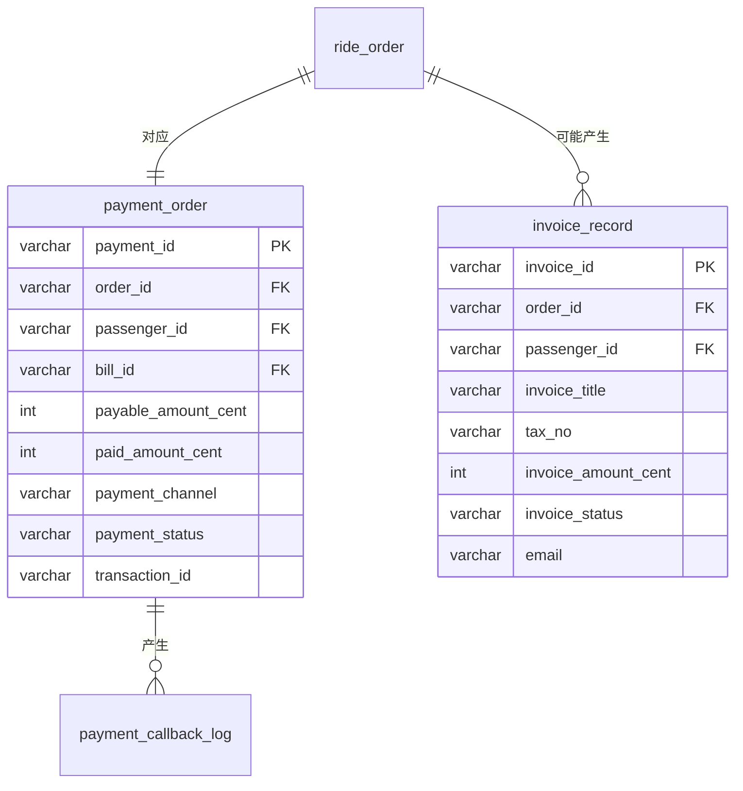
```mermaid
erDiagram
    ride_order ||--|| payment_order : "对应"
    payment_order ||--o{ payment_callback_log : "产生"
    ride_order ||--o{ invoice_record : "可能产生"

    payment_order {
        varchar payment_id PK
        varchar order_id FK
        varchar passenger_id FK
        varchar bill_id FK
        int payable_amount_cent
        int paid_amount_cent
        varchar payment_channel
        varchar payment_status
        varchar transaction_id
    }

    invoice_record {
        varchar invoice_id PK
        varchar order_id FK
        varchar passenger_id FK
        varchar invoice_title
        varchar tax_no
        int invoice_amount_cent
        varchar invoice_status
        varchar email
    }
```

#### 3.2 表结构

##### 表 1：payment_order（支付单表）

- **表名 / 中文名**：`payment_order` / 支付单表
- **业务说明**：存储每笔支付请求的全生命周期信息。
- **分库分表策略**：按 `payment_id` 哈希分 16 库，每库 128 表。
- **预估数据量**：日增 500 万笔，存储 3 年约 54 亿笔。

| 字段名 | 中文 | 类型 | 长度 | 允许空 | 默认值 | 索引 | 示例 | 业务说明 |
|---|---|---|---|---|---|---|---|---|
| payment_id | 支付单 ID | varchar | 32 | 否 | - | PK | pay_001 | - |
| order_id | 订单 ID | varchar | 32 | 否 | - | FK | ord_001 | 逻辑外键 |
| passenger_id | 乘客 ID | varchar | 32 | 否 | - | - | p_001 | - |
| bill_id | 账单 ID | varchar | 32 | 否 | - | FK | bill_001 | - |
| payable_amount_cent | 应付金额 | int | 10 | 否 | - | - | 4280 | 分 |
| discount_amount_cent | 优惠金额 | int | 10 | 否 | 0 | - | 500 | 分 |
| paid_amount_cent | 实付金额 | int | 10 | 是 | NULL | - | 3780 | 分 |
| payment_channel | 支付渠道 | varchar | 16 | 否 | - | IDX | WECHAT | WECHAT/ALIPAY/BANK_CARD/BALANCE |
| payment_status | 支付状态 | varchar | 16 | 否 | PENDING | IDX | SUCCESS | PENDING/PROCESSING/SUCCESS/FAILED/REFUNDED |
| transaction_id | 渠道流水号 | varchar | 64 | 是 | NULL | - | wx_20260421_001 | - |
| settle_status | 结算状态 | varchar | 16 | 否 | TO_SETTLE | - | TO_SETTLE | TO_SETTLE/SETTLED/REFUNDED |
| callback_count | 回调次数 | int | 3 | 否 | 0 | - | 1 | 防重复回调计数 |
| expired_at | 支付过期时间 | datetime(3) | - | 否 | - | - | 2026-04-21 11:00:00 | 默认1小时 |
| paid_at | 支付成功时间 | datetime(3) | - | 是 | NULL | - | 2026-04-21 10:36:00 | - |
| callback_at | 最后回调时间 | datetime(3) | - | 是 | NULL | - | 2026-04-21 10:36:01 | - |

- **索引清单**
  - 主键：`PRIMARY KEY (payment_id)`
  - 唯一索引：`UNIQUE KEY uk_order_channel (order_id, payment_channel, created_at)` ——同一订单同一渠道防重复
  - 普通索引：`KEY idx_transaction_id (transaction_id)` ——渠道对账

##### 表 2：invoice_record（发票记录表）

- **表名 / 中文名**：`invoice_record` / 发票记录表
- **业务说明**：存储电子发票申请与开具记录。
- **分库分表策略**：按 `passenger_id` 哈希分 8 库，每库 64 表。
- **预估数据量**：日增 20 万笔。

| 字段名 | 中文 | 类型 | 长度 | 允许空 | 默认值 | 索引 | 示例 | 业务说明 |
|---|---|---|---|---|---|---|---|---|
| invoice_id | 发票 ID | varchar | 32 | 否 | - | PK | inv_001 | - |
| order_id | 订单 ID | varchar | 32 | 否 | - | FK | ord_001 | 逻辑外键 |
| passenger_id | 乘客 ID | varchar | 32 | 否 | - | - | p_001 | - |
| invoice_title | 发票抬头 | varchar | 128 | 否 | - | - | 北京华夏小猪科技有限公司 | - |
| tax_no | 纳税人识别号 | varchar | 20 | 是 | NULL | - | 91110000XXXX | - |
| invoice_type | 发票类型 | varchar | 16 | 否 | NORMAL | - | NORMAL | NORMAL/SPECIAL |
| invoice_amount_cent | 开票金额 | int | 10 | 否 | - | - | 3560 | 分 |
| invoice_status | 发票状态 | varchar | 16 | 否 | PENDING | - | ISSUED | PENDING/APPLYING/ISSUED/FAILED/CANCELLED |
| invoice_code | 发票代码 | varchar | 16 | 是 | NULL | - | 011001900111 | - |
| invoice_no | 发票号码 | varchar | 20 | 是 | NULL | - | 12345678 | - |
| invoice_pdf_url | PDF 下载地址 | varchar | 512 | 是 | NULL | - | https://... | - |
| email | 接收邮箱 | varchar | 128 | 否 | - | - | user@example.com | - |
| apply_at | 申请时间 | datetime(3) | - | 否 | - | - | 2026-04-21 12:00:00 | - |
| issued_at | 开具时间 | datetime(3) | - | 是 | NULL | - | 2026-04-21 12:05:00 | - |
| fail_reason | 失败原因 | varchar | 255 | 是 | NULL | - | 税号校验失败 | - |

#### 3.3 枚举字典

| 枚举名 | 取值集合 | 所属字段 | Owner |
|---|---|---|---|
| payment_channel_enum | WECHAT/ALIPAY/BANK_CARD/BALANCE | payment_order.payment_channel | 支付中心 |
| payment_status_enum | PENDING/PROCESSING/SUCCESS/FAILED/REFUNDED/CLOSED | payment_order.payment_status | 支付中心 |
| settle_status_enum | TO_SETTLE/SETTLED/REFUNDED/FROZEN | payment_order.settle_status | 结算中心 |
| invoice_type_enum | NORMAL/SPECIAL | invoice_record.invoice_type | 支付中心 |
| invoice_status_enum | PENDING/APPLYING/ISSUED/FAILED/CANCELLED | invoice_record.invoice_status | 支付中心 |

#### 3.4 接口出入参示例

**接口**：`POST /api/v1/payment/create`（创建支付）

**Request Body**：
```json
{
  "order_id": "ord_202604210001",
  "payment_channel": "WECHAT",
  "use_coupon_ids": ["coup_001", "coup_002"],
  "use_balance": true,
  "idempotency_key": "idem_pay_001"
}
```

**Response Body**：
```json
{
  "code": 0,
  "message": "success",
  "data": {
    "payment_id": "pay_202604210001",
    "payment_status": "PENDING",
    "payable_amount_yuan": "35.60",
    "discount_amount_yuan": "5.00",
    "paid_amount_yuan": "30.60",
    "channel_params": {
      "app_id": "wx123456",
      "prepay_id": "wx202604210001",
      "nonce_str": "abc123",
      "timestamp": "1713663600",
      "sign": "DEF123..."
    },
    "expired_at": "2026-04-21T11:00:00+08:00"
  }
}
```

### ④ 关联模块

#### 4.1 上游依赖

| 依赖模块 | 提供内容 |
|---|---|
| 订单服务 | 订单终态与账单信息 |
| 账单服务 | 应付金额计算 |
| 营销服务 | 优惠券可用性校验 |
| 支付渠道（微信/支付宝/银联） | 扣款能力 |

#### 4.2 下游被依赖

| 消费方 | 消费内容 |
|---|---|
| 订单服务 | 支付成功通知，订单完单 |
| 结算中心 | 支付成功后的资金结算 |
| 财务系统 | 对账与开票 |
| 客服系统 | 支付问题查询 |

#### 4.3 同级协作

| 协作模块 | 协作内容 |
|---|---|
| 司机端收入中心 | 乘客支付与司机收入关联对账 |
| 运营后台 | 支付成功率监控、异常订单干预 |

#### 4.4 外部系统

| 外部系统 | 用途 |
|---|---|
| 微信支付 | 支付通道、免密代扣 |
| 支付宝 | 支付通道、免密代扣 |
| 银联云闪付 | 银行卡快捷支付 |
| 百望/航信电子发票平台 | 电子发票开具 |

---

## 1.6 行程评价与客服申诉

### 需求元信息（Meta）

| 属性 | 内容 |
|---|---|
| 需求编号 | PAX-006 |
| 优先级 | P1 |
| 所属域 | 乘客域-服务体验 |
| 责任产品 | 客服产品经理 / 乘客端产品经理 |
| 责任研发 | 客服系统 / 评价服务 |
| 版本 | v1.0.0 |

### ① 需求场景描述

#### 1.1 角色与场景（Who / When / Where）

| 维度 | 描述 |
|---|---|
| Who | 完成行程的乘客；遇到服务问题需申诉的乘客 |
| When | 支付完成后弹出评价；任何时间可在订单详情发起申诉 |
| Where | 支付成功页、订单详情页、客服中心页 |

#### 1.2 用户痛点与业务价值（Why）

- **痛点 1**：低分评价无后续跟进，用户觉得反馈无效。
- **痛点 2**：投诉渠道隐蔽，问题描述不清导致处理慢。
- **痛点 3**：退款/补偿到账周期长，体验差。
- **业务价值**：结构化评价数据用于司机服务质量分层；快速申诉闭环提升 NPS 10%+。

#### 1.3 功能范围

| 类别 | 范围说明 |
|---|---|
| **In Scope** | 星级评价（1-5 星）、结构化标签评价、文字评价、低分二次确认、匿名评价、申诉入口（费用/服务/安全）、申诉材料上传（图片/录音）、工单进度查询、处理结果通知、满意度回访 |
| **边界** | 仅支持已完单订单的评价与申诉 |
| **非目标** | 司机互评、社区化评价展示 |

#### 1.4 验收标准

| 指标 | 目标值 | 计算口径 |
|---|---|---|
| 评价触达率 | >= 98% | 完单后 60 秒内收到评价弹窗的订单 / 完单订单 |
| 评价提交成功率 | >= 99.5% | 评价保存成功 / 提交请求总数 |
| 低分跟进率 | >= 95% | 3 星及以下评价在 24h 内完成客服跟进的 / 低分评价总数 |
| 申诉工单创建成功率 | >= 99.9% | 工单创建成功 / 申诉请求总数 |
| P1 工单响应时效 | <= 10 分钟 | P1 级申诉首次人工响应时间 |

### ② 业务流程

#### 2.1 主流程（mermaid flowchart）

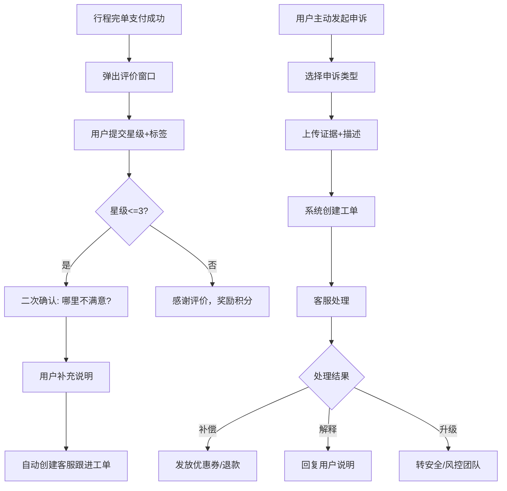
```mermaid
flowchart TD
    A[行程完单支付成功] --> B[弹出评价窗口]
    B --> C[用户提交星级+标签]
    C --> D{星级<=3?}
    D -->|是| E[二次确认: 哪里不满意?]
    D -->|否| F[感谢评价，奖励积分]
    E --> G[用户补充说明]
    G --> H[自动创建客服跟进工单]
    I[用户主动发起申诉] --> J[选择申诉类型]
    J --> K[上传证据+描述]
    K --> L[系统创建工单]
    L --> M[客服处理]
    M --> N{处理结果}
    N -->|补偿| O[发放优惠券/退款]
    N -->|解释| P[回复用户说明]
    N -->|升级| Q[转安全/风控团队]
```

#### 2.2 异常分支与 SOP

| 异常场景 | 触发条件 | 系统行为 | 前端展示 | SOP |
|---|---|---|---|---|
| 评价提交重复 | 同一订单多次提交评价 | 幂等拦截，返回已有评价 | 提示"您已评价过该订单" | - |
| 申诉材料过大 | 图片/视频超过 20MB | 拒绝上传，提示压缩 | 提示"单张图片不超过 20MB" | - |
| 工单创建失败 | 客服系统不可用 | 降级到邮件队列，稍后重试 | 提示"提交成功，处理中请稍候" | 客服系统恢复后补偿 |
| 补偿发放失败 | 优惠券系统超时 | 标记为待重试，3 次后人工处理 | 提示"补偿发放中，请注意查收" | 财务运营介入 |

#### 2.3 状态机（工单生命周期）

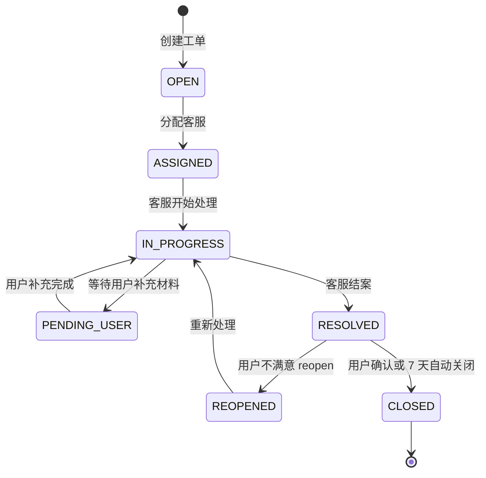
```mermaid
stateDiagram-v2
    [*] --> OPEN: 创建工单
    OPEN --> ASSIGNED: 分配客服
    ASSIGNED --> IN_PROGRESS: 客服开始处理
    IN_PROGRESS --> PENDING_USER: 等待用户补充材料
    PENDING_USER --> IN_PROGRESS: 用户补充完成
    IN_PROGRESS --> RESOLVED: 客服结案
    RESOLVED --> REOPENED: 用户不满意 reopen
    REOPENED --> IN_PROGRESS: 重新处理
    RESOLVED --> CLOSED: 用户确认或 7 天自动关闭
    CLOSED --> [*]
```

#### 2.4 关键规则清单

1. **评价规则**：
   - 评价窗口期：支付完成后 7 天内。
   - 匿名评价：默认匿名，乘客可选择实名。
   - 修改规则：评价提交后 24 小时内可修改 1 次。
2. **申诉时效**：
   - 费用申诉：完单后 7 天内。
   - 服务/安全申诉：完单后 30 天内。
3. **工单分级**：
   - P1（安全/重大资损）：10 分钟内响应，2 小时给出初步方案。
   - P2（费用/服务纠纷）：30 分钟内响应，24 小时内结案。
   - P3（建议/咨询）：4 小时内响应，72 小时内结案。
4. **补偿规则**：
   - 补偿上限：单订单不超过实付金额的 100%。
   - 补偿方式：优惠券（优先）> 余额 > 原路退款。
   - 审批：P1/P2 补偿需主管审批，P3 客服可直批。

### ③ 数据字典（L3）

#### 3.1 实体关系图

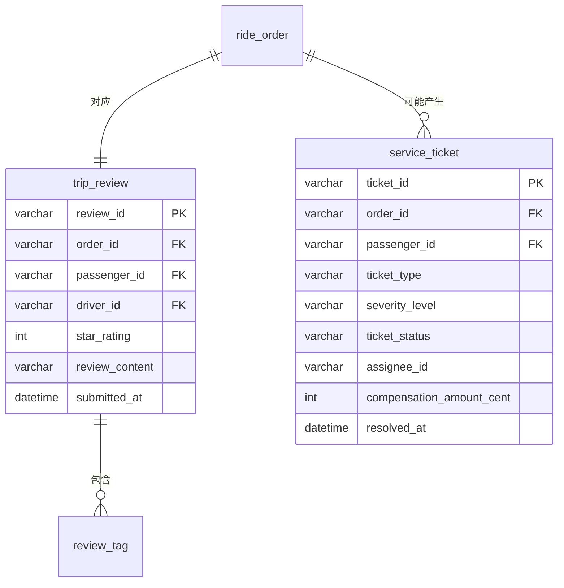
```mermaid
erDiagram
    ride_order ||--|| trip_review : "对应"
    ride_order ||--o{ service_ticket : "可能产生"
    trip_review ||--o{ review_tag : "包含"

    trip_review {
        varchar review_id PK
        varchar order_id FK
        varchar passenger_id FK
        varchar driver_id FK
        int star_rating
        varchar review_content
        datetime submitted_at
    }

    service_ticket {
        varchar ticket_id PK
        varchar order_id FK
        varchar passenger_id FK
        varchar ticket_type
        varchar severity_level
        varchar ticket_status
        varchar assignee_id
        int compensation_amount_cent
        datetime resolved_at
    }
```

#### 3.2 表结构

##### 表 1：trip_review（行程评价表）

- **表名 / 中文名**：`trip_review` / 行程评价表
- **业务说明**：存储乘客对司机服务的评价数据。
- **分库分表策略**：按 `order_id` 哈希分 16 库，每库 64 表。
- **预估数据量**：日增 400 万条。

| 字段名 | 中文 | 类型 | 长度 | 允许空 | 默认值 | 索引 | 示例 | 业务说明 |
|---|---|---|---|---|---|---|---|---|
| review_id | 评价 ID | varchar | 32 | 否 | - | PK | rev_001 | - |
| order_id | 订单 ID | varchar | 32 | 否 | - | UK | ord_001 | 一单一评 |
| passenger_id | 乘客 ID | varchar | 32 | 否 | - | - | p_001 | - |
| driver_id | 司机 ID | varchar | 32 | 否 | - | - | d_001 | - |
| star_rating | 星级 | tinyint | 1 | 否 | - | IDX | 5 | 1-5 |
| review_tags | 评价标签 | varchar | 255 | 是 | NULL | - | ["车内整洁","驾驶平稳"] | JSON 数组 |
| review_content | 文字评价 | varchar | 500 | 是 | NULL | - | 司机师傅态度很好 | - |
| is_anonymous | 是否匿名 | tinyint | 1 | 否 | 1 | - | 1 | 1=匿名 |
| submitted_at | 提交时间 | datetime(3) | - | 否 | - | - | 2026-04-21 10:40:00 | - |
| modified_at | 修改时间 | datetime(3) | - | 是 | NULL | - | 2026-04-21 10:45:00 | - |
| modified_count | 修改次数 | tinyint | 1 | 否 | 0 | - | 0 | 最多1次 |

##### 表 2：service_ticket（客服工单表）

- **表名 / 中文名**：`service_ticket` / 客服工单表
- **业务说明**：存储乘客申诉与服务请求工单。
- **分库分表策略**：按 `ticket_id` 哈希分 8 库，每库 128 表。
- **预估数据量**：日增 10 万条。

| 字段名 | 中文 | 类型 | 长度 | 允许空 | 默认值 | 索引 | 示例 | 业务说明 |
|---|---|---|---|---|---|---|---|---|
| ticket_id | 工单 ID | varchar | 32 | 否 | - | PK | tkt_001 | - |
| order_id | 订单 ID | varchar | 32 | 是 | NULL | FK | ord_001 | - |
| passenger_id | 乘客 ID | varchar | 32 | 否 | - | - | p_001 | - |
| driver_id | 司机 ID | varchar | 32 | 是 | NULL | - | d_001 | - |
| ticket_type | 工单类型 | varchar | 16 | 否 | - | IDX | FARE_DISPUTE | FARE_DISPUTE/SERVICE_COMPLAINT/SAFETY_ISSUE/OTHER |
| severity_level | 严重等级 | varchar | 4 | 否 | P3 | IDX | P2 | P1/P2/P3 |
| ticket_status | 工单状态 | varchar | 16 | 否 | OPEN | IDX | IN_PROGRESS | OPEN/ASSIGNED/IN_PROGRESS/PENDING_USER/RESOLVED/REOPENED/CLOSED |
| assignee_id | 处理人 ID | varchar | 32 | 是 | NULL | - | ops_001 | - |
| description | 问题描述 | varchar | 1000 | 否 | - | - | 费用比预估高 | - |
| evidence_urls | 证据附件 | varchar | 1000 | 是 | NULL | - | ["url1","url2"] | JSON 数组 |
| compensation_amount_cent | 补偿金额 | int | 10 | 是 | 0 | - | 500 | 分 |
| compensation_type | 补偿类型 | varchar | 16 | 是 | NULL | - | COUPON | COUPON/BALANCE/REFUND |
| sla_deadline_at | SLA 截止时间 | datetime(3) | - | 否 | - | - | 2026-04-21 11:00:00 | - |
| resolved_at | 结案时间 | datetime(3) | - | 是 | NULL | - | 2026-04-21 10:50:00 | - |
| passenger_satisfaction | 乘客满意度 | tinyint | 1 | 是 | NULL | - | 4 | 1-5 |

#### 3.3 枚举字典

| 枚举名 | 取值集合 | 所属字段 | Owner |
|---|---|---|---|
| ticket_type_enum | FARE_DISPUTE/SERVICE_COMPLAINT/SAFETY_ISSUE/LOST_ITEM/OTHER | service_ticket.ticket_type | 客服系统 |
| severity_level_enum | P1/P2/P3 | service_ticket.severity_level | 客服系统 |
| ticket_status_enum | OPEN/ASSIGNED/IN_PROGRESS/PENDING_USER/RESOLVED/REOPENED/CLOSED | service_ticket.ticket_status | 客服系统 |
| compensation_type_enum | COUPON/BALANCE/REFUND/NONE | service_ticket.compensation_type | 客服系统 |

#### 3.4 接口出入参示例

**接口**：`POST /api/v1/review/submit`（提交评价）

**Request Body**：
```json
{
  "order_id": "ord_202604210001",
  "star_rating": 5,
  "review_tags": ["车内整洁", "驾驶平稳", "准时到达"],
  "review_content": "司机师傅服务很好，车内干净，推荐！",
  "is_anonymous": true
}
```

**Response Body**：
```json
{
  "code": 0,
  "message": "success",
  "data": {
    "review_id": "rev_202604210001",
    "reward_points": 10,
    "driver_rating_updated": 4.92
  }
}
```

### ④ 关联模块

#### 4.1 上游依赖

| 依赖模块 | 提供内容 |
|---|---|
| 订单服务 | 订单信息与状态 |
| 司机服务 | 司机档案与评分 |
| 对象存储（OSS） | 证据材料存储 |

#### 4.2 下游被依赖

| 消费方 | 消费内容 |
|---|---|
| 司机端 | 评分展示、低分预警 |
| 运营后台 | 服务质量分析、司机分层 |
| 数据仓库 | NPS 分析、服务改进 |

#### 4.3 同级协作

| 协作模块 | 协作内容 |
|---|---|
| 智能客服 | 简单问题自助处理，复杂问题转人工工单 |
| 营销系统 | 补偿优惠券发放 |

#### 4.4 外部系统

| 外部系统 | 用途 |
|---|---|
| 阿里云 OSS | 图片/录音证据存储 |
| 语音转文字服务 | 录音证据自动转写 |

---

## 附录：乘客端全局枚举汇总

| 枚举名 | 取值集合 | 使用位置 |
|---|---|---|
| account_status_enum | ACTIVE/INACTIVE/FROZEN/BANNED/LOGGED_OFF | passenger.account_status |
| auth_type_enum | SMS_LOGIN/WECHAT_LOGIN/ALIPAY_LOGIN/AUTO_LOGIN/REALNAME/LOGOUT | passenger_auth_log.auth_type |
| auth_result_enum | SUCCESS/FAILED/BLOCKED/CHALLENGE/TIMEOUT | passenger_auth_log.auth_result |
| gender_enum | MALE/FEMALE/UNKNOWN | passenger.gender |
| verify_status_enum | PENDING/VERIFIED/FAILED | passenger_realname.verify_status |
| address_tag_enum | HOME/COMPANY/CUSTOM | passenger_address.address_tag |
| address_source_enum | MANUAL/HISTORY/RECOMMEND/IMPORT | passenger_address.source |
| order_status_enum | CREATED/DISPATCHING/ACCEPTED/PICKUP_ARRIVED/ON_TRIP/PAYMENT_PENDING/PAYMENT_FAILED/COMPLETED/CANCELLED/CLOSED_EXCEPTION | ride_order.order_status |
| product_type_enum | INSTANT/RESERVE/REPLACE | ride_order.product_type |
| vehicle_level_enum | ECONOMY/COMFORT/BUSINESS | ride_order.vehicle_level |
| operator_type_enum | PASSENGER/DRIVER/SYSTEM/OPS | 多表 |
| cancel_stage_enum | BEFORE_PICKUP/AFTER_ACCEPT/PICKUP_ARRIVED/ON_TRIP | ride_order_cancel_record.cancel_stage |
| responsibility_enum | PASSENGER/DRIVER/NOBODY/PLATFORM | ride_order_cancel_record.responsibility |
| event_type_enum | ORDER_STATUS_CHANGED/DRIVER_LOCATION_UPDATED/ETA_UPDATED/DRIVER_ARRIVED/TRIP_STARTED/TRIP_ENDED/PAYMENT_COMPLETED | order_status_event.event_type |
| message_channel_enum | WEBSOCKET/PUSH/SMS/IN_APP/ALL | order_status_event.message_channel |
| payment_channel_enum | WECHAT/ALIPAY/BANK_CARD/BALANCE | payment_order.payment_channel |
| payment_status_enum | PENDING/PROCESSING/SUCCESS/FAILED/REFUNDED/CLOSED | payment_order.payment_status |
| invoice_type_enum | NORMAL/SPECIAL | invoice_record.invoice_type |
| invoice_status_enum | PENDING/APPLYING/ISSUED/FAILED/CANCELLED | invoice_record.invoice_status |
| ticket_type_enum | FARE_DISPUTE/SERVICE_COMPLAINT/SAFETY_ISSUE/LOST_ITEM/OTHER | service_ticket.ticket_type |
| severity_level_enum | P1/P2/P3 | service_ticket.severity_level |
| ticket_status_enum | OPEN/ASSIGNED/IN_PROGRESS/PENDING_USER/RESOLVED/REOPENED/CLOSED | service_ticket.ticket_status |
| compensation_type_enum | COUPON/BALANCE/REFUND/NONE | service_ticket.compensation_type |
