# 华夏小猪出行 — 司机端产品需求文档（PRD）

> 文档版本：v1.0.0  
> 适用范围：司机端全量业务（司机 App Android / iOS）  
> 最后更新：2026-04-21  
> 评审状态：Draft  

---

## 全局约定

### 审计字段约定（全表通用）

| 字段名 | 类型 | 允许空 | 默认值 | 说明 |
|---|---|---|---|---|
| created_at | datetime(3) | 否 | CURRENT_TIMESTAMP(3) | 创建时间 |
| updated_at | datetime(3) | 否 | CURRENT_TIMESTAMP(3) ON UPDATE CURRENT_TIMESTAMP(3) | 最后更新时间 |
| deleted_at | datetime(3) | 是 | NULL | 软删除标记 |
| creator_id | varchar(64) | 是 | NULL | 创建人 ID |
| tenant_id | varchar(64) | 否 | 'default' | 租户 ID |

> **注**：本 PRD 所有数据表均默认包含以上审计字段，以下各表字段清单中不再重复列出。

---

## 2.1 司机登录与出车状态管理

### 需求元信息（Meta）

| 属性 | 内容 |
|---|---|
| 需求编号 | DRV-001 |
| 优先级 | P0 |
| 所属域 | 司机域-用户中心 |
| 责任产品 | 司机端产品经理 |
| 责任研发 | 司机中心 / 鉴权服务 / 资质服务 |
| 版本 | v1.0.0 |

### ① 需求场景描述

#### 1.1 角色与场景（Who / When / Where）

| 维度 | 描述 |
|---|---|
| Who | 已注册并通过审核的网约车司机；新入驻待审核司机 |
| When | 每日开工前登录；收车后离线；资质到期前提醒 |
| Where | 司机 App 登录页 / 首页出车开关 |

#### 1.2 用户痛点与业务价值（Why）

- **痛点 1**：登录流程复杂，影响司机出车效率。
- **痛点 2**：资质到期未提醒，导致突然被限制接单。
- **痛点 3**：账号被盗用或出借，引发安全与服务问题。
- **业务价值**：一键出车/收车提升司机日在线时长 15%+；资质到期前 7 天提醒降低资质过期导致的运力损失 80%+。

#### 1.3 功能范围

| 类别 | 范围说明 |
|---|---|
| **In Scope** | 手机号+密码/验证码登录、人脸识别登录（可选）、出车/收车状态切换、车辆绑定与校验、资质状态展示（驾驶证/行驶证/网约车证）、资质到期预警、在线时长统计、账号安全设置（修改密码/绑定手机/设备管理） |
| **边界** | 仅支持已注册并通过审核的司机登录；新司机需先完成入驻流程 |
| **非目标** | 司机社交功能、多账号同时在线 |

#### 1.4 验收标准

| 指标 | 目标值 | 计算口径 |
|---|---|---|
| 司机登录成功率 | >= 99.5% | 成功登录 / 有效登录请求 |
| 资质拦截可审计率 | >= 99.99% | 拦截日志完整 / 资质拦截总数 |
| 出车状态同步成功率 | >= 99.9% | 状态同步 ACK 成功 / 状态变更总数 |
| 资质到期预警命中率 | >= 99.5% | 到期前 7 天成功预警 / 应预警总数 |

### ② 业务流程

#### 2.1 主流程（mermaid sequenceDiagram）

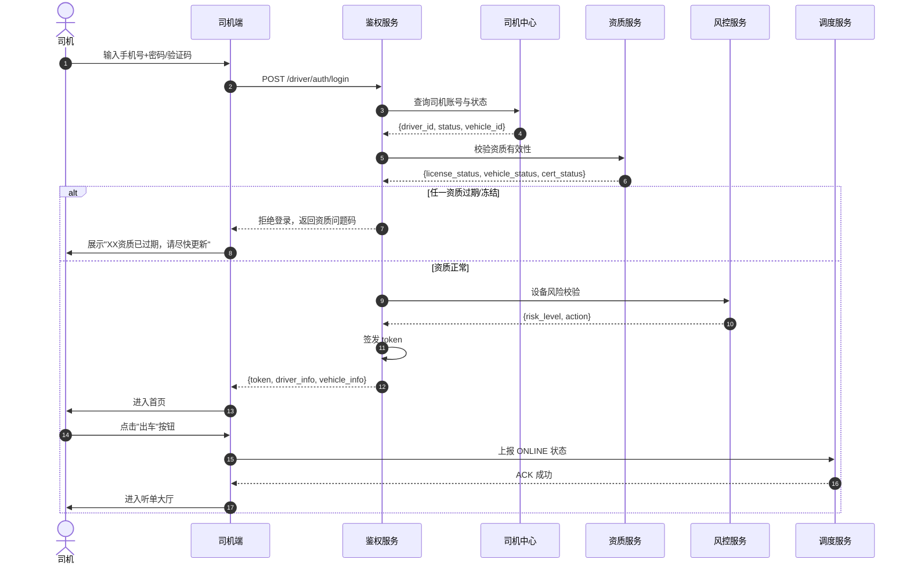
```mermaid
sequenceDiagram
    autonumber
    actor D as 司机
    participant C as 司机端
    participant AUTH as 鉴权服务
   participant DC as 司机中心
    participant QC as 资质服务
    participant RS as 风控服务
    participant DIS as 调度服务

    D->>C: 输入手机号+密码/验证码
    C->>AUTH: POST /driver/auth/login
    AUTH->>DC: 查询司机账号与状态
    DC-->>AUTH: {driver_id, status, vehicle_id}
    AUTH->>QC: 校验资质有效性
    QC-->>AUTH: {license_status, vehicle_status, cert_status}
    alt 任一资质过期/冻结
        AUTH-->>C: 拒绝登录，返回资质问题码
        C->>D: 展示"XX资质已过期，请尽快更新"
    else 资质正常
        AUTH->>RS: 设备风险校验
        RS-->>AUTH: {risk_level, action}
        AUTH->>AUTH: 签发 token
        AUTH-->>C: {token, driver_info, vehicle_info}
        C->>D: 进入首页
        D->>C: 点击"出车"按钮
        C->>DIS: 上报 ONLINE 状态
        DIS-->>C: ACK 成功
        C->>D: 进入听单大厅
    end
```

#### 2.2 异常分支与 SOP

| 异常场景 | 触发条件 | 系统行为 | 前端展示 | SOP |
|---|---|---|---|---|
| 密码错误超限 | 连续输错 5 次 | 锁定账号 30 分钟 | 提示"密码错误次数过多，请30分钟后重试或找回密码" | 客服核实后人工解锁 |
| 资质过期 | 驾驶证/网约车证已过期 | 拒绝出车，保留登录态 | 首页展示"资质已过期，无法接单"，引导更新 | 合规运营跟进 |
| 车辆未绑定 | 司机无有效绑定车辆 | 拒绝出车 | 提示"请先绑定车辆" | - |
| 风控封禁 | 命中刷单/作弊规则 | 拒绝登录/出车 | 提示"账号存在异常，请联系客服" | 风控运营复核 |
| 状态同步失败 | 调度服务不可达 | 重试 3 次，失败后提示司机 | 提示"网络异常，出车失败，请重试" | 调度运维告警 |

#### 2.3 状态机（司机账号生命周期）

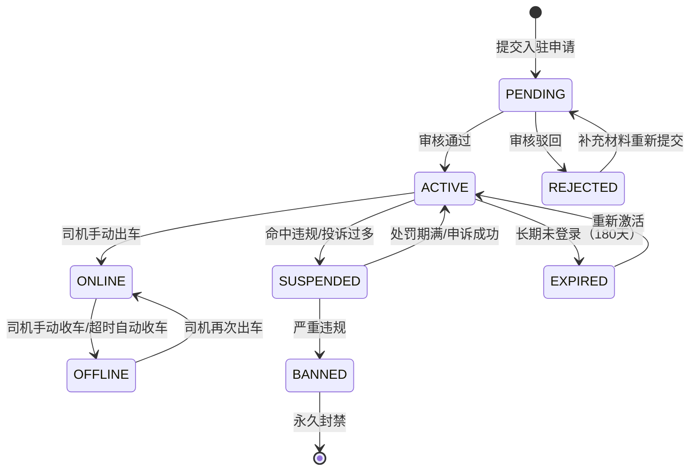
```mermaid
stateDiagram-v2
    [*] --> PENDING: 提交入驻申请
    PENDING --> ACTIVE: 审核通过
    PENDING --> REJECTED: 审核驳回
    REJECTED --> PENDING: 补充材料重新提交
    ACTIVE --> ONLINE: 司机手动出车
    ONLINE --> OFFLINE: 司机手动收车/超时自动收车
    OFFLINE --> ONLINE: 司机再次出车
    ACTIVE --> SUSPENDED: 命中违规/投诉过多
    SUSPENDED --> ACTIVE: 处罚期满/申诉成功
    SUSPENDED --> BANNED: 严重违规
    ACTIVE --> EXPIRED: 长期未登录（180天）
    EXPIRED --> ACTIVE: 重新激活
    BANNED --> [*]: 永久封禁
```

#### 2.4 关键规则清单

1. **登录方式**：支持手机号+密码、手机号+验证码、本机号码一键登录；密码错误 5 次锁定 30 分钟。
2. **出车校验**：出车前必须校验以下项全部通过：
   - 司机账号状态 = ACTIVE
   - 驾驶证在有效期内
   - 网约车驾驶员证在有效期内（如该城市要求）
   - 绑定车辆状态 = ACTIVE
   - 行驶证在有效期内
   - 车辆保险在有效期内
   - 当前无未处理严重违规
3. **自动收车**：司机连续 120 分钟无心跳上报，系统自动切换为 OFFLINE；当日累计在线时长达到平台限制（如 12 小时）后强制收车。
4. **资质预警**：到期前 30 天、15 天、7 天、1 天分别通过 App Push + 短信提醒司机。
5. **设备绑定**：新设备登录需短信验证码二次确认；每台设备记录设备指纹，异常设备触发风控。

### ③ 数据字典（L3）

#### 3.1 实体关系图

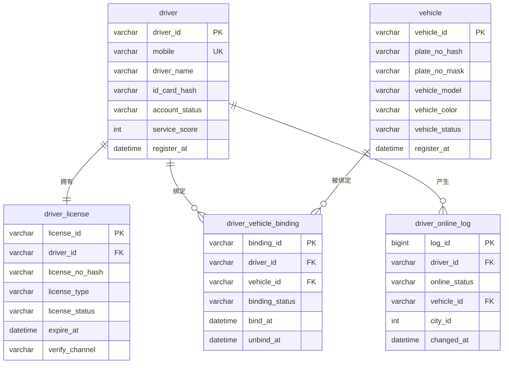
```mermaid
erDiagram
    driver ||--|| driver_license : "拥有"
    driver ||--o{ driver_vehicle_binding : "绑定"
    driver ||--o{ driver_online_log : "产生"
    vehicle ||--o{ driver_vehicle_binding : "被绑定"

    driver {
        varchar driver_id PK
        varchar mobile UK
        varchar driver_name
        varchar id_card_hash
        varchar account_status
        int service_score
        datetime register_at
    }

    driver_license {
        varchar license_id PK
        varchar driver_id FK
        varchar license_no_hash
        varchar license_type
        varchar license_status
        datetime expire_at
        varchar verify_channel
    }

    vehicle {
        varchar vehicle_id PK
        varchar plate_no_hash
        varchar plate_no_mask
        varchar vehicle_model
        varchar vehicle_color
        varchar vehicle_status
        datetime register_at
    }

    driver_vehicle_binding {
        varchar binding_id PK
        varchar driver_id FK
        varchar vehicle_id FK
        varchar binding_status
        datetime bind_at
        datetime unbind_at
    }

    driver_online_log {
        bigint log_id PK
        varchar driver_id FK
        varchar online_status
        varchar vehicle_id FK
        int city_id
        datetime changed_at
    }
```

#### 3.2 表结构

##### 表 1：driver（司机主表）

- **表名 / 中文名**：`driver` / 司机主表
- **业务说明**：司机核心身份与运营状态主档。
- **分库分表策略**：按 `driver_id` 哈希分 16 库，每库 64 表。
- **预估数据量**：3000 万（3 年），日增约 1 万。

| 字段名 | 中文 | 类型 | 长度 | 允许空 | 默认值 | 索引 | 示例 | 业务说明 |
|---|---|---|---|---|---|---|---|---|
| driver_id | 司机 ID | varchar | 32 | 否 | - | PK | d_202604210001 | - |
| mobile | 手机号 | varchar | 11 | 否 | - | UK | 13900139000 | 脱敏存储 |
| mobile_enc | 手机号密文 | varchar | 255 | 否 | - | - | aes(...) | - |
| driver_name | 姓名 | varchar | 32 | 否 | - | - | 张三 | - |
| id_card_hash | 身份证哈希 | varchar | 64 | 否 | - | - | sha256(...) | - |
| id_card_mask | 身份证脱敏 | varchar | 18 | 否 | - | - | 110***********0011 | - |
| account_status | 账号状态 | varchar | 16 | 否 | PENDING | IDX | ACTIVE | PENDING/ACTIVE/SUSPENDED/BANNED/EXPIRED |
| service_score | 服务分 | int | 10 | 否 | 100 | - | 98 | 满分100 |
| service_level | 服务等级 | varchar | 8 | 否 | BRONZE | - | SILVER | BRONZE/SILVER/GOLD/PLATINUM |
| register_at | 注册时间 | datetime(3) | - | 否 | - | - | 2026-04-01 10:00:00 | - |
| last_login_at | 最后登录 | datetime(3) | - | 是 | NULL | - | 2026-04-21 08:00:00 | - |
| last_online_at | 最后出车 | datetime(3) | - | 是 | NULL | - | 2026-04-21 09:00:00 | - |
| total_trip_count | 累计完单 | int | 10 | 否 | 0 | - | 3256 | - |
| total_online_hours | 累计在线时长 | int | 10 | 否 | 0 | - | 4520 | 小时 |
| invite_driver_id | 邀请人 ID | varchar | 32 | 是 | NULL | - | d_002 | 司机邀请裂变 |

- **索引清单**
  - 主键：`PRIMARY KEY (driver_id)`
  - 唯一索引：`UNIQUE KEY uk_mobile (mobile)`
  - 普通索引：`KEY idx_account_status (account_status, register_at)`
  - 普通索引：`KEY idx_service_level (service_level, city_id)`

##### 表 2：driver_license（司机资质表）

- **表名 / 中文名**：`driver_license` / 司机资质表
- **业务说明**：存储驾驶证、网约车驾驶员证等资质信息。
- **分库分表策略**：与 driver 同库同表规则。

| 字段名 | 中文 | 类型 | 长度 | 允许空 | 默认值 | 索引 | 示例 | 业务说明 |
|---|---|---|---|---|---|---|---|---|
| license_id | 资质 ID | varchar | 32 | 否 | - | PK | lic_001 | - |
| driver_id | 司机 ID | varchar | 32 | 否 | - | FK | d_001 | - |
| license_type | 资质类型 | varchar | 16 | 否 | - | - | DRIVING | DRIVING/DRIVER_CERT/ID_CARD |
| license_no_hash | 证件号哈希 | varchar | 64 | 否 | - | - | sha256(...) | - |
| license_no_mask | 证件号脱敏 | varchar | 32 | 否 | - | - | 110101********0011 | - |
| license_status | 资质状态 | varchar | 16 | 否 | VALID | - | VALID | VALID/EXPIRED/EXPIRING/SUSPENDED |
| issue_date | 发证日期 | date | - | 是 | NULL | - | 2018-01-01 | - |
| expire_at | 到期时间 | datetime(3) | - | 否 | - | - | 2028-01-01 00:00:00 | - |
| verify_status | 核验状态 | varchar | 16 | 否 | PENDING | - | VERIFIED | PENDING/VERIFIED/FAILED |
| verify_channel | 核验渠道 | varchar | 16 | 是 | NULL | - | GOV_API | GOV_API/ALIPAY/MANUAL |
| verified_at | 核验时间 | datetime(3) | - | 是 | NULL | - | 2026-04-01 10:00:00 | - |
| front_image_url | 证件正面照 | varchar | 512 | 是 | NULL | - | https://... | - |
| back_image_url | 证件反面照 | varchar | 512 | 是 | NULL | - | https://... | - |

##### 表 3：vehicle（车辆信息表）

- **表名 / 中文名**：`vehicle` / 车辆信息表
- **业务说明**：车辆档案，一辆车可被多个司机轮班绑定。
- **分库分表策略**：按 `vehicle_id` 哈希分 8 库，每库 64 表。

| 字段名 | 中文 | 类型 | 长度 | 允许空 | 默认值 | 索引 | 示例 | 业务说明 |
|---|---|---|---|---|---|---|---|---|
| vehicle_id | 车辆 ID | varchar | 32 | 否 | - | PK | v_001 | - |
| plate_no_hash | 车牌哈希 | varchar | 64 | 否 | - | - | sha256(...) | - |
| plate_no_mask | 车牌脱敏 | varchar | 16 | 否 | - | - | 沪A****12 | - |
| vehicle_model | 车型 | varchar | 64 | 否 | - | - | 比亚迪秦 EV | - |
| vehicle_brand | 品牌 | varchar | 32 | 是 | NULL | - | 比亚迪 | - |
| vehicle_color | 颜色 | varchar | 16 | 是 | NULL | - | 白色 | - |
| vehicle_type | 车辆类型 | varchar | 16 | 否 | SEDAN | - | SEDAN | SEDAN/SUV/MPV |
| seat_count | 座位数 | tinyint | 1 | 否 | 5 | - | 5 | - |
| vehicle_status | 车辆状态 | varchar | 16 | 否 | PENDING | IDX | ACTIVE | PENDING/ACTIVE/SUSPENDED/RETIRED |
| energy_type | 能源类型 | varchar | 16 | 否 | EV | - | EV | EV/PHEV/FUEL |
| register_at | 注册时间 | datetime(3) | - | 否 | - | - | 2026-04-01 10:00:00 | - |

##### 表 4：driver_vehicle_binding（司机车辆绑定表）

- **表名 / 中文名**：`driver_vehicle_binding` / 司机车辆绑定表
- **业务说明**：记录司机与车辆的绑定关系，支持换车换班。
- **分库分表策略**：按 `driver_id` 哈希分 16 库，每库 64 表。

| 字段名 | 中文 | 类型 | 长度 | 允许空 | 默认值 | 索引 | 示例 | 业务说明 |
|---|---|---|---|---|---|---|---|---|
| binding_id | 绑定 ID | varchar | 32 | 否 | - | PK | bdg_001 | - |
| driver_id | 司机 ID | varchar | 32 | 否 | - | FK | d_001 | - |
| vehicle_id | 车辆 ID | varchar | 32 | 否 | - | FK | v_001 | - |
| binding_status | 绑定状态 | varchar | 16 | 否 | ACTIVE | - | ACTIVE | ACTIVE/INACTIVE |
| is_primary | 是否主用车 | tinyint | 1 | 否 | 1 | - | 1 | 1=主用车 |
| bind_at | 绑定时间 | datetime(3) | - | 否 | - | - | 2026-04-01 10:00:00 | - |
| unbind_at | 解绑时间 | datetime(3) | - | 是 | NULL | - | 2026-04-20 18:00:00 | - |
| unbind_reason | 解绑原因 | varchar | 255 | 是 | NULL | - | 车辆维修 | - |

##### 表 5：driver_online_log（司机出车日志表）

- **表名 / 中文名**：`driver_online_log` / 司机出车日志表
- **业务说明**：记录司机每次出车/收车状态变更，用于在线时长统计与调度溯源。
- **分库分表策略**：按 `driver_id` 哈希分 16 库，每库 128 表；180 天归档。
- **预估数据量**：日增 800 万条。

| 字段名 | 中文 | 类型 | 长度 | 允许空 | 默认值 | 索引 | 示例 | 业务说明 |
|---|---|---|---|---|---|---|---|---|
| log_id | 日志 ID | bigint | 20 | 否 | AUTO_INCREMENT | PK | 1 | - |
| driver_id | 司机 ID | varchar | 32 | 否 | - | FK | d_001 | - |
| online_status | 状态 | varchar | 16 | 否 | - | - | ONLINE | ONLINE/OFFLINE |
| vehicle_id | 车辆 ID | varchar | 32 | 否 | - | - | v_001 | - |
| city_id | 城市编码 | int | 10 | 否 | - | - | 310100 | - |
| lat | 纬度 | decimal | 10,7 | 是 | NULL | - | 31.23 | - |
| lng | 经度 | decimal | 10,7 | 是 | NULL | - | 121.47 | - |
| changed_at | 变更时间 | datetime(3) | - | 否 | - | IDX | 2026-04-21 08:00:00 | - |
| change_reason | 变更原因 | varchar | 32 | 是 | NULL | - | USER_CLICK | USER_CLICK/AUTO_TIMEOUT/FORCE_OFFLINE |
| app_version | App 版本 | varchar | 16 | 是 | NULL | - | 3.2.1 | - |
| os_type | 系统类型 | varchar | 8 | 是 | NULL | - | ANDROID | ANDROID/IOS |

#### 3.3 枚举字典

| 枚举名 | 取值集合 | 所属字段 | Owner |
|---|---|---|---|
| driver_account_status_enum | PENDING/ACTIVE/SUSPENDED/BANNED/EXPIRED | driver.account_status | 司机中心 |
| service_level_enum | BRONZE/SILVER/GOLD/PLATINUM | driver.service_level | 司机中心 |
| license_type_enum | DRIVING/DRIVER_CERT/ID_CARD | driver_license.license_type | 资质服务 |
| license_status_enum | VALID/EXPIRED/EXPIRING/SUSPENDED/PENDING | driver_license.license_status | 资质服务 |
| vehicle_status_enum | PENDING/ACTIVE/SUSPENDED/RETIRED | vehicle.vehicle_status | 车辆中心 |
| vehicle_type_enum | SEDAN/SUV/MPV/VAN | vehicle.vehicle_type | 车辆中心 |
| energy_type_enum | EV/PHEV/FUEL | vehicle.energy_type | 车辆中心 |
| binding_status_enum | ACTIVE/INACTIVE | driver_vehicle_binding.binding_status | 司机中心 |
| online_status_enum | ONLINE/OFFLINE | driver_online_log.online_status | 司机中心 |

#### 3.4 接口出入参示例

**接口**：`POST /api/v1/driver/auth/login`

**Request Body**：
```json
{
  "mobile": "13900139000",
  "password": "hashed_pwd_or_sms_code",
  "auth_type": "SMS",
  "device_id": "dvc_driver_001",
  "device_model": "Redmi K70",
  "os_type": "ANDROID",
  "os_version": "14",
  "app_version": "3.2.1",
  "idempotency_key": "idem_d001_20260421"
}
```

**Response Body**：
```json
{
  "code": 0,
  "message": "success",
  "data": {
    "driver_id": "d_202604210001",
    "driver_name": "张三",
    "token": "eyJhbGciOiJIUzI1NiIs...",
    "refresh_token": "rt_...",
    "token_expire_at": "2026-04-21T12:00:00+08:00",
    "account_status": "ACTIVE",
    "vehicle_info": {
      "vehicle_id": "v_001",
      "plate_no_mask": "沪A****12",
      "vehicle_model": "比亚迪秦 EV",
      "vehicle_color": "白色"
    },
    "license_alert": {
      "has_alert": true,
      "alert_items": [
        {"type": "DRIVING", "expire_in_days": 15, "message": "驾驶证将在15天后到期"}
      ]
    }
  }
}
```

### ④ 关联模块

#### 4.1 上游依赖

| 依赖模块 | 提供内容 |
|---|---|
| 短信网关 | 验证码下发 |
| 人脸识别服务 | 司机人脸识别（可选登录/出车校验） |
| 政府核验接口 | 驾驶证/网约车证真实性核验 |
| 风控服务 | 设备风险与账号安全 |

#### 4.2 下游被依赖

| 消费方 | 消费内容 |
|---|---|
| 调度服务 | 出车状态决定司机是否进入派单池 |
| 订单服务 | 司机身份与车辆信息 |
| 结算服务 | 司机在线时长、完单数据 |

#### 4.3 同级协作

| 协作模块 | 协作内容 |
|---|---|
| 运营后台-资质中心 | 资质审核、状态变更 |
| 乘客端 | 司机信息展示（姓名、车牌、车型） |

#### 4.4 外部系统

| 外部系统 | 用途 |
|---|---|
| 公安部驾驶证核验接口 | 驾驶证真实性核验 |
| 交通运输部网约车接口 | 网约车驾驶员证核验 |
| 运营商一键登录 SDK | 本机号码校验 |

---

## 2.2 听单大厅与派单接收

### 需求元信息（Meta）

| 属性 | 内容 |
|---|---|
| 需求编号 | DRV-002 |
| 优先级 | P0 |
| 所属域 | 司机域-调度中心 |
| 责任产品 | 司机端产品经理 / 调度产品经理 |
| 责任研发 | 调度服务 / 消息网关 |
| 版本 | v1.0.0 |

### ① 需求场景描述

#### 1.1 角色与场景（Who / When / Where）

| 维度 | 描述 |
|---|---|
| Who | 已出车在线的司机 |
| When | 出车后随时；系统根据司机位置与订单匹配时 |
| Where | 司机 App 听单大厅页 |

#### 1.2 用户痛点与业务价值（Why）

- **痛点 1**：长时间无单导致司机焦虑，不知道附近有没有订单。
- **痛点 2**：派单信息展示不全，司机接单决策困难。
- **痛点 3**：派单弹窗被系统限制或误触导致漏单。
- **业务价值**：实时热力图让司机了解供需分布，自主调整位置；清晰派单卡片提升应答率 5%+。

#### 1.3 功能范围

| 类别 | 范围说明 |
|---|---|
| **In Scope** | 听单大厅（实时订单热力图、当前位置、在线时长、今日收入）、派单弹窗（订单摘要、接驾距离、预估收入、倒计时）、接单/忽略/超时响应、听单设置（偏好区域、顺路目的地、接单距离上限）、强派模式（平台指派，不可拒绝） |
| **边界** | 仅展示平台自有订单 |
| **非目标** | 司机抢单大厅（多司机同时抢同一单）、议价模式 |

#### 1.4 验收标准

| 指标 | 目标值 | 计算口径 |
|---|---|---|
| 派单消息到达率 | >= 99.7% | 司机端收到并展示 / 调度发出总数 |
| 派单消息延迟 P95 | <= 1s | 调度发送 → 客户端展示耗时 P95 |
| 司机应答率 | >= 85% | 司机响应（接单或忽略）/ 收到派单总数 |
| 派单卡片关键字段完整率 | >= 99.99% | 关键字段非空 / 展示总数 |

### ② 业务流程

#### 2.1 主流程（mermaid sequenceDiagram）

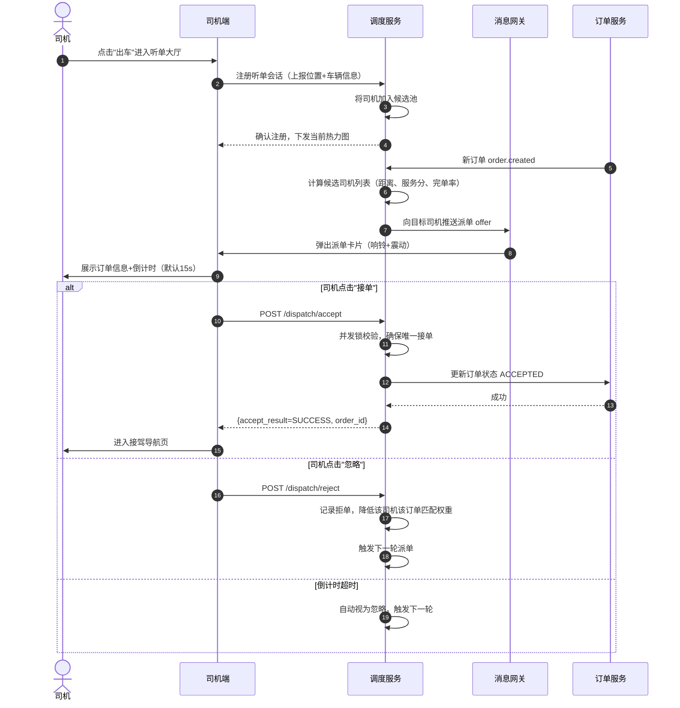
```mermaid
sequenceDiagram
    autonumber
    actor D as 司机
    participant C as 司机端
    participant DIS as 调度服务
    participant MSG as 消息网关
    participant OS as 订单服务

    D->>C: 点击"出车"进入听单大厅
    C->>DIS: 注册听单会话（上报位置+车辆信息）
    DIS->>DIS: 将司机加入候选池
    DIS-->>C: 确认注册，下发当前热力图

    OS->>DIS: 新订单 order.created
    DIS->>DIS: 计算候选司机列表（距离、服务分、完单率）
    DIS->>MSG: 向目标司机推送派单 offer
    MSG->>C: 弹出派单卡片（响铃+震动）
    C->>D: 展示订单信息+倒计时（默认15s）

    alt 司机点击"接单"
        C->>DIS: POST /dispatch/accept
        DIS->>DIS: 并发锁校验，确保唯一接单
        DIS->>OS: 更新订单状态 ACCEPTED
        OS-->>DIS: 成功
        DIS-->>C: {accept_result=SUCCESS, order_id}
        C->>D: 进入接驾导航页
    else 司机点击"忽略"
        C->>DIS: POST /dispatch/reject
        DIS->>DIS: 记录拒单，降低该司机该订单匹配权重
        DIS->>DIS: 触发下一轮派单
    else 倒计时超时
        DIS->>DIS: 自动视为忽略，触发下一轮
    end
```

#### 2.2 异常分支与 SOP

| 异常场景 | 触发条件 | 系统行为 | 前端展示 | SOP |
|---|---|---|---|---|
| 派单到达时司机已离线 | 司机心跳超时 | 取消派单，订单进入下一轮 | - | - |
| 并发抢单冲突 | 多司机同时响应同一订单 | 仅最先到达者成功，其余返回已抢光 | 提示"手慢了，订单已被抢" | - |
| 派单弹窗被系统拦截 | 厂商定制系统限制弹窗 | 降级到通知栏+强震动 | 通知栏展示派单信息 | 引导司机设置权限 |
| 网络中断 | 司机端无网络 | 本地缓存最近派单，恢复后补拉 | 提示"网络异常，正在恢复..." | - |
| 司机拒单过多 | 当日拒单率 > 30% | 降低派单优先级，触发运营提醒 | 提示"拒单过多将影响接单量" | 司机运营回访 |

#### 2.3 状态机（派单生命周期）

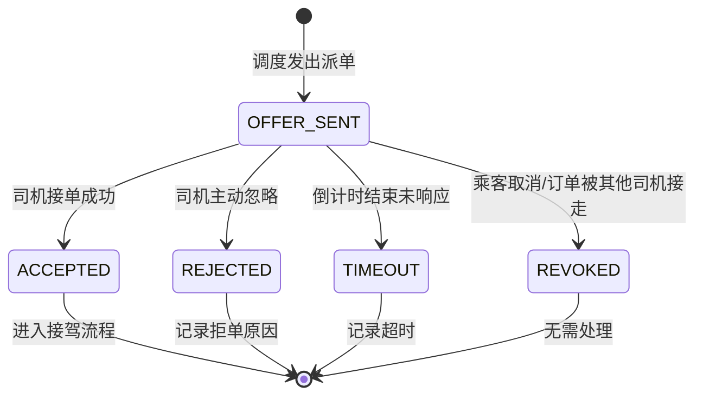
```mermaid
stateDiagram-v2
    [*] --> OFFER_SENT: 调度发出派单
    OFFER_SENT --> ACCEPTED: 司机接单成功
    OFFER_SENT --> REJECTED: 司机主动忽略
    OFFER_SENT --> TIMEOUT: 倒计时结束未响应
    OFFER_SENT --> REVOKED: 乘客取消/订单被其他司机接走
    ACCEPTED --> [*]: 进入接驾流程
    REJECTED --> [*]: 记录拒单原因
    TIMEOUT --> [*]: 记录超时
    REVOKED --> [*]: 无需处理
```

#### 2.4 关键规则清单

1. **派单倒计时**：默认 15 秒，预约单 20 秒，企业单 10 秒；倒计时结束前司机不可接收其他派单。
2. **拒单惩罚**：
   - 当日拒单率 <= 10%：无惩罚。
   - 拒单率 10%~30%：派单优先级降低 20%。
   - 拒单率 > 30%：暂停派单 2 小时，需完成学习视频后恢复。
   - 强派订单拒单：直接暂停派单 4 小时。
3. **热力图规则**：按 500m*500m 网格聚合最近 5 分钟订单密度，颜色分级（绿/黄/红）展示；仅展示相对供需，不展示具体订单信息。
4. **听单设置**：
   - 接驾距离上限：司机可设置最大接驾距离（1km/2km/3km/5km/不限）。
   - 顺路目的地：设置后优先推送终点方向一致的订单。
   - 偏好区域：可设置 1-3 个常去区域，系统优先在该区域内派单。
5. **强派规则**：以下场景触发强派（司机不可拒绝，只能接受）：
   - 极端恶劣天气（暴雨/暴雪/台风）。
   - 重大节假日运力严重不足。
   - 重点保障区域（机场/高铁站深夜）。

### ③ 数据字典（L3）

#### 3.1 实体关系图

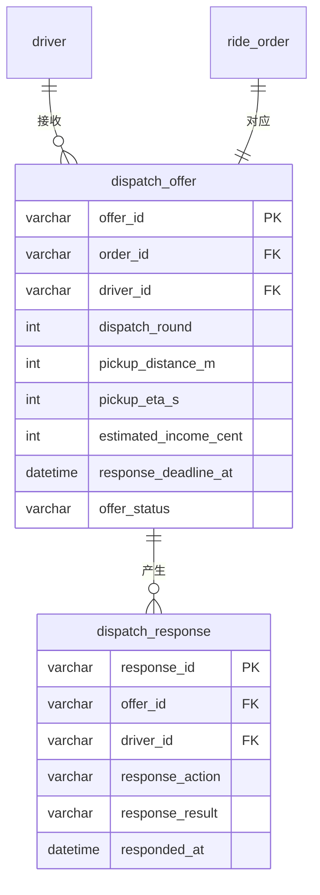
```mermaid
erDiagram
    driver ||--o{ dispatch_offer : "接收"
    ride_order ||--|| dispatch_offer : "对应"
    dispatch_offer ||--o{ dispatch_response : "产生"

    dispatch_offer {
        varchar offer_id PK
        varchar order_id FK
        varchar driver_id FK
        int dispatch_round
        int pickup_distance_m
        int pickup_eta_s
        int estimated_income_cent
        datetime response_deadline_at
        varchar offer_status
    }

    dispatch_response {
        varchar response_id PK
        varchar offer_id FK
        varchar driver_id FK
        varchar response_action
        varchar response_result
        datetime responded_at
    }
```

#### 3.2 表结构

##### 表 1：dispatch_offer（派单记录表）

- **表名 / 中文名**：`dispatch_offer` / 派单记录表
- **业务说明**：记录每次向司机发出的派单信息。
- **分库分表策略**：按 `order_id` 哈希分 32 库，每库 128 表。
- **预估数据量**：日增 2000 万条，存储 30 天。

| 字段名 | 中文 | 类型 | 长度 | 允许空 | 默认值 | 索引 | 示例 | 业务说明 |
|---|---|---|---|---|---|---|---|---|
| offer_id | 派单 ID | varchar | 32 | 否 | - | PK | off_001 | - |
| order_id | 订单 ID | varchar | 32 | 否 | - | FK | ord_001 | - |
| driver_id | 司机 ID | varchar | 32 | 否 | - | FK | d_001 | - |
| dispatch_round | 派单轮次 | int | 10 | 否 | 1 | - | 1 | 1/2/3... |
| pickup_distance_m | 接驾距离 | int | 10 | 否 | - | - | 1200 | 米 |
| pickup_eta_s | 接驾 ETA | int | 10 | 否 | - | - | 240 | 秒 |
| estimated_income_cent | 预估收入 | int | 10 | 否 | - | - | 2800 | 分（司机视角） |
| estimated_fare_cent | 预估车费 | int | 10 | 否 | - | - | 3560 | 分（乘客支付） |
| passenger_score_tag | 乘客标签 | varchar | 16 | 是 | NULL | - | GOOD | GOOD/NORMAL（基于历史评价） |
| response_deadline_at | 响应截止 | datetime(3) | - | 否 | - | - | 2026-04-21 10:00:15 | - |
| offer_status | 派单状态 | varchar | 16 | 否 | SENT | - | SENT | SENT/ACCEPTED/REJECTED/TIMEOUT/REVOKED |
| sent_at | 发出时间 | datetime(3) | - | 否 | - | - | 2026-04-21 10:00:00 | - |
| is_force_dispatch | 是否强派 | tinyint | 1 | 否 | 0 | - | 0 | 1=强派不可拒 |

- **索引清单**
  - 主键：`PRIMARY KEY (offer_id)`
  - 联合索引：`KEY idx_driver_sent (driver_id, sent_at)` ——司机派单历史
  - 联合索引：`KEY idx_order_round (order_id, dispatch_round)` ——订单派单轮次

##### 表 2：dispatch_response（派单响应表）

- **表名 / 中文名**：`dispatch_response` / 派单响应表
- **业务说明**：记录司机对派单的响应动作。
- **分库分表策略**：与 dispatch_offer 同库同表规则。

| 字段名 | 中文 | 类型 | 长度 | 允许空 | 默认值 | 索引 | 示例 | 业务说明 |
|---|---|---|---|---|---|---|---|---|
| response_id | 响应 ID | varchar | 32 | 否 | - | PK | resp_001 | - |
| offer_id | 派单 ID | varchar | 32 | 否 | - | FK | off_001 | - |
| driver_id | 司机 ID | varchar | 32 | 否 | - | - | d_001 | - |
| response_action | 响应动作 | varchar | 16 | 否 | - | - | ACCEPT | ACCEPT/REJECT/TIMEOUT |
| response_result | 处理结果 | varchar | 16 | 否 | - | - | SUCCESS | SUCCESS/FAILED/ORDER_TAKEN |
| reject_reason_code | 拒绝原因码 | varchar | 32 | 是 | NULL | - | TOO_FAR | TOO_FAR/LOW_PRICE/DIRECTION_MISMATCH |
| responded_at | 响应时间 | datetime(3) | - | 否 | - | - | 2026-04-21 10:00:08 | - |
| client_lat | 响应时纬度 | decimal | 10,7 | 是 | NULL | - | 31.23 | - |
| client_lng | 响应时经度 | decimal | 10,7 | 是 | NULL | - | 121.47 | - |

#### 3.3 枚举字典

| 枚举名 | 取值集合 | 所属字段 | Owner |
|---|---|---|---|
| offer_status_enum | SENT/ACCEPTED/REJECTED/TIMEOUT/REVOKED | dispatch_offer.offer_status | 调度中心 |
| response_action_enum | ACCEPT/REJECT/TIMEOUT | dispatch_response.response_action | 调度中心 |
| response_result_enum | SUCCESS/FAILED/ORDER_TAKEN/EXPIRED | dispatch_response.response_result | 调度中心 |
| reject_reason_enum | TOO_FAR/LOW_PRICE/DIRECTION_MISMATCH/PASSENGER_RATING/OTHER | dispatch_response.reject_reason_code | 调度中心 |

#### 3.4 接口出入参示例

**接口**：`POST /api/v1/driver/dispatch/respond`（响应派单）

**Request Body**：
```json
{
  "offer_id": "off_20260421100001",
  "action": "ACCEPT",
  "client_lat": 31.2304167,
  "client_lng": 121.4737010,
  "idempotency_key": "idem_resp_001"
}
```

**Response Body（成功）**：
```json
{
  "code": 0,
  "message": "success",
  "data": {
    "response_result": "SUCCESS",
    "order_id": "ord_202604210001",
    "passenger_info": {
      "passenger_mobile_mask": "138****8000",
      "pickup_poi": "环球港购物中心",
      "pickup_lat": 31.2304,
      "pickup_lng": 121.4737,
      "dest_poi": "浦东机场T2",
      "dest_lat": 31.1443,
      "dest_lng": 121.8083
    },
    "estimated_income_yuan": "28.00",
    "navigate_url": "hxz://nav?order_id=ord_001"
  }
}
```

### ④ 关联模块

#### 4.1 上游依赖

| 依赖模块 | 提供内容 |
|---|---|
| 调度服务 | 派单算法与候选计算 |
| 订单服务 | 订单信息 |
| 消息网关 | 派单消息推送 |
| 地图服务 | 接驾距离与 ETA |

#### 4.2 下游被依赖

| 消费方 | 消费内容 |
|---|---|
| 订单服务 | 接单结果更新订单状态 |
| 调度服务 | 响应结果触发下一轮或停止派单 |

#### 4.3 同级协作

| 协作模块 | 协作内容 |
|---|---|
| 司机画像服务 | 拒单率、应答率统计 |
| 乘客端 | 接单后通知乘客 |

#### 4.4 外部系统

| 外部系统 | 用途 |
|---|---|
| 高德/腾讯地图 | 接驾距离计算 |

---

## 2.3 接单确认与导航接驾

### 需求元信息（Meta）

| 属性 | 内容 |
|---|---|
| 需求编号 | DRV-003 |
| 优先级 | P0 |
| 所属域 | 司机域-接驾服务 |
| 责任产品 | 司机端产品经理 |
| 责任研发 | 接驾服务 / 地图导航服务 |
| 版本 | v1.0.0 |

### ① 需求场景描述

#### 1.1 角色与场景（Who / When / Where）

| 维度 | 描述 |
|---|---|
| Who | 已接单成功的司机 |
| When | 接单后至到达上车点前 |
| Where | 司机 App 接驾导航页 |

#### 1.2 用户痛点与业务价值（Why）

- **痛点 1**：导航路线不合理，导致接驾时间过长。
- **痛点 2**：到达上车点后找不到乘客，沟通成本高。
- **痛点 3**：乘客临时变更上车点，司机需重新导航。
- **业务价值**：智能导航减少接驾时间 10%+；到达确认机制降低取消率 2%+。

#### 1.3 功能范围

| 类别 | 范围说明 |
|---|---|
| **In Scope** | 内置导航（高德/腾讯 SDK）、路线偏好设置（高速优先/躲避拥堵）、实时路况展示、预计到达时间动态更新、到达上车点确认、乘客位置共享（乘客实时位置）、联系乘客（隐私号拨号）、乘客变更上车点重新导航、异常上报（堵车/事故/封路） |
| **边界** | 导航数据依赖第三方地图 |
| **非目标** | AR 实景导航、车内语音助手 |

#### 1.4 验收标准

| 指标 | 目标值 | 计算口径 |
|---|---|---|
| 导航拉起成功率 | >= 99.5% | 接单后 2s 内导航启动 / 接单成功总数 |
| 接驾状态同步成功率 | >= 99.9% | 到达后状态成功切换 / 点击已到达总数 |
| 导航路径有效率 | >= 99.8% | 生成有效可导航路径 / 导航请求总数 |
| 接驾平均时长 | <= 5 分钟 | 接单 → 到达上车点的平均时长 |

### ② 业务流程

#### 2.1 主流程（mermaid sequenceDiagram）

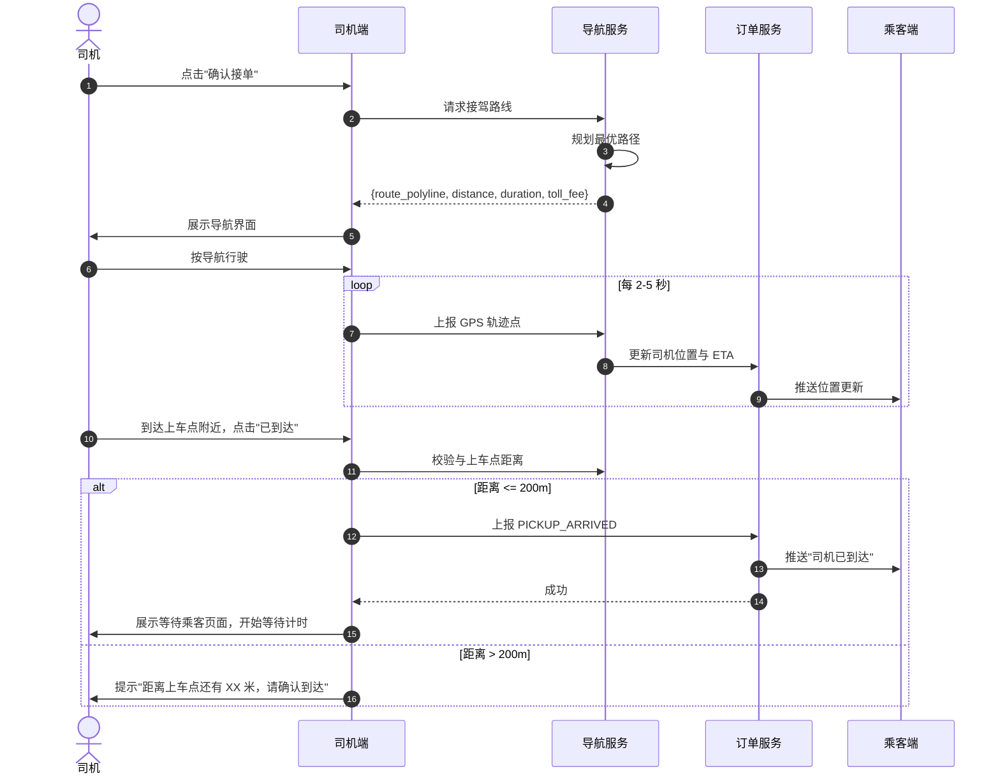
```mermaid
sequenceDiagram
    autonumber
    actor D as 司机
    participant C as 司机端
    participant NAV as 导航服务
    participant OS as 订单服务
    participant PAX as 乘客端

    D->>C: 点击"确认接单"
    C->>NAV: 请求接驾路线
    NAV->>NAV: 规划最优路径
    NAV-->>C: {route_polyline, distance, duration, toll_fee}
    C->>D: 展示导航界面
    D->>C: 按导航行驶

    loop 每 2-5 秒
        C->>NAV: 上报 GPS 轨迹点
        NAV->>OS: 更新司机位置与 ETA
        OS->>PAX: 推送位置更新
    end

    D->>C: 到达上车点附近，点击"已到达"
    C->>NAV: 校验与上车点距离
    alt 距离 <= 200m
        C->>OS: 上报 PICKUP_ARRIVED
        OS->>PAX: 推送"司机已到达"
        OS-->>C: 成功
        C->>D: 展示等待乘客页面，开始等待计时
    else 距离 > 200m
        C->>D: 提示"距离上车点还有 XX 米，请确认到达"
    end
```

#### 2.2 异常分支与 SOP

| 异常场景 | 触发条件 | 系统行为 | 前端展示 | SOP |
|---|---|---|---|---|
| 导航无路线 | 起点终点无法通行 | 推荐备选路线或引导手动选点 | 提示"暂无推荐路线，请尝试地图选点" | - |
| 到达校验失败 | 距离 > 200m 点击到达 | 拒绝状态变更 | 提示"请到达上车点附近后再确认" | - |
| 乘客未出现 | 到达后等待 > 5 分钟 | 允许司机点击"乘客未出现"，系统判责 | 提示"已等待5分钟，可点击乘客未出现" | 客服介入判责 |
| 乘客变更上车点 | 乘客修改上车点 | 重新规划路线，更新 ETA | 提示"乘客修改了上车点，正在重新规划路线" | - |
| 道路临时封闭 | 行驶中遇到封路 | 自动重新规划路线 | 提示"前方道路封闭，已重新规划路线" | - |

#### 2.3 状态机（接驾阶段）

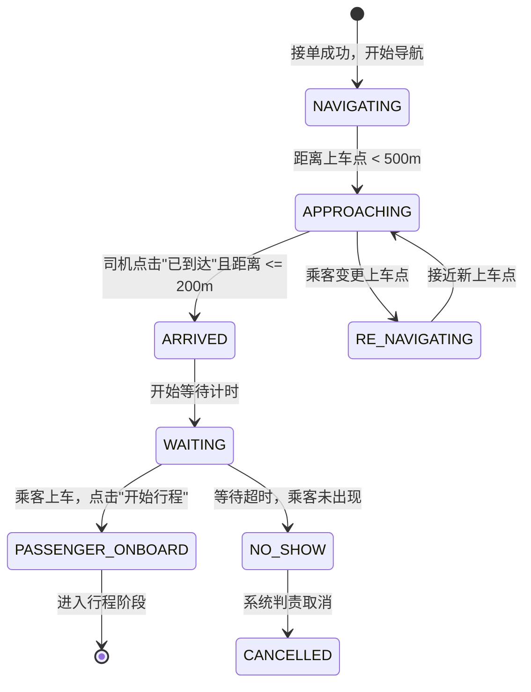
```mermaid
stateDiagram-v2
    [*] --> NAVIGATING: 接单成功，开始导航
    NAVIGATING --> APPROACHING: 距离上车点 < 500m
    APPROACHING --> ARRIVED: 司机点击"已到达"且距离 <= 200m
    APPROACHING --> RE_NAVIGATING: 乘客变更上车点
    RE_NAVIGATING --> APPROACHING: 接近新上车点
    ARRIVED --> WAITING: 开始等待计时
    WAITING --> PASSENGER_ONBOARD: 乘客上车，点击"开始行程"
    WAITING --> NO_SHOW: 等待超时，乘客未出现
    NO_SHOW --> CANCELLED: 系统判责取消
    PASSENGER_ONBOARD --> [*]: 进入行程阶段
```

#### 2.4 关键规则清单

1. **到达校验**：司机点击"已到达"时，系统校验当前 GPS 位置与订单上车点距离 <= 200m；若超过则提示司机继续行驶。
2. **等待计时**：司机到达后开始等待计时，免费等待时长 5 分钟（各城市可配置）；超时后司机可申请"乘客未出现"，系统按规则判责。
3. **隐私号通话**：司机与乘客通过隐私号联系，通话录音留存 30 天；订单完结 24 小时后隐私号失效。
4. **偏航提醒**：接驾过程中若司机偏离导航路线 > 200m 且持续 30 秒，系统提醒司机"已偏离推荐路线"。
5. **重新导航**：乘客修改上车点后，司机端自动重新规划路线；若新上车点距离原上车点 > 2km，司机可选择拒绝并取消订单（无责）。

### ③ 数据字典（L3）

#### 3.1 实体关系图

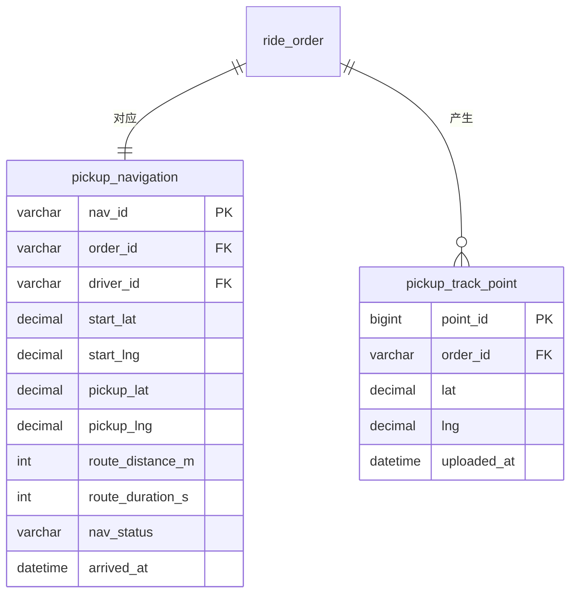
```mermaid
erDiagram
    ride_order ||--|| pickup_navigation : "对应"
    ride_order ||--o{ pickup_track_point : "产生"

    pickup_navigation {
        varchar nav_id PK
        varchar order_id FK
        varchar driver_id FK
        decimal start_lat
        decimal start_lng
        decimal pickup_lat
        decimal pickup_lng
        int route_distance_m
        int route_duration_s
        varchar nav_status
        datetime arrived_at
    }

    pickup_track_point {
        bigint point_id PK
        varchar order_id FK
        decimal lat
        decimal lng
        datetime uploaded_at
    }
```

#### 3.2 表结构

##### 表 1：pickup_navigation（接驾导航表）

- **表名 / 中文名**：`pickup_navigation` / 接驾导航表
- **业务说明**：记录每次接驾导航的会话信息。
- **分库分表策略**：按 `order_id` 哈希分 32 库，每库 64 表。

| 字段名 | 中文 | 类型 | 长度 | 允许空 | 默认值 | 索引 | 示例 | 业务说明 |
|---|---|---|---|---|---|---|---|---|
| nav_id | 导航 ID | varchar | 32 | 否 | - | PK | nav_001 | - |
| order_id | 订单 ID | varchar | 32 | 否 | - | FK | ord_001 | - |
| driver_id | 司机 ID | varchar | 32 | 否 | - | - | d_001 | - |
| start_lat | 起始纬度 | decimal | 10,7 | 否 | - | - | 31.23 | 接单时位置 |
| start_lng | 起始经度 | decimal | 10,7 | 否 | - | - | 121.47 | - |
| pickup_lat | 上车点纬度 | decimal | 10,7 | 否 | - | - | 31.2304 | - |
| pickup_lng | 上车点经度 | decimal | 10,7 | 否 | - | - | 121.4737 | - |
| route_distance_m | 路径里程 | int | 10 | 否 | - | - | 1200 | 米 |
| route_duration_s | 路径时长 | int | 10 | 否 | - | - | 240 | 秒 |
| toll_fee_cent | 过路费 | int | 10 | 是 | 0 | - | 0 | 分 |
| nav_status | 导航状态 | varchar | 16 | 否 | NAVIGATING | - | ARRIVED | NAVIGATING/ARRIVED/RE_NAVIGATED/CANCELLED |
| arrived_at | 到达时间 | datetime(3) | - | 是 | NULL | - | 2026-04-21 10:05:00 | - |
| wait_started_at | 等待开始 | datetime(3) | - | 是 | NULL | - | 2026-04-21 10:05:00 | - |
| passenger_onboard_at | 上车时间 | datetime(3) | - | 是 | NULL | - | 2026-04-21 10:06:00 | - |

##### 表 2：pickup_track_point（接驾轨迹点表）

- **表名 / 中文名**：`pickup_track_point` / 接驾轨迹点表
- **业务说明**：接驾阶段司机 GPS 轨迹，较行程轨迹点存储周期短。
- **分库分表策略**：按 `order_id` 哈希分 32 库，每库 128 表。
- **预估数据量**：日增 3 亿点，存储 7 天。

| 字段名 | 中文 | 类型 | 长度 | 允许空 | 默认值 | 索引 | 示例 | 业务说明 |
|---|---|---|---|---|---|---|---|---|
| point_id | 点 ID | bigint | 20 | 否 | AUTO_INCREMENT | PK | 1 | - |
| order_id | 订单 ID | varchar | 32 | 否 | - | FK | ord_001 | - |
| lat | 纬度 | decimal | 10,7 | 否 | - | - | 31.23 | - |
| lng | 经度 | decimal | 10,7 | 否 | - | - | 121.47 | - |
| speed_kmh | 速度 | decimal | 5,2 | 是 | NULL | - | 30.00 | - |
| uploaded_at | 上报时间 | datetime(3) | - | 否 | - | - | 2026-04-21 10:02:00 | - |

#### 3.3 枚举字典

| 枚举名 | 取值集合 | 所属字段 | Owner |
|---|---|---|---|
| nav_status_enum | NAVIGATING/ARRIVED/RE_NAVIGATED/CANCELLED | pickup_navigation.nav_status | 接驾服务 |

#### 3.4 接口出入参示例

**接口**：`POST /api/v1/driver/order/{order_id}/arrived`（到达上报）

**Request Body**：
```json
{
  "client_lat": 31.2304167,
  "client_lng": 121.4737010,
  "arrived_type": "MANUAL"
}
```

**Response Body**：
```json
{
  "code": 0,
  "message": "success",
  "data": {
    "order_status": "PICKUP_ARRIVED",
    "wait_start_at": "2026-04-21T10:05:00+08:00",
    "free_wait_seconds": 300,
    "passenger_mobile_mask": "138****8000"
  }
}
```

### ④ 关联模块

#### 4.1 上游依赖

| 依赖模块 | 提供内容 |
|---|---|
| 地图导航 SDK | 路线规划、实时导航、路况 |
| 订单服务 | 订单状态与上下车点信息 |
| 隐私号服务 | 司机乘客通话中转 |

#### 4.2 下游被依赖

| 消费方 | 消费内容 |
|---|---|
| 乘客端 | 司机位置与 ETA 展示 |
| 订单服务 | 到达状态更新 |

#### 4.3 同级协作

| 协作模块 | 协作内容 |
|---|---|
| 调度服务 | 接驾阶段异常取消后的重新派单 |

#### 4.4 外部系统

| 外部系统 | 用途 |
|---|---|
| 高德地图导航 SDK | Android/iOS 内置导航 |
| 腾讯地图导航 SDK | 备用导航引擎 |

---

## 2.4 行程执行与轨迹上报

### 需求元信息（Meta）

| 属性 | 内容 |
|---|---|
| 需求编号 | DRV-004 |
| 优先级 | P0 |
| 所属域 | 司机域-行程服务 |
| 责任产品 | 司机端产品经理 |
| 责任研发 | 行程服务 / 轨迹服务 / 计费服务 |
| 版本 | v1.0.0 |

### ① 需求场景描述

#### 1.1 角色与场景（Who / When / Where）

| 维度 | 描述 |
|---|---|
| Who | 已接上乘客、正在行程中的司机 |
| When | 乘客上车后至到达终点前 |
| Where | 司机 App 行程中页面 |

#### 1.2 用户痛点与业务价值（Why）

- **痛点 1**：一口价订单司机担心平台克扣里程，需要透明计费依据。
- **痛点 2**：行程中偏航或绕路引发乘客投诉。
- **痛点 3**：行程结束计费争议多，缺乏可信轨迹证据。
- **业务价值**：高精度轨迹为计费提供可信依据；偏航实时预警降低投诉率 3%+。

#### 1.3 功能范围

| 类别 | 范围说明 |
|---|---|
| **In Scope** | 开始行程确认、终点到达确认、行程中轨迹上报（2-5s/点）、实时里程计算、偏航检测与提醒、计费明细实时展示、临时修改终点、行程录音（可选开启）、一键报警 |
| **边界** | 一口价订单行程中不实时改价（除修改终点外） |
| **非目标** | 车内视频监控、乘客身份二次核验 |

#### 1.4 验收标准

| 指标 | 目标值 | 计算口径 |
|---|---|---|
| 行程状态变更成功率 | >= 99.9% | 开始/结束行程状态更新成功 / 操作总数 |
| 轨迹点上报成功率 | >= 99.5% | 服务端 ACK 成功 / 客户端上报总数 |
| 轨迹丢包率 | <= 0.5% | 缺失轨迹点 / 应发轨迹点 |
| 偏航识别准确率 | >= 95% | 正确识别偏航 / 总偏航样本（标注集） |

### ② 业务流程

#### 2.1 主流程（mermaid sequenceDiagram）

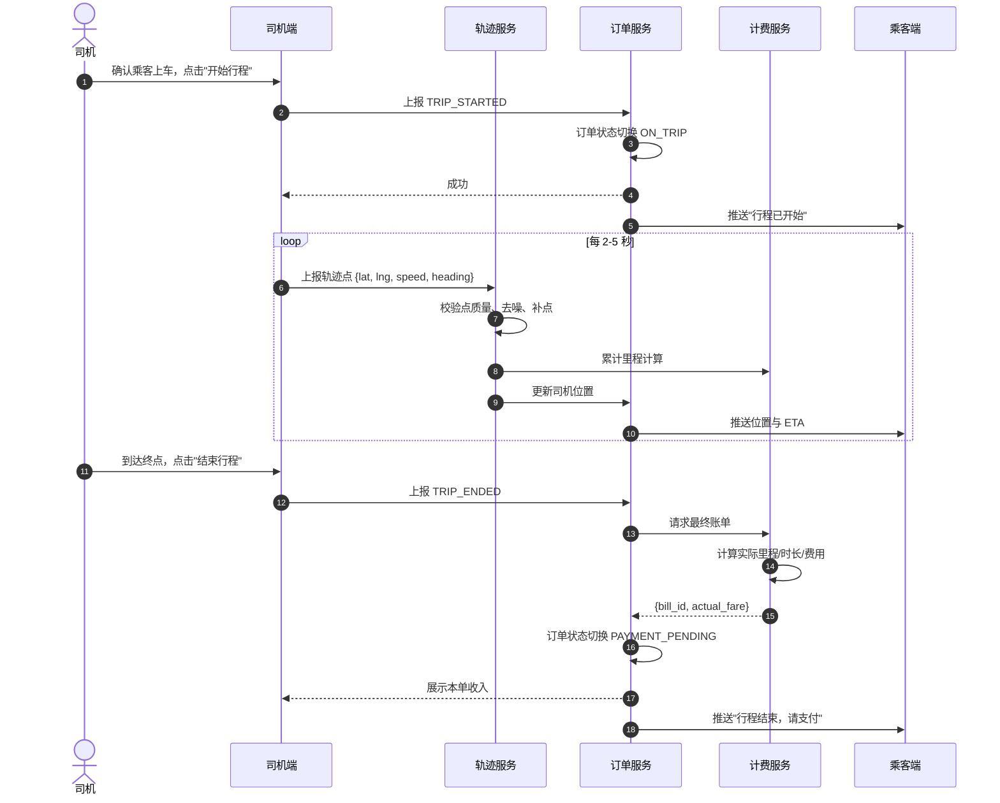
```mermaid
sequenceDiagram
    autonumber
    actor D as 司机
    participant C as 司机端
    participant TS as 轨迹服务
    participant OS as 订单服务
    participant BILL as 计费服务
    participant PAX as 乘客端

    D->>C: 确认乘客上车，点击"开始行程"
    C->>OS: 上报 TRIP_STARTED
    OS->>OS: 订单状态切换 ON_TRIP
    OS-->>C: 成功
    OS->>PAX: 推送"行程已开始"

    loop 每 2-5 秒
        C->>TS: 上报轨迹点 {lat, lng, speed, heading}
        TS->>TS: 校验点质量、去噪、补点
        TS->>BILL: 累计里程计算
        TS->>OS: 更新司机位置
        OS->>PAX: 推送位置与 ETA
    end

    D->>C: 到达终点，点击"结束行程"
    C->>OS: 上报 TRIP_ENDED
    OS->>BILL: 请求最终账单
    BILL->>BILL: 计算实际里程/时长/费用
    BILL-->>OS: {bill_id, actual_fare}
    OS->>OS: 订单状态切换 PAYMENT_PENDING
    OS-->>C: 展示本单收入
    OS->>PAX: 推送"行程结束，请支付"
```

#### 2.2 异常分支与 SOP

| 异常场景 | 触发条件 | 系统行为 | 前端展示 | SOP |
|---|---|---|---|---|
| 轨迹中断 | 连续 30s 无轨迹点 | 标记轨迹中断，触发告警 | 提示"GPS信号弱，请检查定位" | 轨迹服务监控 |
| 偏航预警 | 偏离规划路线 > 500m | 推送偏航提醒 | 提示"已偏离规划路线，请注意" | 客服关注 |
| 乘客要求修改终点 | 行程中修改目的地 | 重新规划路线，一口价重新计算（如有差价展示） | 提示"终点已修改，价格调整为 XX 元" | - |
| 终点校验失败 | 终点距离 > 1km 点击结束 | 提示确认 | 提示"距离终点还有 XX 米，是否确认结束？" | - |
| 行程中取消 | 极端情况（如车辆故障） | 按异常取消处理，记录原因 | 提示"行程异常结束，已记录原因" | 客服跟进 |

#### 2.3 状态机（行程阶段）

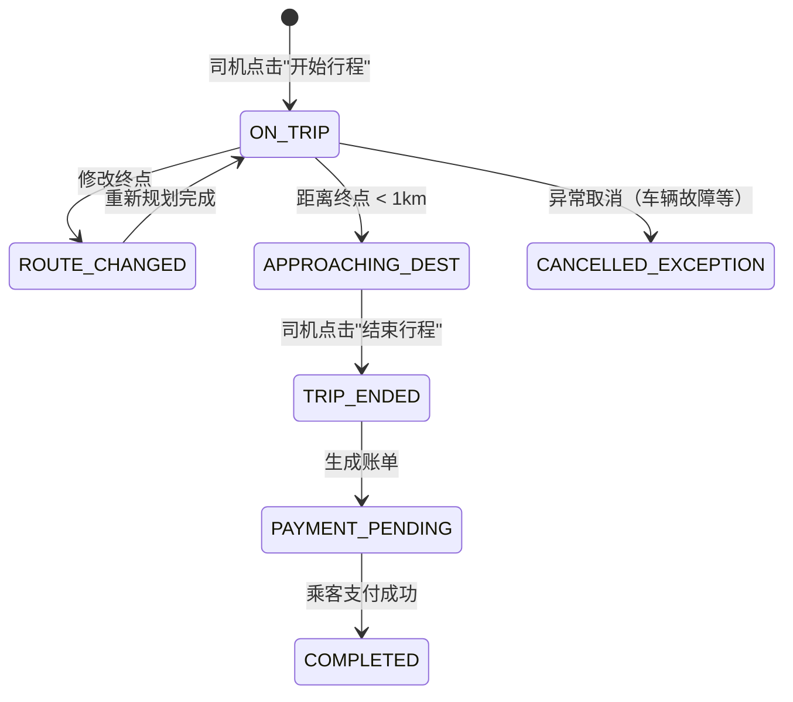
```mermaid
stateDiagram-v2
    [*] --> ON_TRIP: 司机点击"开始行程"
    ON_TRIP --> ROUTE_CHANGED: 修改终点
    ROUTE_CHANGED --> ON_TRIP: 重新规划完成
    ON_TRIP --> APPROACHING_DEST: 距离终点 < 1km
    APPROACHING_DEST --> TRIP_ENDED: 司机点击"结束行程"
    TRIP_ENDED --> PAYMENT_PENDING: 生成账单
    PAYMENT_PENDING --> COMPLETED: 乘客支付成功
    ON_TRIP --> CANCELLED_EXCEPTION: 异常取消（车辆故障等）
```

#### 2.4 关键规则清单

1. **轨迹上报频率**：
   - 城市快速路/高速：2 秒/点。
   - 普通道路：3 秒/点。
   - 拥堵路段：< 20km/h 时 5 秒/点。
2. **里程计算规则**：
   - 基于轨迹点连线累加，剔除 GPS 漂移点（速度 > 200km/h 或两点间速度 > 150km/h 视为漂移）。
   - 隧道/高架 GPS 丢失时，基于惯性导航与地图匹配补点。
3. **一口价重新计算**：行程中修改终点时，基于新路线重新计算一口价；若新价格 > 原价格，展示差价由乘客确认；若新价格 < 原价格，按原价格执行（不降价）。
4. **行程录音**：司机可选择开启行程录音，录音文件加密存储 7 天，仅供安全投诉时调阅；开启前需乘客端提示。
5. **一键报警**：行程中司机可点击一键报警，触发：
   - 拨打 110（自动填充当前位置）。
   - 通知平台安全运营中心。
   - 向乘客紧急联系人发送短信（如乘客开启）。

### ③ 数据字典（L3）

#### 3.1 实体关系图

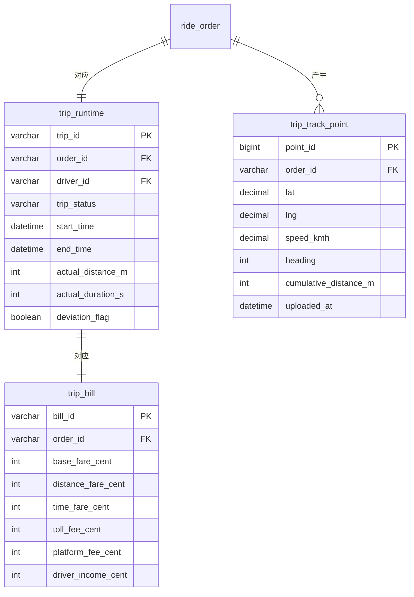
```mermaid
erDiagram
    ride_order ||--|| trip_runtime : "对应"
    ride_order ||--o{ trip_track_point : "产生"
    trip_runtime ||--|| trip_bill : "对应"

    trip_runtime {
        varchar trip_id PK
        varchar order_id FK
        varchar driver_id FK
        varchar trip_status
        datetime start_time
        datetime end_time
        int actual_distance_m
        int actual_duration_s
        boolean deviation_flag
    }

    trip_track_point {
        bigint point_id PK
        varchar order_id FK
        decimal lat
        decimal lng
        decimal speed_kmh
        int heading
        int cumulative_distance_m
        datetime uploaded_at
    }

    trip_bill {
        varchar bill_id PK
        varchar order_id FK
        int base_fare_cent
        int distance_fare_cent
        int time_fare_cent
        int toll_fee_cent
        int platform_fee_cent
        int driver_income_cent
    }
```

#### 3.2 表结构

##### 表 1：trip_runtime（行程运行时表）

- **表名 / 中文名**：`trip_runtime` / 行程运行时表
- **业务说明**：记录行程执行过程中的核心运行时数据。
- **分库分表策略**：按 `order_id` 哈希分 32 库，每库 64 表。

| 字段名 | 中文 | 类型 | 长度 | 允许空 | 默认值 | 索引 | 示例 | 业务说明 |
|---|---|---|---|---|---|---|---|---|
| trip_id | 行程 ID | varchar | 32 | 否 | - | PK | trip_001 | - |
| order_id | 订单 ID | varchar | 32 | 否 | - | FK | ord_001 | - |
| driver_id | 司机 ID | varchar | 32 | 否 | - | - | d_001 | - |
| trip_status | 行程状态 | varchar | 16 | 否 | STARTED | - | ON_TRIP | STARTED/ON_TRIP/ROUTE_CHANGED/ENDED |
| start_time | 开始时间 | datetime(3) | - | 否 | - | - | 2026-04-21 10:06:00 | - |
| end_time | 结束时间 | datetime(3) | - | 是 | NULL | - | 2026-04-21 10:35:00 | - |
| actual_distance_m | 实际里程 | int | 10 | 否 | 0 | - | 12800 | 米 |
| actual_duration_s | 实际时长 | int | 10 | 否 | 0 | - | 1740 | 秒 |
| deviation_flag | 是否偏航 | tinyint | 1 | 否 | 0 | - | 0 | 1=偏航 |
| deviation_count | 偏航次数 | int | 10 | 否 | 0 | - | 0 | - |
| max_speed_kmh | 最高速度 | decimal | 5,2 | 是 | NULL | - | 85.50 | km/h |
| avg_speed_kmh | 平均速度 | decimal | 5,2 | 是 | NULL | - | 35.20 | km/h |
| route_polyline | 路线编码 | text | - | 是 | NULL | - | polyline_str | 用于回放 |
| toll_fee_cent | 过路费 | int | 10 | 否 | 0 | - | 500 | 分 |

##### 表 2：trip_bill（行程账单表）

- **表名 / 中文名**：`trip_bill` / 行程账单表
- **业务说明**：行程结束后生成的账单明细，一口价与实时计费共用。
- **分库分表策略**：按 `order_id` 哈希分 32 库，每库 64 表。

| 字段名 | 中文 | 类型 | 长度 | 允许空 | 默认值 | 索引 | 示例 | 业务说明 |
|---|---|---|---|---|---|---|---|---|
| bill_id | 账单 ID | varchar | 32 | 否 | - | PK | bill_001 | - |
| order_id | 订单 ID | varchar | 32 | 否 | - | FK | ord_001 | - |
| passenger_id | 乘客 ID | varchar | 32 | 否 | - | - | p_001 | - |
| driver_id | 司机 ID | varchar | 32 | 否 | - | - | d_001 | - |
| fare_type | 计费类型 | varchar | 16 | 否 | FIXED | - | FIXED | FIXED/REALTIME |
| base_fare_cent | 起步价 | int | 10 | 否 | 0 | - | 1200 | 分 |
| distance_fare_cent | 里程费 | int | 10 | 否 | 0 | - | 1800 | 分 |
| time_fare_cent | 时长费 | int | 10 | 否 | 0 | - | 560 | 分 |
| long_distance_fare_cent | 远途费 | int | 10 | 否 | 0 | - | 0 | 分 |
| night_fare_cent | 夜间费 | int | 10 | 否 | 0 | - | 0 | 分 |
| toll_fee_cent | 过路费 | int | 10 | 否 | 0 | - | 0 | 分 |
| parking_fee_cent | 停车费 | int | 10 | 否 | 0 | - | 0 | 分 |
| other_fee_cent | 其他费 | int | 10 | 否 | 0 | - | 0 | 分 |
| dynamic_adjustment_cent | 动态调价 | int | 10 | 否 | 0 | - | 0 | 分 |
| coupon_discount_cent | 优惠券抵扣 | int | 10 | 否 | 0 | - | 500 | 分 |
| payable_amount_cent | 应付金额 | int | 10 | 否 | - | - | 3560 | 分 |
| platform_fee_cent | 平台服务费 | int | 10 | 否 | - | - | 760 | 分 |
| driver_income_cent | 司机收入 | int | 10 | 否 | - | - | 2800 | 分 |
| tax_amount_cent | 税费 | int | 10 | 否 | 0 | - | 0 | 分 |
| bill_status | 账单状态 | varchar | 16 | 否 | PENDING | - | PENDING | PENDING/CONFIRMED/DISPUTED/ADJUSTED |

#### 3.3 枚举字典

| 枚举名 | 取值集合 | 所属字段 | Owner |
|---|---|---|---|
| trip_status_enum | STARTED/ON_TRIP/ROUTE_CHANGED/ENDED | trip_runtime.trip_status | 行程服务 |
| fare_type_enum | FIXED/REALTIME | trip_bill.fare_type | 计费中心 |
| bill_status_enum | PENDING/CONFIRMED/DISPUTED/ADJUSTED | trip_bill.bill_status | 计费中心 |

#### 3.4 接口出入参示例

**接口**：`POST /api/v1/driver/order/{order_id}/trip/end`（结束行程）

**Request Body**：
```json
{
  "client_lat": 31.1443439,
  "client_lng": 121.8082730,
  "actual_distance_m": 12800,
  "actual_duration_s": 1740,
  "toll_fee_cent": 0,
  "parking_fee_cent": 0,
  "end_type": "NORMAL"
}
```

**Response Body**：
```json
{
  "code": 0,
  "message": "success",
  "data": {
    "order_status": "PAYMENT_PENDING",
    "bill": {
      "bill_id": "bill_202604210001",
      "payable_amount_yuan": "35.60",
      "driver_income_yuan": "28.00",
      "platform_fee_yuan": "7.60",
      "fare_breakdown": {
        "base_fare": "12.00",
        "distance_fare": "18.00",
        "time_fare": "5.60"
      }
    }
  }
}
```

### ④ 关联模块

#### 4.1 上游依赖

| 依赖模块 | 提供内容 |
|---|---|
| 轨迹服务 | GPS 点质量校验与里程计算 |
| 计费服务 | 费用计算规则 |
| 订单服务 | 订单状态管理 |

#### 4.2 下游被依赖

| 消费方 | 消费内容 |
|---|---|
| 乘客端 | 行程结束通知与账单展示 |
| 支付服务 | 账单驱动支付 |
| 结算服务 | 司机收入结算 |

#### 4.3 同级协作

| 协作模块 | 协作内容 |
|---|---|
| 司机端收入中心 | 本单收入展示 |
| 客服系统 | 账单争议处理 |

#### 4.4 外部系统

| 外部系统 | 用途 |
|---|---|
| 高德/腾讯地图 | 里程校正与偏航识别 |

---

## 2.5 司机收入与账单明细

### 需求元信息（Meta）

| 属性 | 内容 |
|---|---|
| 需求编号 | DRV-005 |
| 优先级 | P1 |
| 所属域 | 司机域-结算中心 |
| 责任产品 | 司机端产品经理 / 结算产品经理 |
| 责任研发 | 结算服务 / 司机中心 |
| 版本 | v1.0.0 |

### ① 需求场景描述

#### 1.1 角色与场景（Who / When / Where）

| 维度 | 描述 |
|---|---|
| Who | 已完成订单的司机 |
| When | 完单后查看本单收入；每日/每周查看汇总；提现时 |
| Where | 司机 App 收入中心页、钱包页 |

#### 1.2 用户痛点与业务价值（Why）

- **痛点 1**：司机不清楚平台抽成比例，担心被多扣。
- **痛点 2**：奖励活动规则复杂，司机不知道是否达标。
- **痛点 3**：提现到账慢，资金周转困难。
- **业务价值**：收入明细透明化提升司机信任度；快速提现（T+0）提升司机留存 10%+。

#### 1.3 功能范围

| 类别 | 范围说明 |
|---|---|
| **In Scope** | 本单收入明细（车费+奖励-平台费）、日/周/月收入汇总、收入趋势图表、奖励活动进度、平台服务费说明、提现申请、提现记录、账单申诉 |
| **边界** | 仅展示平台已结算完成的收入 |
| **非目标** | 司机贷款、理财产品推荐 |

#### 1.4 验收标准

| 指标 | 目标值 | 计算口径 |
|---|---|---|
| 收益账单生成成功率 | >= 99.9% | 完单后 30s 内生成 / 完单总数 |
| 账单关键字段审计通过率 | >= 99.99% | 关键字段完整且金额平衡 / 账单总数 |
| 对账差异率 | <= 0.05% | 不一致订单 / 对账订单总数 |
| 提现成功率 | >= 99.5% | 提现成功 / 提现申请总数 |

### ② 业务流程

#### 2.1 主流程（mermaid flowchart）

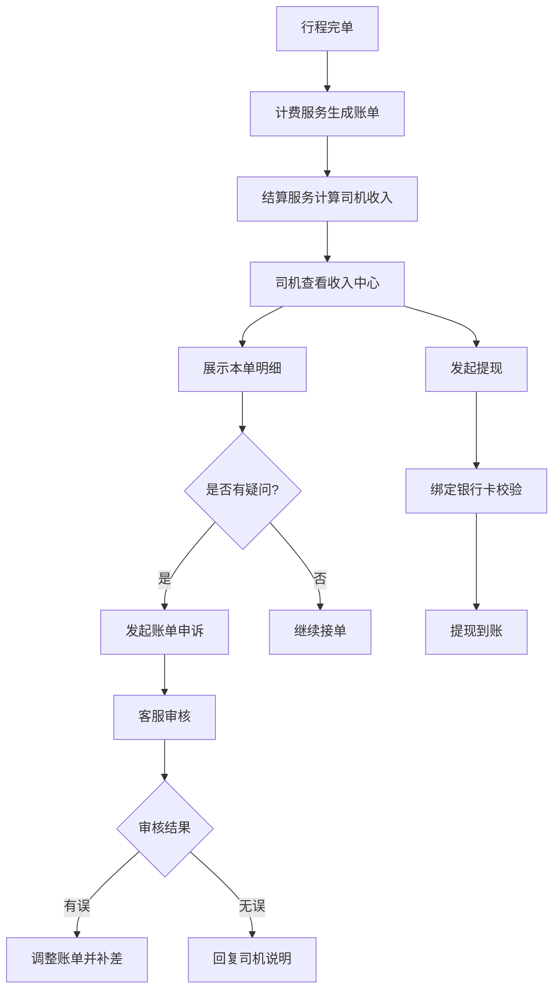
```mermaid
flowchart TD
    A[行程完单] --> B[计费服务生成账单]
    B --> C[结算服务计算司机收入]
    C --> D[司机查看收入中心]
    D --> E[展示本单明细]
    E --> F{是否有疑问?}
    F -->|是| G[发起账单申诉]
    F -->|否| H[继续接单]
    G --> I[客服审核]
    I --> J{审核结果}
    J -->|有误| K[调整账单并补差]
    J -->|无误| L[回复司机说明]
    D --> M[发起提现]
    M --> N[绑定银行卡校验]
    N --> O[提现到账]
```

#### 2.2 异常分支与 SOP

| 异常场景 | 触发条件 | 系统行为 | 前端展示 | SOP |
|---|---|---|---|---|
| 账单生成失败 | 结算服务异常 | 延迟重试，3 次后人工介入 | 提示"账单生成中，请稍候查看" | 结算运营补偿 |
| 提现银行卡异常 | 银行卡注销/冻结 | 拒绝提现，引导更换银行卡 | 提示"银行卡异常，请更换" | - |
| 提现金额超限 | 超过单日/单笔限额 | 拒绝提现 | 提示"超过提现限额" | - |
| 对账差异 | 三方金额不一致 | 冻结差异订单，进入异常队列 | - | 财务运营每日处理 |

#### 2.3 状态机（提现单生命周期）

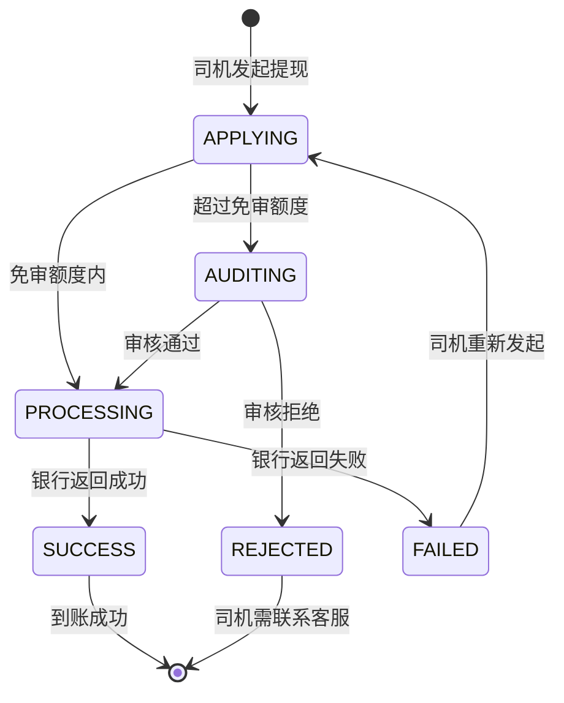
```mermaid
stateDiagram-v2
    [*] --> APPLYING: 司机发起提现
    APPLYING --> AUDITING: 超过免审额度
    APPLYING --> PROCESSING: 免审额度内
    AUDITING --> PROCESSING: 审核通过
    AUDITING --> REJECTED: 审核拒绝
    PROCESSING --> SUCCESS: 银行返回成功
    PROCESSING --> FAILED: 银行返回失败
    FAILED --> APPLYING: 司机重新发起
    SUCCESS --> [*]: 到账成功
    REJECTED --> [*]: 司机需联系客服
```

#### 2.4 关键规则清单

1. **收入构成**：司机收入 = 订单车费（扣除平台服务费）+ 奖励 + 补贴 - 取消费（有责时）- 其他扣款。
2. **平台服务费**：按订单车费比例抽成（各城市不同，通常 20%~30%）；一口价订单服务费按一口价计算。
3. **奖励类型**：
   - 高峰奖励：高峰时段完单额外奖励。
   - 冲单奖励：完成指定单量阶梯奖励。
   - 优质服务奖励：服务分 >= 95 且好评率 >= 98% 的月度奖励。
4. **提现规则**：
   - 到账时效：T+0（工作日 2 小时内到账），T+1（非工作日）。
   - 免审额度：单笔 <= 500 元且当日累计 <= 2000 元免人工审核。
   - 手续费：每笔提现手续费 1 元（平台承担或司机承担，城市可配置）。
5. **对账规则**：每日凌晨 3 点启动与支付渠道、财务系统的三方对账，差异订单自动标记。

### ③ 数据字典（L3）

#### 3.1 实体关系图

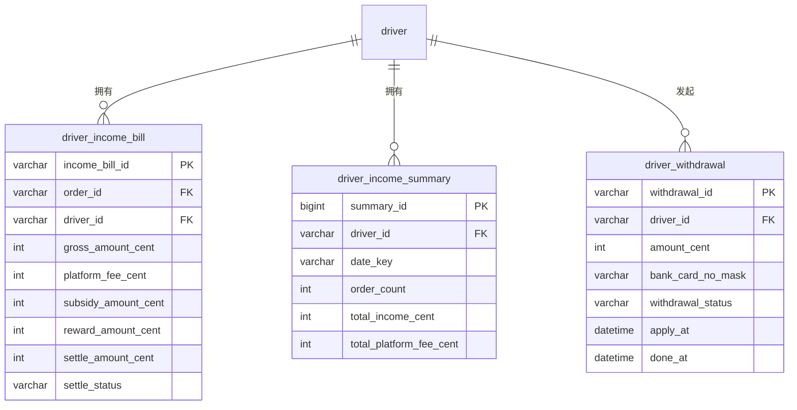
```mermaid
erDiagram
    driver ||--o{ driver_income_bill : "拥有"
    driver ||--o{ driver_income_summary : "拥有"
    driver ||--o{ driver_withdrawal : "发起"

    driver_income_bill {
        varchar income_bill_id PK
        varchar order_id FK
        varchar driver_id FK
        int gross_amount_cent
        int platform_fee_cent
        int subsidy_amount_cent
        int reward_amount_cent
        int settle_amount_cent
        varchar settle_status
    }

    driver_income_summary {
        bigint summary_id PK
        varchar driver_id FK
        varchar date_key
        int order_count
        int total_income_cent
        int total_platform_fee_cent
    }

    driver_withdrawal {
        varchar withdrawal_id PK
        varchar driver_id FK
        int amount_cent
        varchar bank_card_no_mask
        varchar withdrawal_status
        datetime apply_at
        datetime done_at
    }
```

#### 3.2 表结构

##### 表 1：driver_income_bill（司机收入账单表）

- **表名 / 中文名**：`driver_income_bill` / 司机收入账单表
- **业务说明**：每单对应的司机收入明细。
- **分库分表策略**：按 `driver_id` 哈希分 16 库，每库 128 表。
- **预估数据量**：日增 450 万条。

| 字段名 | 中文 | 类型 | 长度 | 允许空 | 默认值 | 索引 | 示例 | 业务说明 |
|---|---|---|---|---|---|---|---|---|
| income_bill_id | 收入账单 ID | varchar | 32 | 否 | - | PK | inc_001 | - |
| order_id | 订单 ID | varchar | 32 | 否 | - | FK | ord_001 | - |
| driver_id | 司机 ID | varchar | 32 | 否 | - | FK | d_001 | - |
| gross_amount_cent | 订单总金额 | int | 10 | 否 | - | - | 3560 | 分（乘客支付） |
| platform_fee_cent | 平台服务费 | int | 10 | 否 | - | - | 760 | 分 |
| platform_fee_rate | 平台费率 | decimal | 4,3 | 否 | - | - | 0.213 | 21.3% |
| subsidy_amount_cent | 补贴金额 | int | 10 | 否 | 0 | - | 200 | 分 |
| reward_amount_cent | 奖励金额 | int | 10 | 否 | 0 | - | 100 | 分 |
| penalty_amount_cent | 扣款金额 | int | 10 | 否 | 0 | - | 0 | 分 |
| tax_amount_cent | 代扣税费 | int | 10 | 否 | 0 | - | 0 | 分 |
| settle_amount_cent | 可结算金额 | int | 10 | 否 | - | - | 3100 | 分 |
| settle_status | 结算状态 | varchar | 16 | 否 | PENDING | - | SETTLED | PENDING/SETTLED/FROZEN/REFUNDED |
| settle_at | 结算时间 | datetime(3) | - | 是 | NULL | - | 2026-04-22 03:00:00 | T+1结算 |
| bill_date | 账单日期 | date | - | 否 | - | - | 2026-04-21 | 归属日期 |

##### 表 2：driver_income_summary（司机日汇总表）

- **表名 / 中文名**：`driver_income_summary` / 司机日汇总表
- **业务说明**：司机每日收入汇总，支撑快速查询。
- **分库分表策略**：按 `driver_id` 哈希分 16 库，每库 64 表。

| 字段名 | 中文 | 类型 | 长度 | 允许空 | 默认值 | 索引 | 示例 | 业务说明 |
|---|---|---|---|---|---|---|---|---|
| summary_id | 汇总 ID | bigint | 20 | 否 | AUTO_INCREMENT | PK | 1 | - |
| driver_id | 司机 ID | varchar | 32 | 否 | - | FK | d_001 | - |
| date_key | 日期 | date | - | 否 | - | UK | 2026-04-21 | driver_id+date_key 唯一 |
| order_count | 完单数 | int | 10 | 否 | 0 | - | 12 | - |
| online_hours | 在线时长 | decimal | 4,2 | 否 | 0 | - | 8.50 | 小时 |
| total_income_cent | 总收入 | int | 10 | 否 | 0 | - | 37200 | 分 |
| total_platform_fee_cent | 总平台费 | int | 10 | 否 | 0 | - | 9120 | 分 |
| total_subsidy_cent | 总补贴 | int | 10 | 否 | 0 | - | 2400 | 分 |
| total_reward_cent | 总奖励 | int | 10 | 否 | 0 | - | 1200 | 分 |
| total_penalty_cent | 总扣款 | int | 10 | 否 | 0 | - | 0 | 分 |
| avg_service_score | 平均服务分 | decimal | 3,1 | 是 | NULL | - | 4.9 | 当日评价平均分 |
| created_at | 创建时间 | datetime(3) | - | 否 | - | - | 2026-04-22 03:00:00 | - |

##### 表 3：driver_withdrawal（司机提现表）

- **表名 / 中文名**：`driver_withdrawal` / 司机提现表
- **业务说明**：司机提现申请与处理记录。
- **分库分表策略**：按 `driver_id` 哈希分 8 库，每库 64 表。

| 字段名 | 中文 | 类型 | 长度 | 允许空 | 默认值 | 索引 | 示例 | 业务说明 |
|---|---|---|---|---|---|---|---|---|
| withdrawal_id | 提现 ID | varchar | 32 | 否 | - | PK | wd_001 | - |
| driver_id | 司机 ID | varchar | 32 | 否 | - | FK | d_001 | - |
| amount_cent | 提现金额 | int | 10 | 否 | - | - | 100000 | 分 |
| bank_card_id | 银行卡 ID | varchar | 32 | 否 | - | - | bc_001 | 逻辑外键 |
| bank_card_no_mask | 银行卡脱敏 | varchar | 19 | 否 | - | - | 6222****8888 | - |
| bank_name | 银行名称 | varchar | 32 | 否 | - | - | 工商银行 | - |
| withdrawal_status | 提现状态 | varchar | 16 | 否 | APPLYING | - | SUCCESS | APPLYING/AUDITING/PROCESSING/SUCCESS/FAILED/REJECTED |
| apply_at | 申请时间 | datetime(3) | - | 否 | - | - | 2026-04-21 18:00:00 | - |
| audit_at | 审核时间 | datetime(3) | - | 是 | NULL | - | 2026-04-21 18:05:00 | - |
| auditor_id | 审核人 | varchar | 32 | 是 | NULL | - | ops_001 | - |
| done_at | 完成时间 | datetime(3) | - | 是 | NULL | - | 2026-04-21 19:30:00 | - |
| bank_transaction_id | 银行流水 | varchar | 64 | 是 | NULL | - | txn_001 | - |
| fail_reason | 失败原因 | varchar | 255 | 是 | NULL | - | 银行卡已注销 | - |

#### 3.3 枚举字典

| 枚举名 | 取值集合 | 所属字段 | Owner |
|---|---|---|---|
| settle_status_enum | PENDING/SETTLED/FROZEN/REFUNDED | driver_income_bill.settle_status | 结算中心 |
| withdrawal_status_enum | APPLYING/AUDITING/PROCESSING/SUCCESS/FAILED/REJECTED | driver_withdrawal.withdrawal_status | 结算中心 |

#### 3.4 接口出入参示例

**接口**：`GET /api/v1/driver/income/summary`（收入汇总查询）

**Request Query**：
```
?date_from=2026-04-01&date_to=2026-04-21&group_by=DAY
```

**Response Body**：
```json
{
  "code": 0,
  "message": "success",
  "data": {
    "total_income_yuan": "372.00",
    "total_order_count": 156,
    "total_online_hours": 186.5,
    "avg_platform_fee_rate": 0.213,
    "daily_list": [
      {
        "date": "2026-04-21",
        "income_yuan": "372.00",
        "order_count": 12,
        "online_hours": 8.5,
        "platform_fee_yuan": "91.20",
        "subsidy_yuan": "24.00",
        "reward_yuan": "12.00"
      }
    ]
  }
}
```

### ④ 关联模块

#### 4.1 上游依赖

| 依赖模块 | 提供内容 |
|---|---|
| 计费服务 | 订单金额与费用明细 |
| 订单服务 | 完单状态与订单信息 |
| 营销服务 | 奖励与补贴规则 |

#### 4.2 下游被依赖

| 消费方 | 消费内容 |
|---|---|
| 司机端 | 收入展示与提现 |
| 财务系统 | 资金结算与对账 |
| 运营后台 | 司机收入分析 |

#### 4.3 同级协作

| 协作模块 | 协作内容 |
|---|---|
| 客服系统 | 收入争议与账单申诉 |
| 风控系统 | 提现风险审核 |

#### 4.4 外部系统

| 外部系统 | 用途 |
|---|---|
| 银行/第三方支付 | 提现打款 |
| 电子发票平台 | 司机收入发票开具（如需） |

---

## 2.6 客服协同与异常上报

### 需求元信息（Meta）

| 属性 | 内容 |
|---|---|
| 需求编号 | DRV-006 |
| 优先级 | P1 |
| 所属域 | 司机域-服务体验 |
| 责任产品 | 客服产品经理 / 司机端产品经理 |
| 责任研发 | 客服系统 / 司机中心 |
| 版本 | v1.0.0 |

### ① 需求场景描述

#### 1.1 角色与场景（Who / When / Where）

| 维度 | 描述 |
|---|---|
| Who | 遇到问题需帮助的司机（乘客未出现、费用争议、系统异常等） |
| When | 接驾中、行程中、完单后、任何时候 |
| Where | 司机 App 订单页 / 个人中心 / 客服入口 |

#### 1.2 用户痛点与业务价值（Why）

- **痛点 1**：司机遇到问题找不到入口，或反馈后石沉大海。
- **痛点 2**：紧急问题（如乘客醉酒闹事）无法快速获得支持。
- **痛点 3**：申诉材料上传麻烦，处理进度不透明。
- **业务价值**：结构化上报+智能客服分流 60% 常见问题；紧急问题 10 分钟内响应。

#### 1.3 功能范围

| 类别 | 范围说明 |
|---|---|
| **In Scope** | 智能客服自助（FAQ+意图识别）、问题分类上报、证据上传（图片/录音/轨迹）、工单进度查询、紧急求助（安全事件）、学习培训中心（规则考试/视频） |
| **边界** | 仅处理与平台业务相关的问题 |
| **非目标** | 司机社交互助社区 |

#### 1.4 验收标准

| 指标 | 目标值 | 计算口径 |
|---|---|---|
| 工单创建成功率 | >= 99.9% | 创建成功 / 请求总数 |
| P1 工单 10 分钟响应率 | >= 95% | 10 分钟内首次响应 / P1 总数 |
| 智能客服解决率 | >= 60% | 智能客服闭环解决 / 总咨询量 |
| 工单结案满意度 | >= 4.2/5 | 结案评价平均分 |

### ② 业务流程

#### 2.1 主流程（mermaid flowchart）

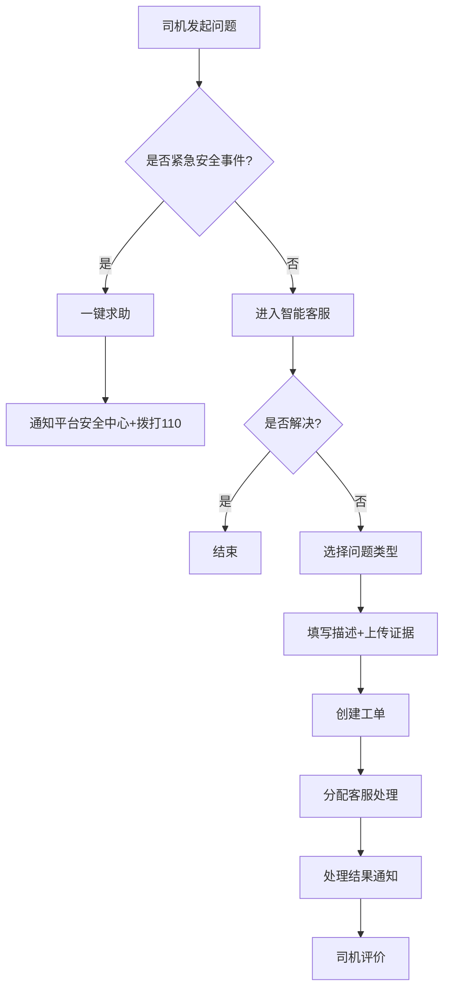
```mermaid
flowchart TD
    A[司机发起问题] --> B{是否紧急安全事件?}
    B -->|是| C[一键求助]
    C --> D[通知平台安全中心+拨打110]
    B -->|否| E[进入智能客服]
    E --> F{是否解决?}
    F -->|是| G[结束]
    F -->|否| H[选择问题类型]
    H --> I[填写描述+上传证据]
    I --> J[创建工单]
    J --> K[分配客服处理]
    K --> L[处理结果通知]
    L --> M[司机评价]
```

#### 2.2 异常分支与 SOP

| 异常场景 | 触发条件 | 系统行为 | 前端展示 | SOP |
|---|---|---|---|---|
| 安全事件升级 | 一键求助后 5 分钟未响应 | 自动升级至安全运营主管 | 提示"已为您升级至安全专员" | 安全运营 7*24 值班 |
| 工单创建失败 | 客服系统不可用 | 降级到邮件/短信队列 | 提示"提交成功，处理中" | 系统恢复后补偿 |
| 证据上传失败 | 网络中断 | 本地缓存，网络恢复后自动重传 | 提示"图片将在网络恢复后上传" | - |

#### 2.3 状态机（工单生命周期）

同乘客端 service_ticket 状态机（OPEN → ASSIGNED → IN_PROGRESS → RESOLVED → CLOSED）。

#### 2.4 关键规则清单

1. **安全事件分级**：
   - S1（人身安全事故）：立即通知安全中心+110 联动+平台高管。
   - S2（财物损失/纠纷）：30 分钟内响应。
   - S3（一般咨询）：4 小时内响应。
2. **智能客服知识库**：覆盖 TOP50 司机常见问题，包括：如何出车、收入计算规则、奖励活动说明、乘客未出现怎么办、账号冻结如何解封等。
3. **证据要求**：费用争议必须提供订单号+截图；安全事件必须提供录音/图片+时间地点。
4. **学习培训**：新司机入驻后需完成在线学习（平台规则、服务标准、安全须知），通过考试后方可出车；违规司机需重新学习考试。

### ③ 数据字典（L3）

复用乘客端 `service_ticket` 表结构，增加司机专属字段：

##### 表：driver_service_ticket（司机客服工单扩展表）

- **表名 / 中文名**：`driver_service_ticket` / 司机客服工单扩展表
- **业务说明**：继承 service_ticket 核心字段，补充司机场景专属信息。
- **分库分表策略**：按 `driver_id` 哈希分 8 库，每库 128 表。

| 字段名 | 中文 | 类型 | 长度 | 允许空 | 默认值 | 索引 | 示例 | 业务说明 |
|---|---|---|---|---|---|---|---|---|
| ticket_id | 工单 ID | varchar | 32 | 否 | - | PK | tkt_001 | 与 service_ticket 共享 |
| driver_id | 司机 ID | varchar | 32 | 否 | - | FK | d_001 | - |
| order_id | 订单 ID | varchar | 32 | 是 | NULL | - | ord_001 | - |
| safety_level | 安全等级 | varchar | 4 | 否 | S3 | - | S3 | S1/S2/S3 |
| issue_category | 问题大类 | varchar | 16 | 否 | - | - | FARE | FARE/SAFETY/ORDER/SYSTEM/ACCOUNT/OTHER |
| issue_subcategory | 问题子类 | varchar | 32 | 是 | NULL | - | PASSENGER_NO_SHOW | - |
| evidence_urls | 证据附件 | varchar | 1000 | 是 | NULL | - | ["url1","url2"] | JSON |
| track_snapshot_url | 轨迹快照 | varchar | 512 | 是 | NULL | - | https://... | 异常时自动截取 |
| handled_by_ai | 是否 AI 预处理 | tinyint | 1 | 否 | 0 | - | 1 | 1=AI 先处理 |
| ai_resolution | AI 处理结果 | varchar | 16 | 是 | NULL | - | ESCALATED | RESOLVED/ESCALATED |
| compensation_amount_cent | 补偿金额 | int | 10 | 是 | 0 | - | 500 | 分 |
| training_required | 是否需要学习 | tinyint | 1 | 否 | 0 | - | 0 | 1=需完成学习视频 |
| training_completed | 是否完成学习 | tinyint | 1 | 是 | NULL | - | 1 | - |

#### 3.3 枚举字典

| 枚举名 | 取值集合 | 所属字段 | Owner |
|---|---|---|---|
| safety_level_enum | S1/S2/S3 | driver_service_ticket.safety_level | 客服系统 |
| issue_category_enum | FARE/SAFETY/ORDER/SYSTEM/ACCOUNT/OTHER | driver_service_ticket.issue_category | 客服系统 |
| ai_resolution_enum | RESOLVED/ESCALATED/UNKNOWN | driver_service_ticket.ai_resolution | 智能客服 |

#### 3.4 接口出入参示例

**接口**：`POST /api/v1/driver/ticket/create`（创建工单）

**Request Body**：
```json
{
  "order_id": "ord_202604210001",
  "issue_category": "ORDER",
  "issue_subcategory": "PASSENGER_NO_SHOW",
  "description": "到达上车点后等待8分钟，乘客未出现且联系不上",
  "evidence_urls": ["https://oss.../photo1.jpg"],
  "safety_level": "S3",
  "idempotency_key": "idem_ticket_001"
}
```

**Response Body**：
```json
{
  "code": 0,
  "message": "success",
  "data": {
    "ticket_id": "tkt_202604210001",
    "ticket_status": "OPEN",
    "sla_deadline_at": "2026-04-21T14:00:00+08:00",
    "estimate_handle_time": "2小时内",
    "auto_compensation": {
      "eligible": true,
      "amount_yuan": "5.00",
      "reason": "乘客未出现等待补偿"
    }
  }
}
```

### ④ 关联模块

#### 4.1 上游依赖

| 依赖模块 | 提供内容 |
|---|---|
| 智能客服 | AI 预处理和自助解答 |
| 订单服务 | 订单信息 |
| 轨迹服务 | 轨迹快照 |
| 对象存储 | 证据材料存储 |

#### 4.2 下游被依赖

| 消费方 | 消费内容 |
|---|---|
| 司机端 | 工单进度展示 |
| 运营后台 | 工单分配与处理 |
| 安全中心 | 安全事件升级 |

#### 4.3 同级协作

| 协作模块 | 协作内容 |
|---|---|
| 乘客客服系统 | 司乘纠纷双向工单关联 |
| 结算系统 | 补偿发放 |

#### 4.4 外部系统

| 外部系统 | 用途 |
|---|---|
| 110 报警联动平台 | S1 安全事件自动报警（合作城市） |
| 阿里云 OSS | 证据存储 |

---

## 附录：司机端全局枚举汇总

| 枚举名 | 取值集合 | 使用位置 |
|---|---|---|
| driver_account_status_enum | PENDING/ACTIVE/SUSPENDED/BANNED/EXPIRED | driver.account_status |
| service_level_enum | BRONZE/SILVER/GOLD/PLATINUM | driver.service_level |
| license_type_enum | DRIVING/DRIVER_CERT/ID_CARD | driver_license.license_type |
| license_status_enum | VALID/EXPIRED/EXPIRING/SUSPENDED/PENDING | driver_license.license_status |
| vehicle_status_enum | PENDING/ACTIVE/SUSPENDED/RETIRED | vehicle.vehicle_status |
| vehicle_type_enum | SEDAN/SUV/MPV/VAN | vehicle.vehicle_type |
| energy_type_enum | EV/PHEV/FUEL | vehicle.energy_type |
| binding_status_enum | ACTIVE/INACTIVE | driver_vehicle_binding.binding_status |
| online_status_enum | ONLINE/OFFLINE | driver_online_log.online_status |
| offer_status_enum | SENT/ACCEPTED/REJECTED/TIMEOUT/REVOKED | dispatch_offer.offer_status |
| response_action_enum | ACCEPT/REJECT/TIMEOUT | dispatch_response.response_action |
| response_result_enum | SUCCESS/FAILED/ORDER_TAKEN/EXPIRED | dispatch_response.response_result |
| reject_reason_enum | TOO_FAR/LOW_PRICE/DIRECTION_MISMATCH/PASSENGER_RATING/OTHER | dispatch_response.reject_reason_code |
| nav_status_enum | NAVIGATING/ARRIVED/RE_NAVIGATED/CANCELLED | pickup_navigation.nav_status |
| trip_status_enum | STARTED/ON_TRIP/ROUTE_CHANGED/ENDED | trip_runtime.trip_status |
| fare_type_enum | FIXED/REALTIME | trip_bill.fare_type |
| bill_status_enum | PENDING/CONFIRMED/DISPUTED/ADJUSTED | trip_bill.bill_status |
| settle_status_enum | PENDING/SETTLED/FROZEN/REFUNDED | driver_income_bill.settle_status |
| withdrawal_status_enum | APPLYING/AUDITING/PROCESSING/SUCCESS/FAILED/REJECTED | driver_withdrawal.withdrawal_status |
| safety_level_enum | S1/S2/S3 | driver_service_ticket.safety_level |
| issue_category_enum | FARE/SAFETY/ORDER/SYSTEM/ACCOUNT/OTHER | driver_service_ticket.issue_category |
| ai_resolution_enum | RESOLVED/ESCALATED/UNKNOWN | driver_service_ticket.ai_resolution |
