# 华夏小猪出行 — 运营后台产品需求文档（PRD）

> 文档版本：v1.0.0  
> 适用范围：运营后台全量业务（Web PC 端）  
> 最后更新：2026-04-21  
> 评审状态：Draft  

---

## 全局约定

### 审计字段约定（全表通用）

| 字段名 | 类型 | 允许空 | 默认值 | 说明 |
|---|---|---|---|---|
| created_at | datetime(3) | 否 | CURRENT_TIMESTAMP(3) | 创建时间 |
| updated_at | datetime(3) | 否 | CURRENT_TIMESTAMP(3) ON UPDATE CURRENT_TIMESTAMP(3) | 最后更新时间 |
| deleted_at | datetime(3) | 是 | NULL | 软删除标记 |
| creator_id | varchar(64) | 是 | NULL | 创建人 ID |
| tenant_id | varchar(64) | 否 | 'default' | 租户 ID |

> **注**：本 PRD 所有数据表均默认包含以上审计字段，以下各表字段清单中不再重复列出。

### 全局枚举治理原则
- 所有 `status` / `type` / `level` 字段禁止自由文本，必须引用集中枚举字典。
- 运营后台所有写操作必须记录操作人 `operator_id`、操作前后快照，确保全程审计可追溯。

---

## 3.1 组织与权限中心（IAM）

### 需求元信息（Meta）

| 属性 | 内容 |
|---|---|
| 需求编号 | OPS-001 |
| 优先级 | P0 |
| 所属域 | 运营域-基础平台 |
| 责任产品 | 平台产品经理 |
| 责任研发 | IAM 研发组 / 安全研发组 |
| 版本 | v1.0.0 |

### ① 需求场景描述

#### 1.1 角色与场景（Who / When / Where）

| 维度 | 描述 |
|---|---|
| Who | 平台运营人员（客服、司机运营、城市经理、财务人员、数据分析师、超级管理员） |
| When | 人员入职/转岗/离职时；权限变更时；日常登录操作时 |
| Where | 运营后台 Web 端 / 管理后台 App |

#### 1.2 用户痛点与业务价值（Why）

- **痛点 1**：越权操作导致敏感数据泄露或资金风险。
- **痛点 2**：人员变动后权限回收不及时，留下安全隐患。
- **痛点 3**：运营操作无记录，出问题无法追溯。
- **业务价值**：最小权限原则降低 90% 数据泄露风险；全量审计日志让操作 100% 可追溯。

#### 1.3 功能范围

| 类别 | 范围说明 |
|---|---|
| **In Scope** | 组织架构管理（公司/部门/小组）、角色模板管理（预设角色+自定义角色）、细粒度权限点（菜单/按钮/字段/数据域）、用户生命周期（创建/启用/禁用/注销）、单点登录（SSO）、操作审计日志、敏感操作二次认证 |
| **边界** | 仅覆盖华夏小猪内部运营人员；代理商/合伙人账号走独立体系 |
| **非目标** | 多租户 SaaS 化（本期仅支撑内部使用）、生物识别登录 |

#### 1.4 验收标准

| 指标 | 目标值 | 计算口径 |
|---|---|---|
| 后台登录鉴权成功率 | >= 99.9% | 鉴权通过 / 有效登录请求 |
| 越权拦截命中率 | >= 99.99% | 越权请求被拒绝且记录完整 / 越权总数 |
| 角色变更生效时延 P95 | <= 60s | 角色更新 → 策略生效时间 P95 |
| 敏感操作审计覆盖率 | = 100% | 带审计日志的敏感操作 / 全部敏感操作 |

### ② 业务流程

#### 2.1 主流程（mermaid sequenceDiagram）

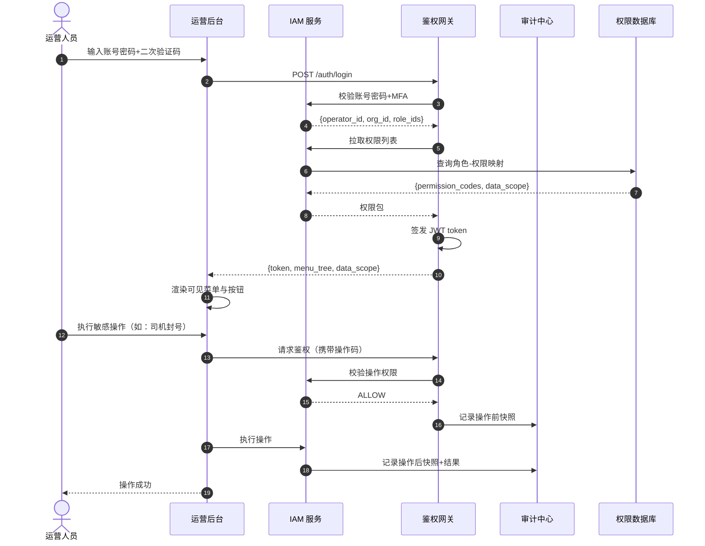

#### 2.2 异常分支与 SOP

| 异常场景 | 触发条件 | 系统行为 | 前端展示 | SOP |
|---|---|---|---|---|
| 账号锁定 | 密码错误 5 次 | 锁定 30 分钟 | 提示"账号已锁定，请联系管理员" | 管理员解锁或 30 分钟自动恢复 |
| MFA 校验失败 | 二次验证码错误 | 拒绝登录 | 提示"验证码错误" | - |
| 越权访问 | 访问无权限页面/接口 | 拦截并记录审计日志 | 展示"无权访问" | 安全运营定期审计 |
| 权限变更未生效 | 缓存未刷新 | 强制刷新权限缓存 | - | 运维手动刷新或等待 60s 自动过期 |
| 审计日志写入失败 | 审计中心故障 | 操作被拒绝（强依赖） | 提示"系统异常，请稍后重试" | 审计服务恢复后重试 |

#### 2.3 状态机（运营账号生命周期）

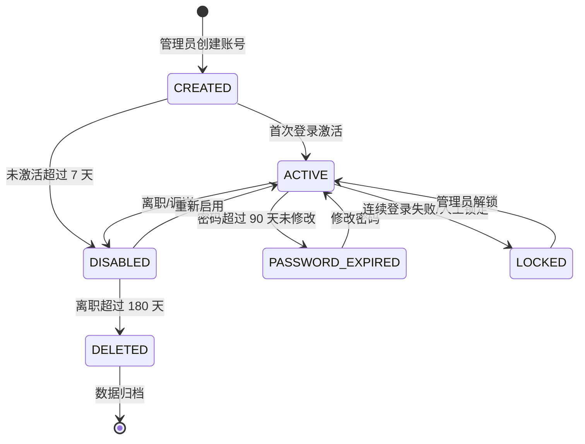

#### 2.4 关键规则清单

1. **密码策略**：最小 8 位，必须包含大小写字母+数字+特殊字符；90 天强制修改；不可与最近 5 次密码重复。
2. **MFA 策略**：超级管理员、财务、安全运营强制开启 Google Authenticator / 企业微信扫码；其他角色建议开启。
3. **数据域隔离**：
   - ALL：全量数据（超级管理员）。
   - CITY：指定城市数据（城市经理）。
   - ORG：所在部门及子部门数据（部门主管）。
   - SELF：仅自己创建的数据（普通运营）。
4. **敏感操作定义**：司机封号/解封、资金操作（补贴发放/退款）、规则发布、数据导出、权限变更。
5. **审计日志保留**：操作日志保留 3 年；登录日志保留 1 年；归档至 OSS。

### ③ 数据字典（L3）

#### 3.1 实体关系图

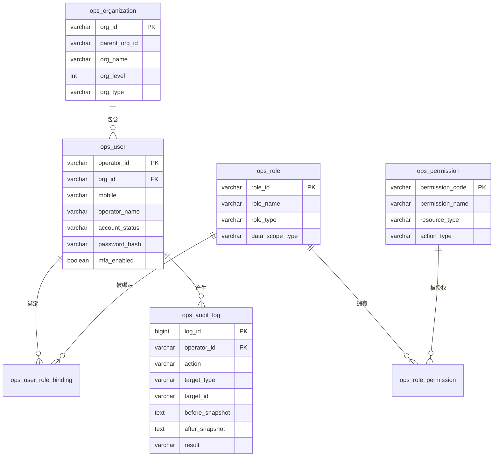

#### 3.2 表结构

##### 表 1：ops_user（运营用户表）

- **表名 / 中文名**：`ops_user` / 运营用户表
- **业务说明**：运营人员账号主档。
- **分库分表策略**：单库单表（数据量小，预计 < 1 万）。

| 字段名 | 中文 | 类型 | 长度 | 允许空 | 默认值 | 索引 | 示例 | 业务说明 |
|---|---|---|---|---|---|---|---|---|
| operator_id | 运营人员 ID | varchar | 32 | 否 | - | PK | ops_001 | - |
| org_id | 组织 ID | varchar | 32 | 否 | - | FK | org_001 | - |
| mobile | 手机号 | varchar | 11 | 否 | - | UK | 13800138000 | - |
| operator_name | 姓名 | varchar | 32 | 否 | - | - | 李明 | - |
| email | 邮箱 | varchar | 128 | 是 | NULL | - | li.ming@huaxiaozhu.com | - |
| password_hash | 密码哈希 | varchar | 255 | 否 | - | - | bcrypt(...) | - |
| account_status | 账号状态 | varchar | 16 | 否 | CREATED | - | ACTIVE | CREATED/ACTIVE/LOCKED/DISABLED/DELETED |
| mfa_enabled | 是否开启 MFA | tinyint | 1 | 否 | 0 | - | 1 | - |
| mfa_secret | MFA 密钥 | varchar | 64 | 是 | NULL | - | secret_key | 加密存储 |
| last_login_at | 最后登录 | datetime(3) | - | 是 | NULL | - | 2026-04-21 09:00:00 | - |
| last_login_ip | 最后登录 IP | varchar | 64 | 是 | NULL | - | 10.0.0.1 | - |
| password_changed_at | 密码修改时间 | datetime(3) | - | 是 | NULL | - | 2026-04-01 10:00:00 | - |
| created_by | 创建人 | varchar | 32 | 否 | - | - | ops_admin | - |

- **索引清单**
  - 主键：`PRIMARY KEY (operator_id)`
  - 唯一索引：`UNIQUE KEY uk_mobile (mobile)`
  - 普通索引：`KEY idx_org_status (org_id, account_status)`

##### 表 2：ops_role（运营角色表）

- **表名 / 中文名**：`ops_role` / 运营角色表
- **业务说明**：角色模板定义。

| 字段名 | 中文 | 类型 | 长度 | 允许空 | 默认值 | 索引 | 示例 | 业务说明 |
|---|---|---|---|---|---|---|---|---|
| role_id | 角色 ID | varchar | 32 | 否 | - | PK | role_001 | - |
| role_name | 角色名称 | varchar | 64 | 否 | - | - | 城市运营经理 | - |
| role_type | 角色类型 | varchar | 16 | 否 | CUSTOM | - | PRESET | PRESET/CUSTOM |
| role_desc | 角色描述 | varchar | 255 | 是 | NULL | - | 负责城市日常运营 | - |
| data_scope_type | 数据域范围 | varchar | 16 | 否 | SELF | - | CITY | ALL/CITY/ORG/SELF |
| permission_codes | 权限点集合 | json | - | 否 | - | - | ["p_001","p_002"] | JSON 数组 |
| is_system | 是否系统预设 | tinyint | 1 | 否 | 0 | - | 1 | 1=不可删除 |

##### 表 3：ops_audit_log（操作审计日志表）

- **表名 / 中文名**：`ops_audit_log` / 操作审计日志表
- **业务说明**：全量操作审计，支撑安全追溯与合规。
- **分库分表策略**：单库，按月分区表；保留 36 个月。
- **预估数据量**：日增 50 万条。

| 字段名 | 中文 | 类型 | 长度 | 允许空 | 默认值 | 索引 | 示例 | 业务说明 |
|---|---|---|---|---|---|---|---|---|
| log_id | 日志 ID | bigint | 20 | 否 | AUTO_INCREMENT | PK | 1 | - |
| trace_id | 链路 ID | varchar | 64 | 否 | - | - | trc_001 | - |
| operator_id | 操作人 ID | varchar | 32 | 否 | - | IDX | ops_001 | - |
| operator_name | 操作人姓名 | varchar | 32 | 是 | NULL | - | 李明 | - |
| action | 操作类型 | varchar | 32 | 否 | - | IDX | DRIVER_BAN | - |
| action_desc | 操作描述 | varchar | 255 | 是 | NULL | - | 封禁司机账号 | - |
| target_type | 操作对象类型 | varchar | 32 | 否 | - | - | DRIVER | DRIVER/ORDER/RULE/CAMPAIGN |
| target_id | 操作对象 ID | varchar | 32 | 否 | - | - | d_001 | - |
| before_snapshot | 操作前快照 | json | - | 是 | NULL | - | {...} | JSON |
| after_snapshot | 操作后快照 | json | - | 是 | NULL | - | {...} | JSON |
| result | 操作结果 | varchar | 16 | 否 | SUCCESS | - | SUCCESS | SUCCESS/FAILED |
| error_code | 错误码 | varchar | 32 | 是 | NULL | - | - | - |
| client_ip | 客户端 IP | varchar | 64 | 否 | - | - | 10.0.0.1 | - |
| user_agent | UA | varchar | 512 | 是 | NULL | - | Mozilla/5.0... | - |
| occurred_at | 发生时间 | datetime(3) | - | 否 | - | IDX | 2026-04-21 10:00:00 | - |

- **索引清单**
  - 主键：`PRIMARY KEY (log_id)`
  - 联合索引：`KEY idx_operator_time (operator_id, occurred_at)`
  - 普通索引：`KEY idx_action (action, occurred_at)`
  - 普通索引：`KEY idx_target (target_type, target_id, occurred_at)`

#### 3.3 枚举字典

| 枚举名 | 取值集合 | 所属字段 | Owner |
|---|---|---|---|
| account_status_enum | CREATED/ACTIVE/LOCKED/DISABLED/DELETED | ops_user.account_status | IAM |
| role_type_enum | PRESET/CUSTOM | ops_role.role_type | IAM |
| data_scope_type_enum | ALL/CITY/ORG/SELF | ops_role.data_scope_type | IAM |
| action_result_enum | SUCCESS/FAILED | ops_audit_log.result | 审计中心 |

#### 3.4 接口出入参示例

**接口**：`POST /api/v1/ops/user/create`（创建运营账号）

**Request Body**：
```json
{
  "operator_name": "王芳",
  "mobile": "13800138001",
  "email": "wang.fang@huaxiaozhu.com",
  "org_id": "org_sh_001",
  "role_ids": ["role_city_ops"],
  "mfa_enabled": true,
  "idempotency_key": "idem_ops_001"
}
```

### ④ 关联模块

#### 4.1 上游依赖

| 依赖模块 | 提供内容 |
|---|---|
| 企业微信/钉钉 | 组织架构同步、扫码登录 |
| MFA 服务 | 二次认证能力 |

#### 4.2 下游被依赖

| 消费方 | 消费内容 |
|---|---|
| 全部后台模块 | 用户身份与权限校验 |
| 审计中心 | 操作日志存储与分析 |

#### 4.3 同级协作

| 协作模块 | 协作内容 |
|---|---|
| 司机中心 | 运营人员对司机的操作权限 |
| 订单中心 | 运营人员对订单的干预权限 |

#### 4.4 外部系统

| 外部系统 | 用途 |
|---|---|
| 企业微信 | 组织架构同步、消息通知 |
| 钉钉 | 备用组织架构源 |

---

## 3.2 订单运营看板与干预

### 需求元信息（Meta）

| 属性 | 内容 |
|---|---|
| 需求编号 | OPS-002 |
| 优先级 | P0 |
| 所属域 | 运营域-订单中心 |
| 责任产品 | 运营产品经理 |
| 责任研发 | 数据平台 / 订单中心 / BI 团队 |
| 版本 | v1.0.0 |

### ① 需求场景描述

#### 1.1 角色与场景（Who / When / Where）

| 维度 | 描述 |
|---|---|
| Who | 城市运营经理、客服主管、调度运营 |
| When | 实时监控时段、异常告警时、日常复盘时 |
| Where | 运营后台-订单看板页、客服工作台 |

#### 1.2 用户痛点与业务价值（Why）

- **痛点 1**：数据延迟高，无法实时掌握城市运营态势。
- **痛点 2**：异常订单处理慢，乘客投诉升级。
- **痛点 3**：人工干预无记录，后续无法复盘。
- **业务价值**：分钟级看板让运营决策效率提升 50%；人工干预全流程记录降低运营操作风险。

#### 1.3 功能范围

| 类别 | 范围说明 |
|---|---|
| **In Scope** | 实时订单看板（下单量/完单量/取消率/派单超时率）、城市/时段筛选、异常订单实时告警、订单详情查询、人工干预（重派/补贴/强制取消/恢复）、干预记录审计、订单轨迹回放、乘客/司机信息查询（脱敏） |
| **边界** | 仅展示和处理平台自有订单 |
| **非目标** | 预测性调度（走 AI 模块）、自动派单策略调整 |

#### 1.4 验收标准

| 指标 | 目标值 | 计算口径 |
|---|---|---|
| 看板数据新鲜度达标率 | >= 99.5% | 延迟 <= 60s 的刷新 / 总刷新次数 |
| 人工干预执行成功率 | >= 99.0% | 返回 SUCCESS 的干预 / 干预请求总数 |
| 干预审计完整率 | >= 99.99% | 日志元组完整的干预 / 干预成功总数 |
| 高取消率告警触达率 | >= 99% | 1 分钟内完成告警推送 / 命中阈值次数 |

### ② 业务流程

#### 2.1 主流程（mermaid flowchart）

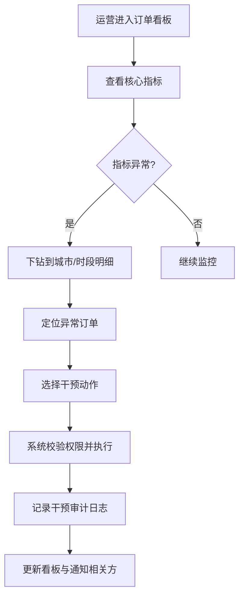

#### 2.2 异常分支与 SOP

| 异常场景 | 触发条件 | 系统行为 | 前端展示 | SOP |
|---|---|---|---|---|
| 干预权限不足 | 运营无该城市/订单操作权限 | 拒绝执行 | 提示"无权操作该订单" | 联系主管授权 |
| 订单状态已变更 | 干预时订单状态不符合前提 | 拒绝执行 | 提示"订单状态已变更，请刷新后重试" | - |
| 干预执行超时 | 下游服务响应超时 | 标记为处理中，异步补偿 | 提示"执行中，请稍后查看结果" | 运维监控补偿任务 |
| 批量干预超限 | 单次批量操作超过 50 单 | 拒绝执行 | 提示"单次批量操作不超过50单" | - |

#### 2.3 状态机（人工干预生命周期）

```mermaid
stateDiagram-v2
    [*] --> INITIATED: 运营发起干预
    INITIATED --> VALIDATING: 权限与状态校验
    VALIDATING --> EXECUTING: 校验通过
    VALIDATING --> REJECTED: 校验失败
    EXECUTING --> SUCCESS: 执行成功
    EXECUTING --> FAILED: 执行失败
    EXECUTING --> PARTIAL: 部分成功（批量场景）
    SUCCESS --> AUDITED: 审计日志记录
    PARTIAL --> AUDITED: 审计日志记录
    FAILED --> RETRYING: 自动重试
    RETRYING --> SUCCESS: 重试成功
    RETRYING --> FAILED: 重试失败
    AUDITED --> [*]: 闭环
    REJECTED --> [*]: 记录拒绝原因
```

#### 2.4 关键规则清单

1. **干预权限矩阵**：
   - 重派：客服主管+城市经理。
   - 补贴：城市经理+运营主管（需审批单 > 100 元）。
   - 强制取消：客服主管+（需填写原因码）。
   - 恢复：超级管理员+安全运营。
2. **干预原因码**：所有人工干预必须选择标准原因码（如：系统故障补偿、乘客投诉安抚、司机作弊处罚），禁止自由文本。
3. **补贴上限**：单次干预补贴不超过 200 元；日累计不超过 2000 元/运营人员。
4. **轨迹回放**：运营可查看订单完整轨迹（接驾+行程），用于判责；轨迹数据保留 90 天。
5. **敏感信息脱敏**：运营查看乘客/司机手机号时仅展示脱敏值（如 138****8000）；查看完整手机号需二次审批并记录。

### ③ 数据字典（L3）

#### 3.1 实体关系图

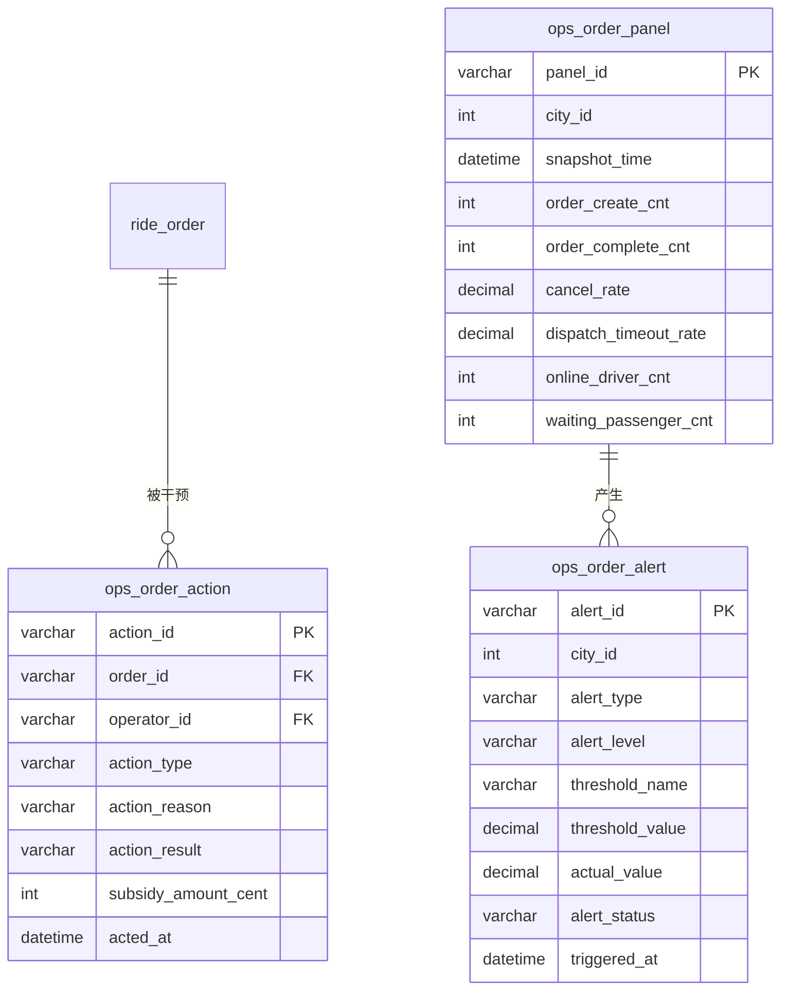

#### 3.2 表结构

##### 表 1：ops_order_panel（订单看板快照表）

- **表名 / 中文名**：`ops_order_panel` / 订单看板快照表
- **业务说明**：分钟级运营指标快照，用于看板展示与趋势分析。
- **分库分表策略**：按 `city_id` 哈希分 8 库，每库 64 表。
- **预估数据量**：日增 1440 条/城市，100 城约 14.4 万条/日。

| 字段名 | 中文 | 类型 | 长度 | 允许空 | 默认值 | 索引 | 示例 | 业务说明 |
|---|---|---|---|---|---|---|---|---|
| panel_id | 快照 ID | varchar | 32 | 否 | - | PK | pan_001 | - |
| city_id | 城市编码 | int | 10 | 否 | - | FK | 310100 | - |
| snapshot_time | 快照时间 | datetime(3) | - | 否 | - | UK | 2026-04-21 10:00:00 | 分钟级 |
| order_create_cnt | 下单量 | int | 10 | 否 | 0 | - | 1200 | 最近1分钟 |
| order_complete_cnt | 完单量 | int | 10 | 否 | 0 | - | 980 | 最近1分钟 |
| cancel_rate | 取消率 | decimal | 5,4 | 否 | 0.0000 | - | 0.0500 | 5% |
| dispatch_timeout_rate | 派单超时率 | decimal | 5,4 | 否 | 0.0000 | - | 0.0200 | 2% |
| avg_accept_time_s | 平均应答时长 | int | 10 | 否 | 0 | - | 45 | 秒 |
| online_driver_cnt | 在线司机数 | int | 10 | 否 | 0 | - | 3500 | - |
| waiting_passenger_cnt | 等待乘客数 | int | 10 | 否 | 0 | - | 280 | 已下单无司机接单 |
| supply_demand_ratio | 供需比 | decimal | 5,2 | 是 | NULL | - | 2.50 | 司机/乘客 |

##### 表 2：ops_order_action（订单干预记录表）

- **表名 / 中文名**：`ops_order_action` / 订单干预记录表
- **业务说明**：记录所有人工干预操作。
- **分库分表策略**：按 `order_id` 哈希分 16 库，每库 128 表。

| 字段名 | 中文 | 类型 | 长度 | 允许空 | 默认值 | 索引 | 示例 | 业务说明 |
|---|---|---|---|---|---|---|---|---|
| action_id | 干预 ID | varchar | 32 | 否 | - | PK | act_001 | - |
| order_id | 订单 ID | varchar | 32 | 否 | - | FK | ord_001 | - |
| operator_id | 操作人 | varchar | 32 | 否 | - | - | ops_001 | - |
| operator_name | 操作人姓名 | varchar | 32 | 是 | NULL | - | 李明 | - |
| action_type | 干预类型 | varchar | 16 | 否 | - | - | REDISPATCH | REDISPATCH/SUBSIDY/CLOSE/RESTORE |
| action_reason | 干预原因码 | varchar | 32 | 否 | - | - | SYSTEM_FAULT | - |
| action_reason_desc | 原因描述 | varchar | 255 | 是 | NULL | - | 系统派单故障 | - |
| action_result | 执行结果 | varchar | 16 | 否 | - | - | SUCCESS | SUCCESS/FAILED/PARTIAL |
| subsidy_amount_cent | 补贴金额 | int | 10 | 是 | 0 | - | 1000 | 分 |
| before_status | 干预前状态 | varchar | 32 | 是 | NULL | - | DISPATCHING | - |
| after_status | 干预后状态 | varchar | 32 | 是 | NULL | - | CANCELLED | - |
| acted_at | 操作时间 | datetime(3) | - | 否 | - | - | 2026-04-21 10:05:00 | - |
| error_code | 错误码 | varchar | 32 | 是 | NULL | - | - | - |
| approval_ticket_id | 审批单号 | varchar | 32 | 是 | NULL | - | appr_001 | 大额补贴需审批 |

##### 表 3：ops_order_alert（订单告警表）

- **表名 / 中文名**：`ops_order_alert` / 订单告警表
- **业务说明**：实时告警记录。

| 字段名 | 中文 | 类型 | 长度 | 允许空 | 默认值 | 索引 | 示例 | 业务说明 |
|---|---|---|---|---|---|---|---|---|
| alert_id | 告警 ID | varchar | 32 | 否 | - | PK | alt_001 | - |
| city_id | 城市编码 | int | 10 | 否 | - | - | 310100 | - |
| alert_type | 告警类型 | varchar | 32 | 否 | - | - | HIGH_CANCEL_RATE | HIGH_CANCEL_RATE/DISPATCH_TIMEOUT/SUPPLY_SHORTAGE |
| alert_level | 告警级别 | varchar | 8 | 否 | WARNING | - | CRITICAL | WARNING/CRITICAL/EMERGENCY |
| threshold_name | 阈值名称 | varchar | 64 | 否 | - | - | cancel_rate_threshold | - |
| threshold_value | 阈值 | decimal | 10,4 | 否 | - | - | 0.1000 | 10% |
| actual_value | 实际值 | decimal | 10,4 | 否 | - | - | 0.1500 | 15% |
| alert_status | 告警状态 | varchar | 16 | 否 | TRIGGERED | - | RESOLVED | TRIGGERED/ACKED/RESOLVED/IGNORED |
| triggered_at | 触发时间 | datetime(3) | - | 否 | - | - | 2026-04-21 10:00:00 | - |
| resolved_at | 恢复时间 | datetime(3) | - | 是 | NULL | - | 2026-04-21 10:30:00 | - |
| acked_by | 确认人 | varchar | 32 | 是 | NULL | - | ops_001 | - |

#### 3.3 枚举字典

| 枚举名 | 取值集合 | 所属字段 | Owner |
|---|---|---|---|
| action_type_enum | REDISPATCH/SUBSIDY/CLOSE/RESTORE/FORCE_COMPLETE | ops_order_action.action_type | 订单运营 |
| action_result_enum | SUCCESS/FAILED/PARTIAL | ops_order_action.action_result | 订单运营 |
| alert_type_enum | HIGH_CANCEL_RATE/DISPATCH_TIMEOUT/SUPPLY_SHORTAGE/PAYMENT_ANOMALY/SAFETY_EVENT | ops_order_alert.alert_type | 监控平台 |
| alert_level_enum | WARNING/CRITICAL/EMERGENCY | ops_order_alert.alert_level | 监控平台 |
| alert_status_enum | TRIGGERED/ACKED/RESOLVED/IGNORED | ops_order_alert.alert_status | 监控平台 |

#### 3.4 接口出入参示例

**接口**：`POST /api/v1/ops/order/intervene`（订单干预）

**Request Body**：
```json
{
  "order_id": "ord_202604210001",
  "action_type": "SUBSIDY",
  "action_reason": "PASSENGER_COMPLAINT_COMPENSATION",
  "subsidy_amount_cent": 1000,
  "operator_remark": "乘客投诉等待时间过长，补偿10元",
  "approval_ticket_id": null,
  "idempotency_key": "idem_intervene_001"
}
```

**Response Body**：
```json
{
  "code": 0,
  "message": "success",
  "data": {
    "action_id": "act_202604210001",
    "action_result": "SUCCESS",
    "order_status_after": "COMPLETED",
    "subsidy_sent": true,
    "audit_log_id": 1000001
  }
}
```

### ④ 关联模块

#### 4.1 上游依赖

| 依赖模块 | 提供内容 |
|---|---|
| 数据平台 | 实时指标计算 |
| 订单服务 | 订单状态与详情 |
| 调度服务 | 重派能力 |
| 营销服务 | 补贴发放 |

#### 4.2 下游被依赖

| 消费方 | 消费内容 |
|---|---|
| 运营看板 | 实时数据展示 |
| 审计中心 | 干预操作审计 |
| 告警中心 | 异常触发告警 |

#### 4.3 同级协作

| 协作模块 | 协作内容 |
|---|---|
| 客服系统 | 投诉驱动干预 |
| 司机中心 | 司机状态干预 |

#### 4.4 外部系统

| 外部系统 | 用途 |
|---|---|
| 企业微信 | 告警推送 |
| 钉钉 | 告警推送 |

---

## 3.3 司机与车辆运营管理

### 需求元信息（Meta）

| 属性 | 内容 |
|---|---|
| 需求编号 | OPS-003 |
| 优先级 | P0 |
| 所属域 | 运营域-司机中心 |
| 责任产品 | 司机运营产品经理 |
| 责任研发 | 司机中心 / 合规服务 |
| 版本 | v1.0.0 |

### ① 需求场景描述

#### 1.1 角色与场景（Who / When / Where）

| 维度 | 描述 |
|---|---|
| Who | 司机运营、合规审核员、风控运营 |
| When | 司机入驻审核、日常资质复核、风险处置、司机培训 |
| Where | 运营后台-司机管理页、资质审核页、风控处置页 |

#### 1.2 用户痛点与业务价值（Why）

- **痛点 1**：入驻审核慢，司机流失到竞品。
- **痛点 2**：资质过期司机继续接单，合规风险高。
- **痛点 3**：问题司机处置滞后，引发安全事件。
- **业务价值**：自动化审核将入驻时效从 3 天缩短至 4 小时；资质到期预警消除 99%+ 过期资质运力。

#### 1.3 功能范围

| 类别 | 范围说明 |
|---|---|
| **In Scope** | 司机入驻审核（资料提交→机审→人审→结果）、资质到期预警与复核、司机分层管理（服务分/完单率/投诉率）、司机封号/解封/限制派单、车辆档案管理、司机培训与考试、黑名单管理 |
| **边界** | 仅管理平台注册司机 |
| **非目标** | 司机招聘（走 HR 系统）、车辆采购 |

#### 1.4 验收标准

| 指标 | 目标值 | 计算口径 |
|---|---|---|
| 资质审核按时完成率 | >= 98% | SLA 内完成 / 审核任务总数 |
| 到期预警命中率 | >= 99.5% | 到期前 7 天成功预警 / 应预警总数 |
| 停复用操作一致率 | >= 99.99% | 多系统状态一致 / 停复用操作总数 |
| 入驻审核平均时效 | <= 4 小时 | 提交审核 → 审核通过平均时长 |

### ② 业务流程

#### 2.1 主流程（mermaid flowchart）

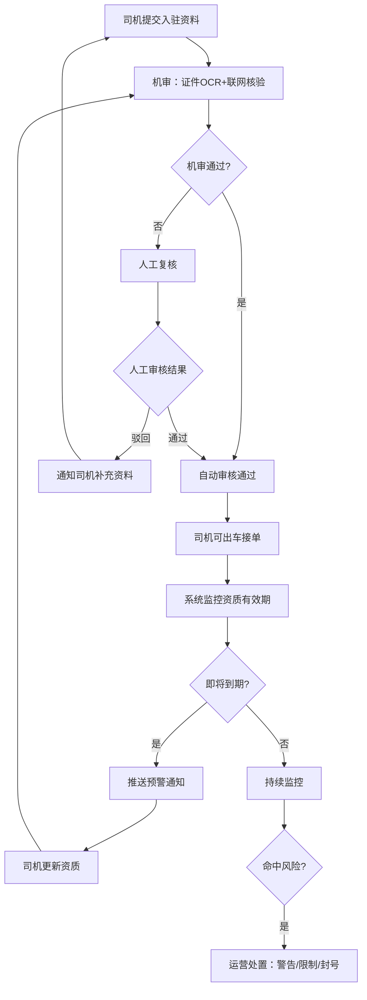

#### 2.2 异常分支与 SOP

| 异常场景 | 触发条件 | 系统行为 | 前端展示 | SOP |
|---|---|---|---|---|
| 机审接口超时 | 政府核验接口超时 | 降级到人工复核队列 | 提示"系统繁忙，进入人工审核" | 合规运营优先处理 |
| 司机资质造假 | 人工复核发现 PS/伪造 | 永久拒绝入驻，记录黑名单 | - | 风控运营标记 |
| 批量到期 | 节假日后批量资质到期 | 自动扩容审核人力提醒 | 运营后台展示到期预警清单 | 提前安排审核排班 |
| 误封账号 | 司机申诉成功 | 解封并补偿 | - | 客服主管审批 |

#### 2.3 状态机（司机运营状态）

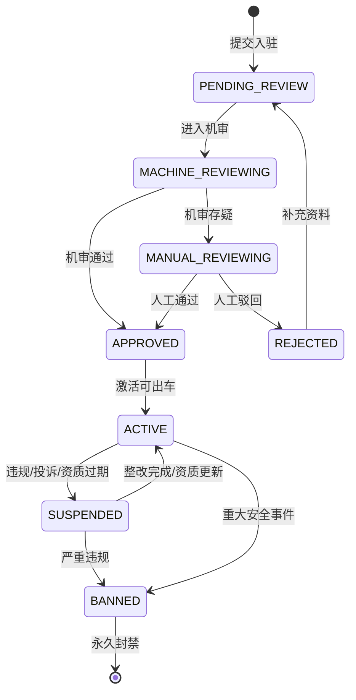

#### 2.4 关键规则清单

1. **入驻审核流程**：
   - 机审：OCR 识别证件 → 联网核验真伪 → 人脸比对 → 犯罪记录筛查（如有接口）。
   - 人审：机审置信度 < 90% 或敏感情况进入人工。
   - 时效承诺：机审 5 分钟，人审 4 小时。
2. **资质预警规则**：
   - 到期前 30 天：App Push 提醒。
   - 到期前 15 天：Push + 短信提醒。
   - 到期前 7 天：Push + 短信 + 电话提醒（客服外呼）。
   - 到期当天：自动限制出车。
3. **司机分层**：
   - 钻石：服务分 >= 98，完单率 >= 99%，投诉率 <= 0.1%。
   - 金牌：服务分 >= 95，完单率 >= 97%，投诉率 <= 0.3%。
   - 银牌：服务分 >= 90，完单率 >= 95%，投诉率 <= 0.5%。
   - 铜牌：其他。
   - 分层影响：优先派单权重、奖励资格、申诉快速通道。
4. **封号规则**：
   - 临时封禁（1-30 天）：一般违规（拒单过多、服务态度差）。
   - 永久封禁：严重违规（犯罪记录、重大安全事故、刷单作弊）。
   - 封禁需双人复核，永久封禁需法务确认。

### ③ 数据字典（L3）

复用司机端 driver、driver_license、vehicle、driver_vehicle_binding 表，补充运营后台专属表：

##### 表 1：compliance_review（合规审核任务表）

- **表名 / 中文名**：`compliance_review` / 合规审核任务表
- **业务说明**：司机/车辆入驻与复核的审核任务。
- **分库分表策略**：按 `target_id` 哈希分 8 库，每库 64 表。

| 字段名 | 中文 | 类型 | 长度 | 允许空 | 默认值 | 索引 | 示例 | 业务说明 |
|---|---|---|---|---|---|---|---|---|
| review_id | 审核 ID | varchar | 32 | 否 | - | PK | rev_001 | - |
| review_type | 审核类型 | varchar | 16 | 否 | - | - | ONBOARD | ONBOARD/RENEW/RISK_RECHECK |
| target_type | 对象类型 | varchar | 16 | 否 | - | - | DRIVER | DRIVER/VEHICLE |
| target_id | 对象 ID | varchar | 32 | 否 | - | - | d_001 | - |
| submitter_id | 提交人 | varchar | 32 | 否 | - | - | d_001 | 司机自己 |
| reviewer_id | 审核人 | varchar | 32 | 是 | NULL | - | ops_001 | - |
| review_result | 审核结果 | varchar | 16 | 是 | NULL | - | PASS | PASS/REJECT/NEED_MORE |
| review_stage | 审核阶段 | varchar | 16 | 否 | MACHINE | - | MANUAL | MACHINE/MANUAL/FINAL |
| machine_score | 机审置信度 | decimal | 5,2 | 是 | NULL | - | 0.95 | - |
| reject_reason_code | 驳回原因码 | varchar | 32 | 是 | NULL | - | BLURRY_PHOTO | - |
| reject_reason_desc | 驳回描述 | varchar | 255 | 是 | NULL | - | 证件照片模糊 | - |
| submitted_at | 提交时间 | datetime(3) | - | 否 | - | - | 2026-04-01 10:00:00 | - |
| reviewed_at | 审核时间 | datetime(3) | - | 是 | NULL | - | 2026-04-01 14:00:00 | - |
| sla_deadline_at | SLA 截止 | datetime(3) | - | 否 | - | - | 2026-04-01 14:00:00 | - |

#### 3.3 枚举字典

| 枚举名 | 取值集合 | 所属字段 | Owner |
|---|---|---|---|
| review_type_enum | ONBOARD/RENEW/RISK_RECHECK | compliance_review.review_type | 合规服务 |
| review_result_enum | PASS/REJECT/NEED_MORE | compliance_review.review_result | 合规服务 |
| review_stage_enum | MACHINE/MANUAL/FINAL | compliance_review.review_stage | 合规服务 |

### ④ 关联模块

#### 4.1 上游依赖

| 依赖模块 | 提供内容 |
|---|---|
| 司机端 | 资料提交 |
| OCR 服务 | 证件识别 |
| 政府核验接口 | 证件真伪核验 |
| 风控服务 | 犯罪记录/黑名单筛查 |

#### 4.2 下游被依赖

| 消费方 | 消费内容 |
|---|---|
| 司机中心 | 审核结果驱动司机状态 |
| 调度服务 | 资质状态决定派单资格 |

#### 4.3 同级协作

| 协作模块 | 协作内容 |
|---|---|
| 运营后台-订单看板 | 司机状态影响运力展示 |
| 客服系统 | 司机申诉处理 |

#### 4.4 外部系统

| 外部系统 | 用途 |
|---|---|
| 公安部身份核验 | 身份证核验 |
| 交通运输部接口 | 网约车证核验 |
| 驾驶证联网查询 | 驾驶证真伪与状态 |

---

## 3.4 营销活动与补贴配置

### 需求元信息（Meta）

| 属性 | 内容 |
|---|---|
| 需求编号 | OPS-004 |
| 优先级 | P1 |
| 所属域 | 运营域-营销中心 |
| 责任产品 | 营销产品经理 |
| 责任研发 | 营销平台 / 规则引擎 |
| 版本 | v1.0.0 |

### ① 需求场景描述

#### 1.1 角色与场景（Who / When / Where）

| 维度 | 描述 |
|---|---|
| Who | 营销运营、城市经理、财务审核员 |
| When | 新城市开城、节假日、淡季拉活、竞争应对 |
| Where | 运营后台-营销中心 |

#### 1.2 用户痛点与业务价值（Why）

- **痛点 1**：活动配置复杂，上线周期长，错过营销时机。
- **痛点 2**：补贴预算超支，缺乏实时熔断机制。
- **痛点 3**：活动效果评估滞后，无法及时调整。
- **业务价值**：可视化活动配置将上线周期从 2 天缩短至 2 小时；实时预算熔断避免超支 100%。

#### 1.3 功能范围

| 类别 | 范围说明 |
|---|---|
| **In Scope** | 活动模板管理、投放范围配置（城市/人群/时段）、规则编排（IF-THEN 可视化）、预算设置与预警、A/B 实验、实时效果看板、活动一键回滚、乘客券/司机奖励/一口价折扣 |
| **边界** | 仅补贴类营销；品牌广告不涵盖 |
| **非目标** | 外部渠道投放（抖音/微信广告） |

#### 1.4 验收标准

| 指标 | 目标值 | 计算口径 |
|---|---|---|
| 活动发布成功率 | >= 99.9% | 成功发布 / 发布请求 |
| 补贴命中计算准确率 | >= 99.95% | 抽样复算一致 / 抽样总数 |
| 预算超限拦截成功率 | >= 99.9% | 达到阈值后阻断 / 应阻断次数 |
| 活动回滚生效率 | >= 99% | 停用后 60s 内命中降为 0 / 停用总数 |

### ② 业务流程

#### 2.1 主流程（mermaid flowchart）

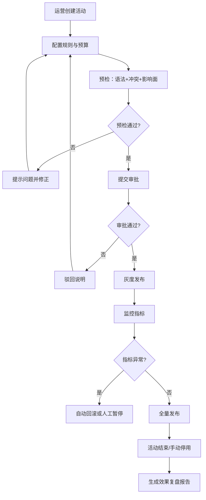

#### 2.2 异常分支与 SOP

| 异常场景 | 触发条件 | 系统行为 | 前端展示 | SOP |
|---|---|---|---|---|
| 规则冲突 | 新活动与线上活动规则重叠 | 预检拦截，提示冲突活动 | 展示"与活动 X 规则冲突" | 运营调整互斥策略 |
| 预算超支 | 实际消耗 > 预算上限 | 自动停止命中，拦截新增补贴 | 提示"活动预算已耗尽，自动停止" | 财务审批追加预算 |
| 灰度指标异常 | 灰度期间取消率上升 > 阈值 | 自动回滚 | 提示"活动已自动回滚" | 运营复盘 |
| 活动停用后仍命中 | 缓存未刷新 | 补偿退款 | - | 技术排查缓存问题 |

#### 2.3 状态机（活动生命周期）

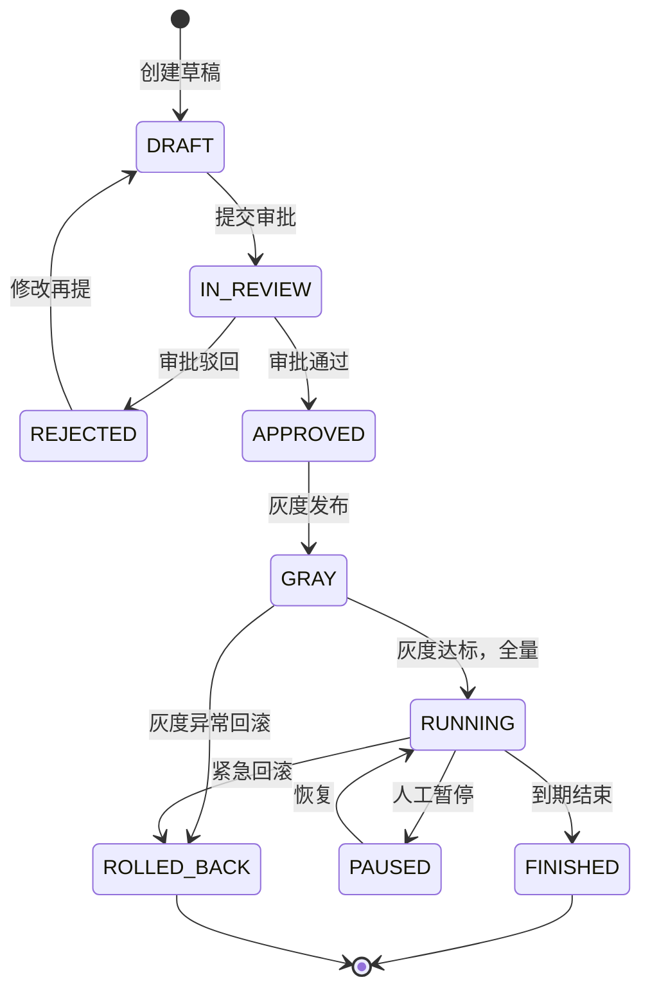

#### 2.4 关键规则清单

1. **预算控制**：
   - 活动级预算：总预算上限，达到后活动自动失效。
   - 日预算：每日消耗上限，达到后当日停止，次日恢复。
   - 单用户上限：同一乘客/司机活动期间最高补贴次数/金额。
2. **灰度规则**：
   - 默认灰度 5% 流量，观察 30 分钟。
   - 灰度指标：下单转化率、取消率、单均补贴成本、ROI。
   - 任一指标劣化 > 20% 自动回滚。
3. **活动类型**：
   - 乘客端：新客首单免单、满减券、折扣券、一口价直降。
   - 司机端：高峰奖励、冲单奖、邀请司机奖、服务分奖励。
4. **互斥规则**：同一订单不可叠加多个乘客优惠券（取最优）；司机奖励可叠加但有上限。

### ③ 数据字典（L3）

##### 表 1：campaign_plan（营销活动计划表）

- **表名 / 中文名**：`campaign_plan` / 营销活动计划表
- **业务说明**：营销活动主表。
- **分库分表策略**：单库单表（数据量小，预计 < 1 万条活跃活动）。

| 字段名 | 中文 | 类型 | 长度 | 允许空 | 默认值 | 索引 | 示例 | 业务说明 |
|---|---|---|---|---|---|---|---|---|
| campaign_id | 活动 ID | varchar | 32 | 否 | - | PK | camp_001 | - |
| campaign_name | 活动名称 | varchar | 128 | 否 | - | - | 五一出行季 | - |
| campaign_type | 活动类型 | varchar | 16 | 否 | - | - | PASSENGER_SUBSIDY | PASSENGER_SUBSIDY/DRIVER_REWARD/PRICE_DISCOUNT |
| city_scope | 投放城市 | json | - | 否 | - | - | [310100,440300] | JSON 数组 |
| user_scope | 用户范围 | json | - | 是 | NULL | - | {"new_user":true} | JSON |
| start_at | 开始时间 | datetime(3) | - | 否 | - | - | 2026-05-01 00:00:00 | - |
| end_at | 结束时间 | datetime(3) | - | 否 | - | - | 2026-05-05 23:59:59 | - |
| time_window | 时段限制 | varchar | 64 | 是 | NULL | - | 07:00-10:00,17:00-21:00 | - |
| budget_cap_cent | 总预算 | int | 10 | 否 | - | - | 100000000 | 分 |
| daily_budget_cent | 日预算 | int | 10 | 是 | NULL | - | 20000000 | 分 |
| consumed_budget_cent | 已消耗预算 | int | 10 | 否 | 0 | - | 5000000 | 分 |
| campaign_status | 活动状态 | varchar | 16 | 否 | DRAFT | - | RUNNING | DRAFT/IN_REVIEW/APPROVED/GRAY/RUNNING/PAUSED/FINISHED/ROLLED_BACK |
| gray_ratio | 灰度比例 | decimal | 5,4 | 是 | 0.05 | - | 0.0500 | 5% |
| rules_json | 规则 JSON | json | - | 否 | - | - | {...} | 规则引擎配置 |
| creator_id | 创建人 | varchar | 32 | 否 | - | - | ops_001 | - |
| approver_id | 审批人 | varchar | 32 | 是 | NULL | - | ops_manager_001 | - |
| rolled_back_at | 回滚时间 | datetime(3) | - | 是 | NULL | - | - | - |
| rollback_reason | 回滚原因 | varchar | 255 | 是 | NULL | - | 取消率异常 | - |

##### 表 2：subsidy_hit（补贴命中记录表）

- **表名 / 中文名**：`subsidy_hit` / 补贴命中记录表
- **业务说明**：每笔补贴的命中记录。
- **分库分表策略**：按 `order_id` 哈希分 16 库，每库 256 表。
- **预估数据量**：日增 300 万条。

| 字段名 | 中文 | 类型 | 长度 | 允许空 | 默认值 | 索引 | 示例 | 业务说明 |
|---|---|---|---|---|---|---|---|---|
| hit_id | 命中 ID | varchar | 32 | 否 | - | PK | hit_001 | - |
| campaign_id | 活动 ID | varchar | 32 | 否 | - | FK | camp_001 | - |
| order_id | 订单 ID | varchar | 32 | 否 | - | FK | ord_001 | - |
| user_id | 用户 ID | varchar | 32 | 否 | - | - | p_001 | - |
| user_type | 用户类型 | varchar | 16 | 否 | - | - | PASSENGER | PASSENGER/DRIVER |
| subsidy_amount_cent | 补贴金额 | int | 10 | 否 | - | - | 1000 | 分 |
| hit_rule_code | 命中规则码 | varchar | 32 | 否 | - | - | rule_001 | - |
| settled_flag | 是否入账 | tinyint | 1 | 否 | 0 | - | 1 | - |
| settled_at | 入账时间 | datetime(3) | - | 是 | NULL | - | 2026-04-21 10:00:00 | - |
| hit_at | 命中时间 | datetime(3) | - | 否 | - | - | 2026-04-21 10:00:00 | - |

#### 3.3 枚举字典

| 枚举名 | 取值集合 | 所属字段 | Owner |
|---|---|---|---|
| campaign_type_enum | PASSENGER_SUBSIDY/DRIVER_REWARD/PRICE_DISCOUNT/REFERRAL | campaign_plan.campaign_type | 营销平台 |
| campaign_status_enum | DRAFT/IN_REVIEW/APPROVED/GRAY/RUNNING/PAUSED/FINISHED/ROLLED_BACK | campaign_plan.campaign_status | 营销平台 |

### ④ 关联模块

#### 4.1 上游依赖

| 依赖模块 | 提供内容 |
|---|---|
| 规则引擎 | 活动规则执行 |
| 财务系统 | 预算审批与管控 |
| 订单服务 | 订单事件驱动命中 |

#### 4.2 下游被依赖

| 消费方 | 消费内容 |
|---|---|
| 乘客端 | 优惠券展示与核销 |
| 司机端 | 奖励展示与发放 |
| 结算服务 | 补贴入账 |

#### 4.3 同级协作

| 协作模块 | 协作内容 |
|---|---|
| 数据平台 | 活动效果分析 |
| 运营后台-订单看板 | 活动对订单指标影响监控 |

#### 4.4 外部系统

| 外部系统 | 用途 |
|---|---|
| 短信/推送平台 | 活动通知 |

---

## 3.5 客诉与服务质量运营

### 需求元信息（Meta）

| 属性 | 内容 |
|---|---|
| 需求编号 | OPS-005 |
| 优先级 | P1 |
| 所属域 | 运营域-客服中心 |
| 责任产品 | 客服产品经理 |
| 责任研发 | 客服系统 / 质检平台 |
| 版本 | v1.0.0 |

### ① 需求场景描述

#### 1.1 角色与场景（Who / When / Where）

| 维度 | 描述 |
|---|---|
| Who | 客服专员、客服主管、质检员、运营分析师 |
| When | 客诉处理、服务质量监控、月度复盘 |
| Where | 运营后台-客服中心 / 质检平台 |

#### 1.2 用户痛点与业务价值（Why）

- **痛点 1**：客诉处理慢，乘客/司机满意度下降。
- **痛点 2**：同类型问题反复出现，缺乏根因治理。
- **痛点 3**：质检依赖人工抽检，效率低。
- **业务价值**：自动分级与分派缩短处理时效 40%；根因分析驱动产品改进，降低重复投诉率。

#### 1.3 功能范围

| 类别 | 范围说明 |
|---|---|
| **In Scope** | 客诉工单统一管理、智能分级分派、SLA 监控与预警、处理过程记录、补偿审批、质检抽检、根因分析报表、满意度回访、知识库管理 |
| **边界** | 仅处理平台业务相关客诉 |
| **非目标** | 外部舆情监控（走品牌部门） |

#### 1.4 验收标准

| 指标 | 目标值 | 计算口径 |
|---|---|---|
| 案件自动分级准确率 | >= 95% | 抽检一致 / 抽检总数 |
| 高优先级案件按时结案率 | >= 90% | P1/P2 按时结案 / 高优先级总数 |
| 客诉处理可追溯率 | >= 99.99% | 含完整证据链 / 结案总数 |
| 质检覆盖率 | >= 30% | 质检案件 / 总案件 |

### ② 业务流程

#### 2.1 主流程（mermaid flowchart）

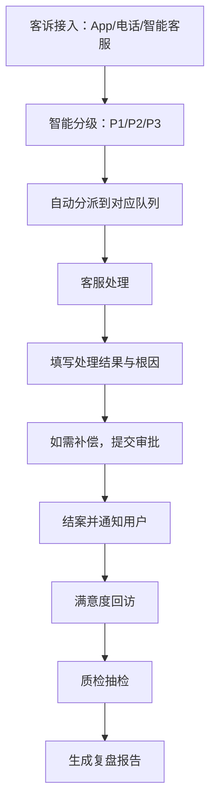

#### 2.2 异常分支与 SOP

| 异常场景 | 触发条件 | 系统行为 | 前端展示 | SOP |
|---|---|---|---|---|
| 分派失败 | 对应队列无空闲客服 | 进入溢出队列，通知主管 | 主管告警"XX队列积压" | 调配人力 |
| SLA 即将超时 | 距离截止 < 30 分钟 | 标红提醒，升级主管 | 工单标红 + 推送提醒 | 主管介入 |
| 用户 reopen | 结案后用户不满意 | 重新打开，关联原工单 | - | 优先处理 |
| 补偿审批驳回 | 主管拒绝补偿 | 通知客服修改方案 | - | 客服与用户重新协商 |

#### 2.3 状态机（客诉案件生命周期）

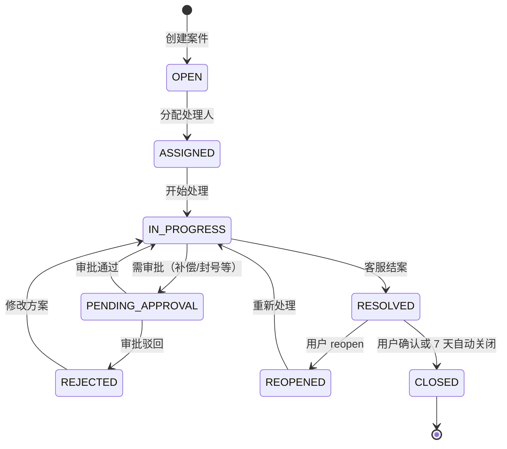

#### 2.4 关键规则清单

1. **分级规则**：
   - P1（紧急）：人身安全、重大资损（> 1000 元）、媒体曝光风险。响应时效：10 分钟；处理时效：2 小时。
   - P2（重要）：费用争议、服务纠纷、账号异常。响应时效：30 分钟；处理时效：24 小时。
   - P3（一般）：咨询、建议、轻微投诉。响应时效：4 小时；处理时效：72 小时。
2. **分派规则**：按案件类型自动分派到专业队列（费用组/安全组/账号组）；支持技能标签匹配（如英语客服）。
3. **补偿审批**：
   - <= 50 元：客服直批。
   - 50~200 元：客服主管审批。
   - > 200 元：客服总监+财务审批。
4. **质检规则**：
   - 全量质检：P1 案件 100% 质检。
   - 随机抽检：P2/P3 按 30% 比例抽检。
   - 差评触发：满意度 <= 3 星的案件强制质检。
5. **根因分类**：费用计算错误、司机服务问题、系统故障、乘客误操作、规则不清、第三方问题。

### ③ 数据字典（L3）

复用乘客端/司机端 service_ticket 表，补充运营后台专属扩展表：

##### 表 1：service_case（服务案件主表，运营视角）

- **表名 / 中文名**：`service_case` / 服务案件主表
- **业务说明**：客服案件统一主表。
- **分库分表策略**：按 `case_id` 哈希分 8 库，每库 128 表。

| 字段名 | 中文 | 类型 | 长度 | 允许空 | 默认值 | 索引 | 示例 | 业务说明 |
|---|---|---|---|---|---|---|---|---|
| case_id | 案件 ID | varchar | 32 | 否 | - | PK | case_001 | - |
| ticket_id | 工单 ID | varchar | 32 | 是 | NULL | - | tkt_001 | 关联乘客/司机工单 |
| source_channel | 来源渠道 | varchar | 16 | 否 | - | - | APP | APP/PHONE/WEB/ROBOT/WECHAT |
| case_type | 案件类型 | varchar | 16 | 否 | - | - | FARE_DISPUTE | FARE_DISPUTE/SAFETY/SERVICE/ACCOUNT/OTHER |
| severity_level | 严重等级 | varchar | 4 | 否 | P3 | - | P2 | P1/P2/P3 |
| case_status | 案件状态 | varchar | 16 | 否 | OPEN | - | IN_PROGRESS | OPEN/ASSIGNED/IN_PROGRESS/PENDING_APPROVAL/RESOLVED/REOPENED/CLOSED |
| assignee_id | 处理人 | varchar | 32 | 是 | NULL | - | cs_001 | - |
| assignee_group | 处理组 | varchar | 32 | 是 | NULL | - | fee_team | - |
| sla_deadline_at | SLA 截止 | datetime(3) | - | 否 | - | - | 2026-04-21 12:00:00 | - |
| root_cause_code | 根因编码 | varchar | 32 | 是 | NULL | - | fare_calc_error | - |
| root_cause_desc | 根因描述 | varchar | 255 | 是 | NULL | - | 计费里程与实际不符 | - |
| compensation_amount_cent | 补偿金额 | int | 10 | 是 | 0 | - | 500 | 分 |
| compensation_approved_by | 补偿审批人 | varchar | 32 | 是 | NULL | - | cs_manager_001 | - |
| satisfaction_score | 满意度 | tinyint | 1 | 是 | NULL | - | 5 | 1-5 |
| satisfaction_comment | 满意度评价 | varchar | 500 | 是 | NULL | - | 处理很快 | - |
| reopened_count | reopen 次数 | int | 10 | 否 | 0 | - | 0 | - |
| closed_at | 结案时间 | datetime(3) | - | 是 | NULL | - | 2026-04-21 11:00:00 | - |
| closed_by | 结案人 | varchar | 32 | 是 | NULL | - | cs_001 | - |

- **索引清单**
  - 主键：`PRIMARY KEY (case_id)`
  - 联合索引：`KEY idx_assignee_status (assignee_id, case_status, sla_deadline_at)`
  - 联合索引：`KEY idx_severity_sla (severity_level, sla_deadline_at)`
  - 普通索引：`KEY idx_root_cause (root_cause_code, created_at)`

##### 表 2：quality_inspection（质检记录表）

- **表名 / 中文名**：`quality_inspection` / 质检记录表
- **业务说明**：客服案件质检评分。

| 字段名 | 中文 | 类型 | 长度 | 允许空 | 默认值 | 索引 | 示例 | 业务说明 |
|---|---|---|---|---|---|---|---|---|
| inspection_id | 质检 ID | varchar | 32 | 否 | - | PK | qi_001 | - |
| case_id | 案件 ID | varchar | 32 | 否 | - | FK | case_001 | - |
| inspector_id | 质检员 | varchar | 32 | 否 | - | - | qa_001 | - |
| inspection_type | 质检类型 | varchar | 16 | 否 | - | - | RANDOM | RANDOM/MANDATORY/BAD_REVIEW |
| score_total | 总分 | int | 10 | 否 | - | - | 95 | 百分制 |
| score_service_attitude | 服务态度分 | int | 10 | 是 | NULL | - | 20 | 20 分制 |
| score_professionalism | 专业度分 | int | 10 | 是 | NULL | - | 25 | 25 分制 |
| score_response_time | 响应时效分 | int | 10 | 是 | NULL | - | 25 | 25 分制 |
| score_solution | 解决效果分 | int | 10 | 是 | NULL | - | 25 | 25 分制 |
| defect_items | 缺陷项 | json | - | 是 | NULL | - | ["响应慢","未安抚情绪"] | JSON |
| inspection_result | 质检结果 | varchar | 16 | 否 | PASS | - | PASS | PASS/FAIL/IMPROVEMENT |
| inspected_at | 质检时间 | datetime(3) | - | 否 | - | - | 2026-04-22 10:00:00 | - |

#### 3.3 枚举字典

| 枚举名 | 取值集合 | 所属字段 | Owner |
|---|---|---|---|
| case_type_enum | FARE_DISPUTE/SAFETY/SERVICE/ACCOUNT/OTHER | service_case.case_type | 客服系统 |
| case_status_enum | OPEN/ASSIGNED/IN_PROGRESS/PENDING_APPROVAL/RESOLVED/REOPENED/CLOSED | service_case.case_status | 客服系统 |
| inspection_type_enum | RANDOM/MANDATORY/BAD_REVIEW/CALIBRATION | quality_inspection.inspection_type | 质检平台 |
| inspection_result_enum | PASS/FAIL/IMPROVEMENT | quality_inspection.inspection_result | 质检平台 |

### ④ 关联模块

#### 4.1 上游依赖

| 依赖模块 | 提供内容 |
|---|---|
| 乘客/司机客服系统 | 工单创建 |
| 智能客服 | 自动分级 |
| 订单服务 | 订单信息 |

#### 4.2 下游被依赖

| 消费方 | 消费内容 |
|---|---|
| 运营分析 | 服务质量报表 |
| 产品团队 | 根因分析驱动改进 |
| 司机中心 | 司机服务质量考核 |

#### 4.3 同级协作

| 协作模块 | 协作内容 |
|---|---|
| 结算系统 | 补偿发放 |
| 运营后台-订单看板 | 高危订单标记 |

#### 4.4 外部系统

| 外部系统 | 用途 |
|---|---|
| 呼叫中心 | 电话客服接入 |
| 在线客服系统 | 在线会话接入 |

---

## 3.6 规则配置与发布治理

### 需求元信息（Meta）

| 属性 | 内容 |
|---|---|
| 需求编号 | OPS-006 |
| 优先级 | P1 |
| 所属域 | 运营域-规则中心 |
| 责任产品 | 平台产品经理 |
| 责任研发 | 规则引擎 / 规则中心 |
| 版本 | v1.0.0 |

### ① 需求场景描述

#### 1.1 角色与场景（Who / When / Where）

| 维度 | 描述 |
|---|---|
| Who | 规则运营、算法运营、安全运营、技术负责人 |
| When | 新规则上线、规则优化、紧急止损 |
| Where | 运营后台-规则中心 |

#### 1.2 用户痛点与业务价值（Why）

- **痛点 1**：规则发布缺乏流程，线上故障频繁。
- **痛点 2**：规则冲突无法提前发现，导致叠加效应。
- **痛点 3**：紧急问题回滚慢，故障放大。
- **业务价值**：规则预检+灰度+回滚机制将规则故障降低 80%；分钟级回滚保障业务连续性。

#### 1.3 功能范围

| 类别 | 范围说明 |
|---|---|
| **In Scope** | 规则域管理（派单/风控/营销/服务）、规则草稿编辑（可视化 DSL）、语法预检、冲突检测、影响面评估、审批流、灰度发布、实时监控、自动回滚、版本管理、规则快照对比 |
| **边界** | 仅管理业务规则，不涉及代码发布 |
| **非目标** | AI 模型发布（走 MLOps 模块） |

#### 1.4 验收标准

| 指标 | 目标值 | 计算口径 |
|---|---|---|
| 规则预检拦截准确率 | >= 99.5% | 正确拦截高风险 / 高风险总数 |
| 灰度发布成功率 | >= 99.0% | 按计划灰度成功 / 灰度批次总数 |
| 自动回滚触发有效率 | >= 99% | 阈值命中后 30s 内回滚成功 / 命中总数 |
| 发布与执行版本一致率 | >= 99.99% | 版本一致 / 规则执行请求总数 |

### ② 业务流程

#### 2.1 主流程（mermaid flowchart）

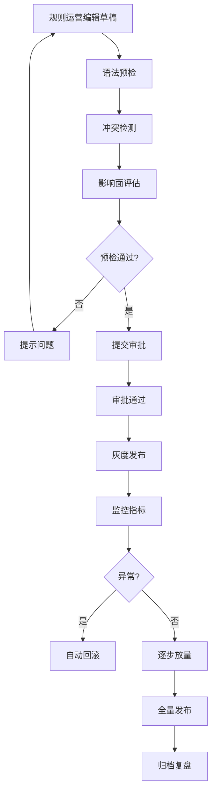

#### 2.2 异常分支与 SOP

| 异常场景 | 触发条件 | 系统行为 | 前端展示 | SOP |
|---|---|---|---|---|
| 规则语法错误 | 预检发现语法问题 | 拦截发布 | 提示"规则语法错误：第 X 行" | 运营修正 |
| 规则冲突 | 与线上规则条件重叠 | 警告并提示冲突规则 | 展示"与规则 X 条件重叠，建议互斥" | 运营调整 |
| 灰度指标劣化 | 取消率上升 > 20% | 自动回滚 | 提示"规则已自动回滚" | 运营复盘 |
| 回滚失败 | 回滚服务异常 | 触发 P1 告警，人工介入 | - | 技术值班处理 |
| 发布与执行不一致 | 版本号不匹配 | 拒绝执行，告警 | - | 技术排查缓存/推送问题 |

#### 2.3 状态机（规则发布生命周期）

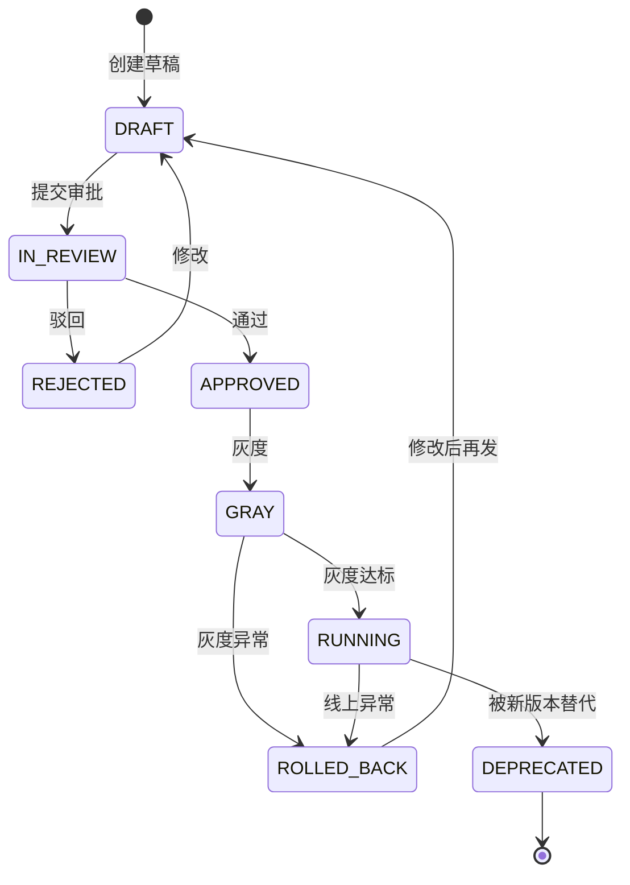

#### 2.4 关键规则清单

1. **规则域划分**：
   - DISPATCH：派单策略（派单半径、应答时限、强派条件）。
   - RISK：风控策略（刷单识别、异常登录、资金风险）。
   - MARKETING：营销规则（优惠券命中、奖励触发）。
   - SERVICE：服务规则（取消判责、取消费计算、SLA）。
2. **灰度策略**：
   - 按城市灰度：选择 1-3 个城市先行。
   - 按流量灰度：从 5% → 20% → 50% → 100% 阶梯放量。
   - 按用户灰度：按乘客/司机 ID 哈希取模。
3. **自动回滚阈值**：
   - 取消率较基线上升 > 20%。
   - 客诉率较基线上升 > 30%。
   - 系统错误率 > 1%。
   - 任何一条触发，30 秒内自动回滚。
4. **版本管理**：规则支持多版本并存，回滚时可精确到上一稳定版本；历史版本保留 90 天。

### ③ 数据字典（L3）

##### 表 1：rule_release（规则发布表）

- **表名 / 中文名**：`rule_release` / 规则发布表
- **业务说明**：规则发布批次记录。
- **分库分表策略**：单库单表。

| 字段名 | 中文 | 类型 | 长度 | 允许空 | 默认值 | 索引 | 示例 | 业务说明 |
|---|---|---|---|---|---|---|---|---|
| release_id | 发布 ID | varchar | 32 | 否 | - | PK | rel_001 | - |
| rule_domain | 规则域 | varchar | 16 | 否 | - | - | DISPATCH | DISPATCH/RISK/MARKETING/SERVICE |
| rule_code | 规则编码 | varchar | 32 | 否 | - | - | dispatch_radius_v2 | - |
| draft_version | 草稿版本 | varchar | 16 | 否 | - | - | v2.1 | - |
| rule_content | 规则内容 | text | - | 否 | - | - | if ... then ... | DSL |
| target_scope | 发布范围 | json | - | 否 | - | - | {"cities":[310100]} | JSON |
| gray_ratio | 灰度比例 | decimal | 5,4 | 是 | 0 | - | 0.0500 | - |
| approval_ticket_id | 审批单 | varchar | 32 | 否 | - | - | appr_001 | - |
| release_status | 发布状态 | varchar | 16 | 否 | DRAFT | - | RUNNING | DRAFT/APPROVED/GRAY/RUNNING/ROLLED_BACK/DEPRECATED |
| rollback_flag | 是否回滚 | tinyint | 1 | 否 | 0 | - | 0 | - |
| rollback_reason | 回滚原因 | varchar | 255 | 是 | NULL | - | 取消率异常 | - |
| rollback_trigger | 回滚触发方式 | varchar | 16 | 是 | NULL | - | AUTO | AUTO/MANUAL |
| released_at | 发布时间 | datetime(3) | - | 是 | NULL | - | 2026-04-21 10:00:00 | - |
| rolled_back_at | 回滚时间 | datetime(3) | - | 是 | NULL | - | 2026-04-21 10:30:00 | - |
| released_by | 发布人 | varchar | 32 | 是 | NULL | - | ops_001 | - |

##### 表 2：rule_execution_log（规则执行日志表）

- **表名 / 中文名**：`rule_execution_log` / 规则执行日志表
- **业务说明**：规则命中与执行记录，用于效果分析。
- **分库分表策略**：按 `rule_domain` 分库，按日期分表；保留 30 天。

| 字段名 | 中文 | 类型 | 长度 | 允许空 | 默认值 | 索引 | 示例 | 业务说明 |
|---|---|---|---|---|---|---|---|---|
| log_id | 日志 ID | bigint | 20 | 否 | AUTO_INCREMENT | PK | 1 | - |
| rule_domain | 规则域 | varchar | 16 | 否 | - | - | DISPATCH | - |
| rule_code | 规则编码 | varchar | 32 | 否 | - | - | dispatch_radius_v2 | - |
| rule_version | 规则版本 | varchar | 16 | 否 | - | - | v2.1 | - |
| biz_type | 业务类型 | varchar | 16 | 否 | - | - | ORDER | ORDER/DRIVER/PASSENGER |
| biz_id | 业务 ID | varchar | 32 | 否 | - | - | ord_001 | - |
| hit_result | 命中结果 | varchar | 16 | 否 | - | - | HIT | HIT/MISS/SKIP |
| action_result | 执行结果 | varchar | 16 | 是 | NULL | - | ALLOW | ALLOW/REJECT/MODIFY |
| execution_time_ms | 执行耗时 | int | 10 | 否 | - | - | 5 | ms |
| executed_at | 执行时间 | datetime(3) | - | 否 | - | - | 2026-04-21 10:00:00 | - |

#### 3.3 枚举字典

| 枚举名 | 取值集合 | 所属字段 | Owner |
|---|---|---|---|
| rule_domain_enum | DISPATCH/RISK/MARKETING/SERVICE | rule_release.rule_domain | 规则中心 |
| release_status_enum | DRAFT/APPROVED/GRAY/RUNNING/ROLLED_BACK/DEPRECATED | rule_release.release_status | 规则中心 |
| hit_result_enum | HIT/MISS/SKIP/ERROR | rule_execution_log.hit_result | 规则引擎 |
| action_result_enum | ALLOW/REJECT/MODIFY/WARNING | rule_execution_log.action_result | 规则引擎 |

### ④ 关联模块

#### 4.1 上游依赖

| 依赖模块 | 提供内容 |
|---|---|
| 规则引擎 | 规则执行能力 |
| 审批系统 | 发布审批流 |
| 监控平台 | 灰度指标监控 |

#### 4.2 下游被依赖

| 消费方 | 消费内容 |
|---|---|
| 调度服务 | 派单规则 |
| 风控服务 | 风控规则 |
| 营销服务 | 营销规则 |
| 订单服务 | 服务规则 |

#### 4.3 同级协作

| 协作模块 | 协作内容 |
|---|---|
| AI 模块 | AI 策略与规则策略协同 |
| 数据平台 | 规则效果分析 |

#### 4.4 外部系统

| 外部系统 | 用途 |
|---|---|
| 企业微信 | 审批通知与告警 |

---

## 附录：运营后台全局枚举汇总

| 枚举名 | 取值集合 | 使用位置 |
|---|---|---|
| account_status_enum | CREATED/ACTIVE/LOCKED/DISABLED/DELETED | ops_user.account_status |
| role_type_enum | PRESET/CUSTOM | ops_role.role_type |
| data_scope_type_enum | ALL/CITY/ORG/SELF | ops_role.data_scope_type |
| action_result_enum | SUCCESS/FAILED | ops_audit_log.result |
| action_type_enum | REDISPATCH/SUBSIDY/CLOSE/RESTORE/FORCE_COMPLETE | ops_order_action.action_type |
| alert_type_enum | HIGH_CANCEL_RATE/DISPATCH_TIMEOUT/SUPPLY_SHORTAGE/PAYMENT_ANOMALY/SAFETY_EVENT | ops_order_alert.alert_type |
| alert_level_enum | WARNING/CRITICAL/EMERGENCY | ops_order_alert.alert_level |
| alert_status_enum | TRIGGERED/ACKED/RESOLVED/IGNORED | ops_order_alert.alert_status |
| review_type_enum | ONBOARD/RENEW/RISK_RECHECK | compliance_review.review_type |
| review_result_enum | PASS/REJECT/NEED_MORE | compliance_review.review_result |
| review_stage_enum | MACHINE/MANUAL/FINAL | compliance_review.review_stage |
| campaign_type_enum | PASSENGER_SUBSIDY/DRIVER_REWARD/PRICE_DISCOUNT/REFERRAL | campaign_plan.campaign_type |
| campaign_status_enum | DRAFT/IN_REVIEW/APPROVED/GRAY/RUNNING/PAUSED/FINISHED/ROLLED_BACK | campaign_plan.campaign_status |
| case_type_enum | FARE_DISPUTE/SAFETY/SERVICE/ACCOUNT/OTHER | service_case.case_type |
| case_status_enum | OPEN/ASSIGNED/IN_PROGRESS/PENDING_APPROVAL/RESOLVED/REOPENED/CLOSED | service_case.case_status |
| inspection_type_enum | RANDOM/MANDATORY/BAD_REVIEW/CALIBRATION | quality_inspection.inspection_type |
| inspection_result_enum | PASS/FAIL/IMPROVEMENT | quality_inspection.inspection_result |
| rule_domain_enum | DISPATCH/RISK/MARKETING/SERVICE | rule_release.rule_domain |
| release_status_enum | DRAFT/APPROVED/GRAY/RUNNING/ROLLED_BACK/DEPRECATED | rule_release.release_status |
| hit_result_enum | HIT/MISS/SKIP/ERROR | rule_execution_log.hit_result |
| action_result_enum | ALLOW/REJECT/MODIFY/WARNING | rule_execution_log.action_result |
