# 华夏小猪出行 — AI 能力产品需求文档（PRD）

> 文档版本：v1.0.0  
> 适用范围：AI 中台全量业务（智能客服 / 智能调度 / 智能路线规划 / MLOps）  
> 最后更新：2026-04-21  
> 评审状态：Draft  

---

## 全局约定

### 审计字段约定（全表通用）

| 字段名 | 类型 | 允许空 | 默认值 | 说明 |
|---|---|---|---|---|
| created_at | datetime(3) | 否 | CURRENT_TIMESTAMP(3) | 创建时间 |
| updated_at | datetime(3) | 否 | CURRENT_TIMESTAMP(3) ON UPDATE CURRENT_TIMESTAMP(3) | 最后更新时间 |
| deleted_at | datetime(3) | 是 | NULL | 软删除标记 |
| creator_id | varchar(64) | 是 | NULL | 创建人 ID |
| tenant_id | varchar(64) | 否 | 'default' | 租户 ID |

> **注**：本 PRD 所有数据表均默认包含以上审计字段，以下各表字段清单中不再重复列出。

### AI 治理基线要素
所有 AI 能力上线前必须完成以下治理 checklist：
- 训练时间窗：明确训练数据起止时间，禁止跨越未冻结数据分区。
- 离线指标：定义核心离线指标与门禁阈值（AUC、F1、MAPE、NDCG 等）。
- 在线指标：定义核心在线指标与观察窗口（时延、转化、取消率、投诉率）。
- 灰度发布：配置灰度比例、范围、观察时长与放量策略。
- 回滚阈值：配置自动回滚阈值与人工接管条件，确保故障分钟级止损。

---

## 4.1 智能客服（意图识别与自动应答）

### 需求元信息（Meta）

| 属性 | 内容 |
|---|---|
| 需求编号 | AI-001 |
| 优先级 | P0 |
| 所属域 | AI 域-智能客服 |
| 责任产品 | AI 产品经理 / 客服产品经理 |
| 责任研发 | NLP 算法组 / 客服工程组 |
| 版本 | v1.0.0 |

### ① 需求场景描述

#### 1.1 角色与场景（Who / When / Where）

| 维度 | 描述 |
|---|---|
| Who | 咨询问题的乘客、求助的司机、处理简单问题的智能客服机器人 |
| When | 7×24 小时；用户发起咨询时；人工坐席繁忙时 |
| Where | 乘客 App 客服入口、司机 App 客服入口、客服工作台、微信小程序 |

#### 1.2 用户痛点与业务价值（Why）

- **痛点 1**：高峰期人工坐席排队长，用户等待时间 > 5 分钟。
- **痛点 2**：80% 咨询为重复性问题（如何开发票、如何修改手机号、订单取消规则），人工处理效率低。
- **痛点 3**：人工客服回答口径不一致，引发二次投诉。
- **业务价值**：智能客服分流 60%+ 简单咨询，降低人工坐席成本 40%；首响时间从分钟级降至秒级。

#### 1.3 功能范围

| 类别 | 范围说明 |
|---|---|
| **In Scope** | 多轮对话管理、意图识别（NLU）、槽位填充、知识库检索（FAQ+RAG）、自动应答生成、情绪识别、转人工策略、会话摘要生成、智能填单、工单预分类、坐席辅助（实时推荐答案） |
| **边界** | 仅处理平台业务范围内问题；法律/医疗等专业问题引导转人工 |
| **非目标** | 完全替代人工客服、情感陪伴型对话 |

#### 1.4 验收标准

| 指标 | 目标值 | 计算口径 |
|---|---|---|
| 意图识别准确率 | >= 90% | 抽检意图预测与人工标注一致 / 抽检总数 |
| 自动应答首响时延 P95 | <= 800ms | 用户提问 → 首条回复 P95 |
| 转人工建议可用率 | >= 99% | 转人工时带结构化摘要 / 转人工总数 |
| 智能客服解决率 | >= 60% | 未转人工且用户确认解决 / 总咨询量 |
| 高风险应答拦截率 | >= 99.9% | 命中安全策略被拦截 / 高风险候选总数 |

### ② 业务流程

#### 2.1 主流程（mermaid sequenceDiagram）

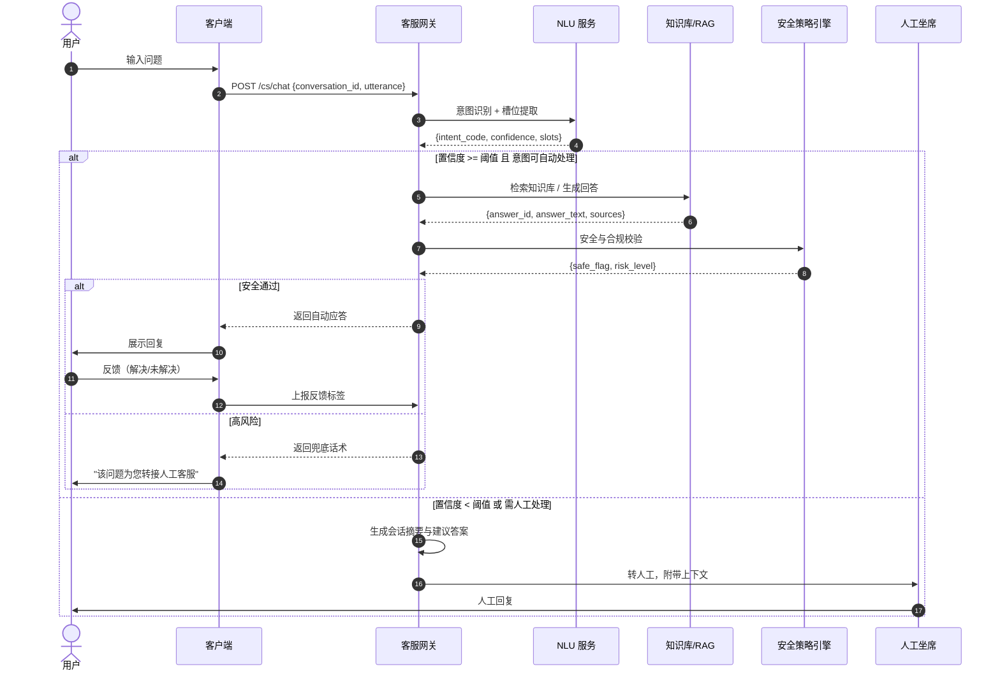

#### 2.2 异常分支与 SOP

| 异常场景 | 触发条件 | 系统行为 | 前端展示 | SOP |
|---|---|---|---|---|
| NLU 服务超时 | 800ms 内未返回意图 | 降级到关键词匹配 | 返回基于关键词的 FAQ 推荐 | 算法优化模型时延 |
| 知识库无匹配 | 检索结果相似度 < 阈值 | 返回"未找到答案"并引导转人工 | 提示"该问题较复杂，为您转人工" | 运营补充知识库 |
| 安全拦截误伤 | 正常回答被安全策略拦截 | 记录并降级到兜底话术 | 提示"该问题为您转接人工" | 优化安全策略 |
| 多轮对话迷失 | 用户连续 3 轮未命中意图 | 主动询问"您是想咨询 XX 吗？" | 展示澄清选项 | - |
| 用户情绪激烈 | 情绪识别为愤怒/焦虑 | 优先转人工，标记紧急 | 提示"理解您的心情，立即为您安排专员" | 优先分配资深客服 |

#### 2.3 状态机（会话生命周期）

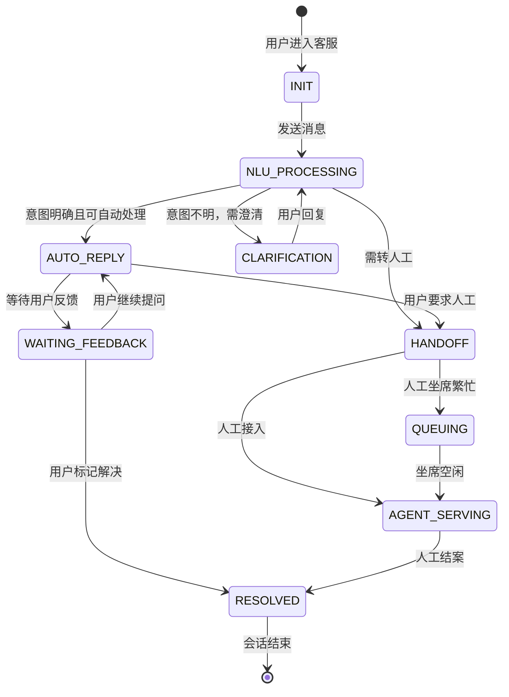

#### 2.4 关键规则清单

1. **意图分级**：
   - L1（直接回答）：FAQ 可直接回答，无需操作（如"开发票有效期多久"→"30天"）。
   - L2（需查询状态）：需查询订单/账户状态后回答（如"我的订单到哪里了"）。
   - L3（需执行动作）：需系统执行操作（如"取消订单"、"修改目的地"）。
   - L4（必须转人工）：安全/投诉/复杂纠纷。
2. **转人工触发条件**：
   - 用户主动输入"人工"/"客服"。
   - 意图置信度 < 0.6。
   - 连续 2 轮自动回答用户反馈"未解决"。
   - 情绪识别为愤怒且涉及资金安全。
   - 命中高危关键词（"报警"、"起诉"、"媒体"）。
3. **知识库更新**：运营每周补充新知识，算法每月全量重训意图模型。
4. **RAG 策略**：对政策变更类问题，优先检索最新文档；对操作类问题，优先检索结构化 FAQ。
5. **安全策略**：禁止生成涉及竞争对手攻击、政治敏感、医疗建议、法律建议的内容；所有生成内容经合规模型二次过滤。

### ③ 数据字典（L3）

#### 3.1 实体关系图

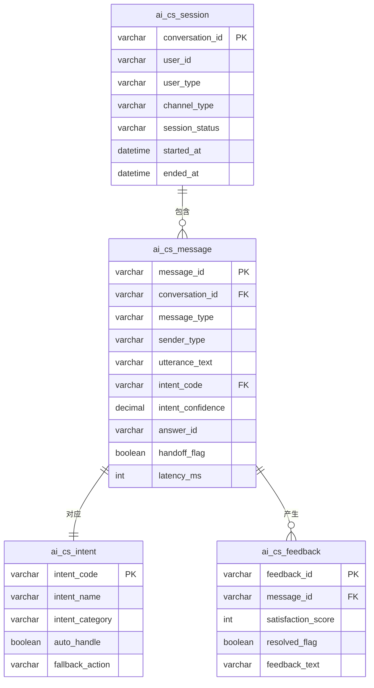

#### 3.2 表结构

##### 表 1：ai_cs_session（智能客服会话表）

- **表名 / 中文名**：`ai_cs_session` / 智能客服会话表
- **业务说明**：客服会话主档。
- **分库分表策略**：按 `conversation_id` 哈希分 8 库，每库 128 表。
- **预估数据量**：日增 500 万会话，存储 90 天。

| 字段名 | 中文 | 类型 | 长度 | 允许空 | 默认值 | 索引 | 示例 | 业务说明 |
|---|---|---|---|---|---|---|---|---|
| conversation_id | 会话 ID | varchar | 32 | 否 | - | PK | cs_001 | - |
| user_id | 用户 ID | varchar | 32 | 否 | - | - | p_001 | - |
| user_type | 用户类型 | varchar | 16 | 否 | - | - | PASSENGER | PASSENGER/DRIVER |
| channel_type | 渠道 | varchar | 16 | 否 | - | - | APP | APP/DRIVER_APP/WEB/MINI_PROGRAM |
| session_status | 会话状态 | varchar | 16 | 否 | ACTIVE | - | ACTIVE | ACTIVE/HANDOFF/RESOLVED/CLOSED |
| handoff_reason | 转人工原因 | varchar | 32 | 是 | NULL | - | LOW_CONFIDENCE | LOW_CONFIDENCE/HIGH_RISK/USER_REQUEST |
| agent_id | 人工坐席 ID | varchar | 32 | 是 | NULL | - | agent_001 | - |
| topic_tag | 会话主题 | varchar | 32 | 是 | NULL | - | FARE_QUERY | 算法自动打标 |
| satisfaction_score | 满意度 | tinyint | 1 | 是 | NULL | - | 5 | 1-5 |
| started_at | 开始时间 | datetime(3) | - | 否 | - | - | 2026-04-21 10:00:00 | - |
| ended_at | 结束时间 | datetime(3) | - | 是 | NULL | - | 2026-04-21 10:05:00 | - |
| message_count | 消息数 | int | 10 | 否 | 0 | - | 8 | - |

##### 表 2：ai_cs_message（智能客服消息表）

- **表名 / 中文名**：`ai_cs_message` / 智能客服消息表
- **业务说明**：会话中的每条消息及其 AI 处理结果。
- **分库分表策略**：按 `conversation_id` 哈希分 16 库，每库 256 表。

| 字段名 | 中文 | 类型 | 长度 | 允许空 | 默认值 | 索引 | 示例 | 业务说明 |
|---|---|---|---|---|---|---|---|---|
| message_id | 消息 ID | varchar | 32 | 否 | - | PK | msg_001 | - |
| conversation_id | 会话 ID | varchar | 32 | 否 | - | FK | cs_001 | - |
| message_seq | 消息序号 | int | 10 | 否 | - | - | 1 | - |
| message_type | 消息类型 | varchar | 16 | 否 | - | - | TEXT | TEXT/IMAGE/VOICE/RICH_MEDIA |
| sender_type | 发送者 | varchar | 16 | 否 | - | - | USER | USER/BOT/AGENT/SYSTEM |
| utterance_text | 文本内容 | varchar | 2000 | 是 | NULL | - | 怎么开发票？ | - |
| intent_code | 意图编码 | varchar | 32 | 是 | NULL | - | INVOICE_QUERY | - |
| intent_confidence | 意图置信度 | decimal | 5,4 | 是 | NULL | - | 0.9520 | - |
| slots_json | 槽位 JSON | json | - | 是 | NULL | - | {"invoice_type":"normal"} | - |
| answer_id | 答案 ID | varchar | 32 | 是 | NULL | - | ans_001 | - |
| answer_text | 回复文本 | varchar | 4000 | 是 | NULL | - | 您可以在"我的-发票中心"申请... | - |
| answer_source | 答案来源 | varchar | 16 | 是 | NULL | - | KB | KB/GENERATION/RAG |
| handoff_flag | 是否转人工 | tinyint | 1 | 否 | 0 | - | 0 | - |
| latency_ms | 处理耗时 | int | 10 | 否 | - | - | 450 | ms |
| model_version | 模型版本 | varchar | 16 | 是 | NULL | - | nlu_v2.1 | - |
| sent_at | 发送时间 | datetime(3) | - | 否 | - | - | 2026-04-21 10:00:01 | - |

##### 表 3：ai_cs_intent（意图字典表）

- **表名 / 中文名**：`ai_cs_intent` / 意图字典表
- **业务说明**：意图定义与管理。
- **分库分表策略**：单库单表。

| 字段名 | 中文 | 类型 | 长度 | 允许空 | 默认值 | 索引 | 示例 | 业务说明 |
|---|---|---|---|---|---|---|---|---|
| intent_code | 意图编码 | varchar | 32 | 否 | - | PK | INVOICE_QUERY | - |
| intent_name | 意图名称 | varchar | 64 | 否 | - | - | 发票查询 | - |
| intent_category | 意图分类 | varchar | 32 | 否 | - | - | PAYMENT | PAYMENT/ORDER/ACCOUNT/SAFETY/OTHER |
| auto_handle | 是否自动处理 | tinyint | 1 | 否 | 1 | - | 1 | 1=可自动 |
| fallback_action | 降级动作 | varchar | 16 | 是 | NULL | - | HANDOFF | HANDOFF/FAQ_RECOMMEND |
| answer_template | 答案模板 | varchar | 4000 | 是 | NULL | - | 您可以在{{page}}申请... | - |
| related_faqs | 关联 FAQ | json | - | 是 | NULL | - | ["faq_001","faq_002"] | - |
| model_version | 绑定模型版本 | varchar | 16 | 是 | NULL | - | nlu_v2.1 | - |

#### 3.3 枚举字典

| 枚举名 | 取值集合 | 所属字段 | Owner |
|---|---|---|---|
| session_status_enum | ACTIVE/HANDOFF/RESOLVED/CLOSED/EXPIRED | ai_cs_session.session_status | 智能客服 |
| handoff_reason_enum | LOW_CONFIDENCE/HIGH_RISK/USER_REQUEST/SYSTEM_TIMEOUT/EMOTION | ai_cs_session.handoff_reason | 智能客服 |
| sender_type_enum | USER/BOT/AGENT/SYSTEM | ai_cs_message.sender_type | 智能客服 |
| answer_source_enum | KB/GENERATION/RAG/RULE | ai_cs_message.answer_source | 智能客服 |
| intent_category_enum | PAYMENT/ORDER/ACCOUNT/SAFETY/SERVICE/OTHER | ai_cs_intent.intent_category | 智能客服 |

#### 3.4 接口出入参示例

**接口**：`POST /api/v1/ai/cs/chat`（智能客服对话）

**Request Body**：
```json
{
  "conversation_id": "cs_p001_20260421100001",
  "utterance": "我的订单取消了，钱什么时候退回来？",
  "user_id": "p_001",
  "user_type": "PASSENGER",
  "channel_type": "APP",
  "context": {
    "current_order_id": null,
    "last_order_id": "ord_202604210001"
  }
}
```

**Response Body**：
```json
{
  "code": 0,
  "message": "success",
  "data": {
    "message_id": "msg_20260421100001",
    "sender_type": "BOT",
    "answer_text": "您的订单 ord_202604210001 已取消，退款将在 1-3 个工作日内原路退回至您的微信账户。如有疑问可继续提问或转人工客服。",
    "intent_code": "REFUND_STATUS_QUERY",
    "intent_confidence": 0.9680,
    "handoff_flag": false,
    "latency_ms": 420,
    "suggested_actions": [
      {"type": "QUICK_REPLY", "text": "退款进度查询"},
      {"type": "QUICK_REPLY", "text": "联系人工客服"}
    ]
  }
}
```

### ④ 关联模块

#### 4.1 上游依赖

| 依赖模块 | 提供内容 |
|---|---|
| 知识库服务 | FAQ 与政策文档检索 |
| 大模型服务 | 生成式回答、会话摘要 |
| 订单服务 | 订单状态查询 |
| 用户中心 | 用户信息查询 |

#### 4.2 下游被依赖

| 消费方 | 消费内容 |
|---|---|
| 乘客端 / 司机端 | 客服入口对话 |
| 人工坐席系统 | 会话上下文与摘要 |
| 客服工单系统 | 智能填单与预分类 |

#### 4.3 同级协作

| 协作模块 | 协作内容 |
|---|---|
| 数据标注平台 | 意图标注与模型迭代 |
| A/B 实验平台 | 模型效果对比实验 |

#### 4.4 外部系统

| 外部系统 | 用途 |
|---|---|
| 阿里云百炼 / 百度千帆 / 智谱 AI | 大模型 API 调用（生成式回答） |
| 自研 NLU 模型 | 意图识别与槽位提取 |

---

## 4.2 智能调度（供需预测与派单策略）

### 需求元信息（Meta）

| 属性 | 内容 |
|---|---|
| 需求编号 | AI-002 |
| 优先级 | P0 |
| 所属域 | AI 域-智能调度 |
| 责任产品 | AI 产品经理 / 调度产品经理 |
| 责任研发 | 调度算法组 / 在线推理工程组 |
| 版本 | v1.0.0 |

### ① 需求场景描述

#### 1.1 角色与场景（Who / When / Where）

| 维度 | 描述 |
|---|---|
| Who | 平台调度系统、乘客、司机 |
| When | 实时派单决策（秒级）、供需预判（分钟级/小时级）、运力调度（调度运营干预） |
| Where | 调度引擎、运营后台调度看板 |

#### 1.2 用户痛点与业务价值（Why）

- **痛点 1**：高峰期供需失衡，乘客等待时间长，司机空驶率高。
- **痛点 2**：派单仅考虑距离，忽视司机收益与乘客体验的平衡。
- **痛点 3**：突发天气/事件导致区域供需剧烈波动，系统反应滞后。
- **业务价值**：智能调度将平均接驾时间缩短 15%+，司机小时收入提升 8%+，乘客取消率降低 3%+。

#### 1.3 功能范围

| 类别 | 范围说明 |
|---|---|
| **In Scope** | 供需预测（区域级 5min/30min/1h 预测）、候选司机排序模型、多目标派单策略（乘客等待+司机收益+平台效率）、动态调价建议、调度仿真（What-if 分析）、异常区域自动识别与运力引导、派单决策可解释性 |
| **边界** | 仅针对即时订单；预约单走独立调度逻辑 |
| **非目标** | 自动驾驶车辆调度、无人机配送 |

#### 1.4 验收标准

| 指标 | 目标值 | 计算口径 |
|---|---|---|
| 派单决策成功率 | >= 99.9% | 时限内产出有效决策 / 调度请求总数 |
| 决策时延 P95 | <= 120ms | 从请求到决策落库 P95 |
| 兜底覆盖可用率 | >= 99.99% | 模型不可用时规则兜底成功 / 模型不可用总数 |
| 平均接驾时长 | <= 5 分钟 | 接单 → 到达上车点平均时长 |
| 供需预测 MAPE | <= 20% | 预测误差绝对百分比 |

### ② 业务流程

#### 2.1 主流程（mermaid sequenceDiagram）

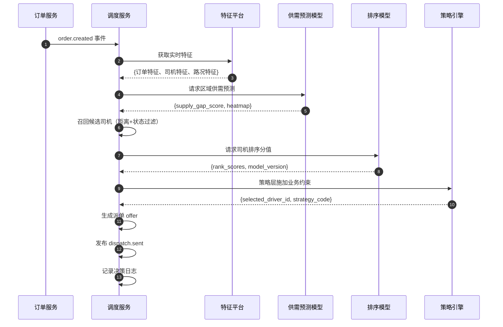

#### 2.2 异常分支与 SOP

| 异常场景 | 触发条件 | 系统行为 | 前端展示 | SOP |
|---|---|---|---|---|
| 模型推理超时 | 120ms 内未返回 | 降级到规则兜底（最近距离优先） | 无感知 | 算法优化模型时延 |
| 特征缺失 | 司机特征版本不匹配 | 使用默认特征值，标记日志 | 无感知 | 特征平台修复 |
| 模型输出异常 | 分值全为 0 或 NaN | 拒绝模型结果，走规则兜底 | 无感知 | 模型回滚 |
| 无可用司机 | 候选池为空 | 触发派单超时，引导乘客加价/等待 | 提示"附近暂无可用司机" | 调度运营关注 |
| 供需预测偏差大 | 实际与预测差异 > 50% | 标记异常，实时修正系数 | - | 算法调整模型 |

#### 2.3 状态机（派单决策生命周期）

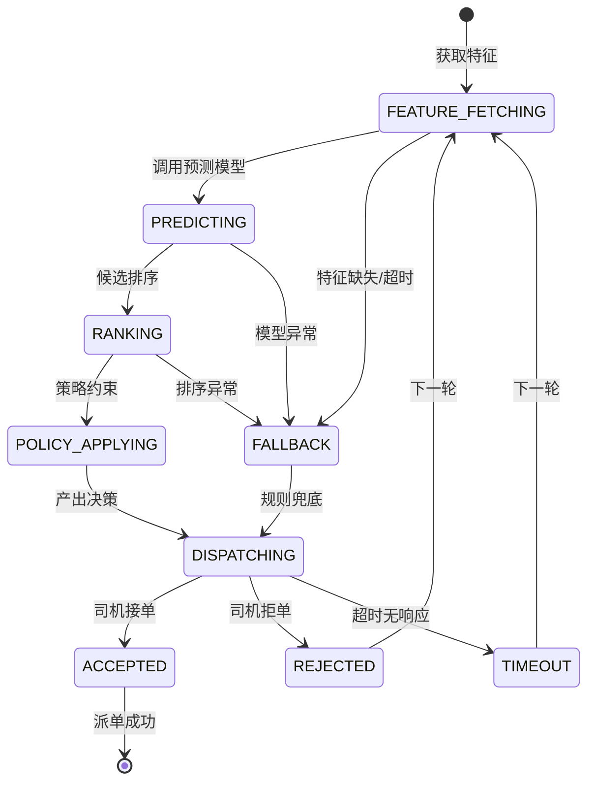

#### 2.4 关键规则清单

1. **多目标排序模型**：
   - 目标 1：乘客体验（接驾时长、等待焦虑）。
   - 目标 2：司机收益（接驾距离、订单金额、空驶成本）。
   - 目标 3：平台效率（成单率、GMV、取消率）。
   - 通过多任务学习（MTL）或强化学习（RL）平衡三目标。
2. **派单轮次**：
   - 首轮：向最优 3-5 个司机同时派单（广播模式）。
   - 次轮：首轮无应答后，扩大半径，向次优司机派单。
   - 最多 3 轮，第 3 轮为全量广播。
3. **动态调价**：供需缺口 > 阈值时，建议调价倍数；调价需乘客确认。
4. **运力引导**：通过司机端推送+奖励，引导司机前往供需失衡区域。
5. **可解释性**：运营后台可查看每单派单决策理由（如"选中司机 A：距离最近 800m，服务分高，历史应答快"）。

### ③ 数据字典（L3）

#### 3.1 实体关系图

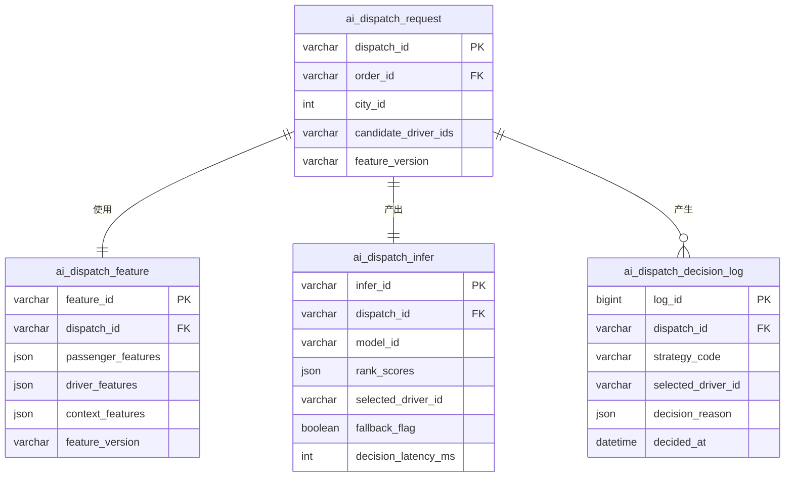

#### 3.2 表结构

##### 表 1：ai_dispatch_request（调度请求表）

- **表名 / 中文名**：`ai_dispatch_request` / 调度请求表
- **业务说明**：记录每次调度请求的输入信息。
- **分库分表策略**：按 `order_id` 哈希分 32 库，每库 128 表。
- **预估数据量**：日增 500 万条，存储 7 天。

| 字段名 | 中文 | 类型 | 长度 | 允许空 | 默认值 | 索引 | 示例 | 业务说明 |
|---|---|---|---|---|---|---|---|---|
| dispatch_id | 调度 ID | varchar | 32 | 否 | - | PK | dsp_001 | - |
| order_id | 订单 ID | varchar | 32 | 否 | - | FK | ord_001 | - |
| city_id | 城市编码 | int | 10 | 否 | - | - | 310100 | - |
| dispatch_round | 轮次 | int | 10 | 否 | 1 | - | 1 | - |
| candidate_driver_ids | 候选司机 | json | - | 否 | - | - | ["d_001","d_002"] | JSON |
| candidate_count | 候选数量 | int | 10 | 否 | - | - | 5 | - |
| feature_version | 特征版本 | varchar | 16 | 否 | - | - | feat_v2.1 | - |
| request_at | 请求时间 | datetime(3) | - | 否 | - | - | 2026-04-21 10:00:00 | - |

##### 表 2：ai_dispatch_feature（调度特征表）

- **表名 / 中文名**：`ai_dispatch_feature` / 调度特征表
- **业务说明**：调度用特征快照，用于离线分析与模型迭代。

| 字段名 | 中文 | 类型 | 长度 | 允许空 | 默认值 | 索引 | 示例 | 业务说明 |
|---|---|---|---|---|---|---|---|---|
| feature_id | 特征 ID | varchar | 32 | 否 | - | PK | ft_001 | - |
| dispatch_id | 调度 ID | varchar | 32 | 否 | - | FK | dsp_001 | - |
| passenger_features | 乘客特征 | json | - | 是 | NULL | - | {...} | 历史完单数、取消率等 |
| driver_features | 司机特征 | json | - | 是 | NULL | - | {...} | 服务分、应答率、位置等 |
| order_features | 订单特征 | json | - | 是 | NULL | - | {...} | 距离、金额、时段等 |
| context_features | 上下文特征 | json | - | 是 | NULL | - | {...} | 区域供需、天气、路况等 |
| feature_version | 特征版本 | varchar | 16 | 否 | - | - | feat_v2.1 | - |
| snapshot_at | 快照时间 | datetime(3) | - | 否 | - | - | 2026-04-21 10:00:00 | - |

##### 表 3：ai_dispatch_infer（调度推理结果表）

- **表名 / 中文名**：`ai_dispatch_infer` / 调度推理结果表
- **业务说明**：模型推理输出与最终决策。

| 字段名 | 中文 | 类型 | 长度 | 允许空 | 默认值 | 索引 | 示例 | 业务说明 |
|---|---|---|---|---|---|---|---|---|
| infer_id | 推理 ID | varchar | 32 | 否 | - | PK | inf_001 | - |
| dispatch_id | 调度 ID | varchar | 32 | 否 | - | FK | dsp_001 | - |
| model_id | 模型 ID | varchar | 32 | 否 | - | - | dispatch-rank-v3 | - |
| model_version | 模型版本 | varchar | 16 | 否 | - | - | v3.2 | - |
| rank_scores | 排序分值 | json | - | 是 | NULL | - | {"d_001":0.92,"d_002":0.85} | JSON |
| selected_driver_id | 选中司机 | varchar | 32 | 是 | NULL | - | d_001 | - |
| fallback_flag | 是否兜底 | tinyint | 1 | 否 | 0 | - | 0 | - |
| decision_latency_ms | 决策耗时 | int | 10 | 否 | - | - | 85 | ms |
| policy_constraints | 策略约束 | json | - | 是 | NULL | - | {"max_distance":3000} | - |
| infer_at | 推理时间 | datetime(3) | - | 否 | - | - | 2026-04-21 10:00:00 | - |

##### 表 4：ai_supply_demand_forecast（供需预测表）

- **表名 / 中文名**：`ai_supply_demand_forecast` / 供需预测表
- **业务说明**：区域级供需预测结果。
- **分库分表策略**：按 `city_id` 哈希分 8 库，每库 64 表。

| 字段名 | 中文 | 类型 | 长度 | 允许空 | 默认值 | 索引 | 示例 | 业务说明 |
|---|---|---|---|---|---|---|---|---|
| forecast_id | 预测 ID | varchar | 32 | 否 | - | PK | fc_001 | - |
| city_id | 城市编码 | int | 10 | 否 | - | - | 310100 | - |
| grid_id | 网格 ID | varchar | 32 | 否 | - | - | grid_310100_001 | - |
| forecast_time | 预测目标时间 | datetime(3) | - | 否 | - | - | 2026-04-21 10:05:00 | - |
| forecast_horizon_min | 预测提前量 | int | 10 | 否 | - | - | 5 | 分钟 |
| predicted_demand | 预测需求 | int | 10 | 否 | - | - | 120 | 订单数 |
| predicted_supply | 预测供给 | int | 10 | 否 | - | - | 80 | 在线司机数 |
| supply_gap_score | 供需缺口分 | decimal | 5,2 | 是 | NULL | - | 2.50 | - |
| confidence_interval_lower | 置信下限 | int | 10 | 是 | NULL | - | 100 | - |
| confidence_interval_upper | 置信上限 | int | 10 | 是 | NULL | - | 140 | - |
| model_id | 模型 ID | varchar | 32 | 否 | - | - | sd-forecast-v2 | - |
| forecast_at | 预测生成时间 | datetime(3) | - | 否 | - | - | 2026-04-21 10:00:00 | - |

#### 3.3 枚举字典

| 枚举名 | 取值集合 | 所属字段 | Owner |
|---|---|---|---|
| fallback_flag_enum | 0/1 | ai_dispatch_infer.fallback_flag | 调度算法 |
| forecast_horizon_enum | 5/15/30/60 | ai_supply_demand_forecast.forecast_horizon_min | 调度算法 |

#### 3.4 接口出入参示例

**接口**：`POST /api/v1/ai/dispatch/rank`（司机排序推理）

**Request Body**：
```json
{
  "dispatch_id": "dsp_20260421100001",
  "order_id": "ord_202604210001",
  "city_id": 310100,
  "candidate_drivers": [
    {"driver_id": "d_001", "lat": 31.2304, "lng": 121.4737, "service_score": 98},
    {"driver_id": "d_002", "lat": 31.2310, "lng": 121.4740, "service_score": 92}
  ],
  "feature_version": "feat_v2.1",
  "model_id": "dispatch-rank-v3"
}
```

**Response Body**：
```json
{
  "code": 0,
  "message": "success",
  "data": {
    "infer_id": "inf_20260421100001",
    "model_id": "dispatch-rank-v3",
    "model_version": "v3.2",
    "rank_result": [
      {"driver_id": "d_001", "score": 0.9234, "rank": 1},
      {"driver_id": "d_002", "score": 0.8856, "rank": 2}
    ],
    "fallback_flag": false,
    "latency_ms": 78,
    "selected_driver_id": "d_001",
    "decision_reason": {
      "primary_factors": ["距离最近(800m)", "服务分高(98)", "历史应答快(avg 3s)"]
    }
  }
}
```

### ④ 关联模块

#### 4.1 上游依赖

| 依赖模块 | 提供内容 |
|---|---|
| 特征平台 | 实时特征拼接 |
| 模型训练平台 | 模型训练与迭代 |
| 订单服务 | 订单信息 |
| 司机状态服务 | 司机实时状态 |
| 地图服务 | 路况与 ETA |

#### 4.2 下游被依赖

| 消费方 | 消费内容 |
|---|---|
| 调度服务 | 排序结果与决策 |
| 运营后台 | 调度效果分析 |
| 数据仓库 | 离线模型训练数据 |

#### 4.3 同级协作

| 协作模块 | 协作内容 |
|---|---|
| 规则引擎 | AI 策略与规则策略互补 |
| 营销服务 | 动态调价联动 |

#### 4.4 外部系统

| 外部系统 | 用途 |
|---|---|
| 高德/腾讯地图 | 路况数据 |
| 气象服务 | 天气数据输入预测模型 |

---

## 4.3 智能路线规划（多目标路径优化）

### 需求元信息（Meta）

| 属性 | 内容 |
|---|---|
| 需求编号 | AI-003 |
| 优先级 | P0 |
| 所属域 | AI 域-路线规划 |
| 责任产品 | AI 产品经理 / 地图产品经理 |
| 责任研发 | 路线算法组 / 地图工程组 |
| 版本 | v1.0.0 |

### ① 需求场景描述

#### 1.1 角色与场景（Who / When / Where）

| 维度 | 描述 |
|---|---|
| Who | 接驾/行程中的司机；查看 ETA 的乘客 |
| When | 接单后接驾路线规划、行程中路线规划、乘客下单前预估 |
| Where | 司机端导航、乘客端地图、后台调度系统 |

#### 1.2 用户痛点与业务价值（Why）

- **痛点 1**：传统导航仅考虑最短/最快，忽视打车业务场景（如接驾路线是否好停车）。
- **痛点 2**：实时路况变化快，原始路线很快失效。
- **痛点 3**：偏航/绕路引发费用争议。
- **业务价值**：智能路线规划将 ETA 准确度提升至 85%+，偏航投诉降低 5%+。

#### 1.3 功能范围

| 类别 | 范围说明 |
|---|---|
| **In Scope** | 多目标路线规划（时效+成本+稳定性）、实时路况融合、接驾路线优化（考虑停车便利性）、行程中动态重规划、ETA 预测、偏航检测与提醒、历史轨迹学习（司机常用路线）、路线可解释性（为什么走这条路） |
| **边界** | 仅支持陆路导航 |
| **非目标** | 室内导航、AR 导航 |

#### 1.4 验收标准

| 指标 | 目标值 | 计算口径 |
|---|---|---|
| 规划成功率 | >= 99.8% | 成功返回主路线 / 路线请求总数 |
| ETA 准确度 MAPE | <= 15% | \|ETA-实际\|/实际 的均值 |
| 重规划有效率 | >= 95% | 重规划后优于原路径 / 重规划总数 |
| 地图服务不可用降级成功率 | >= 99% | 地图异常时切换静态模板成功 / 地图异常总数 |

### ② 业务流程

#### 2.1 主流程（mermaid sequenceDiagram）

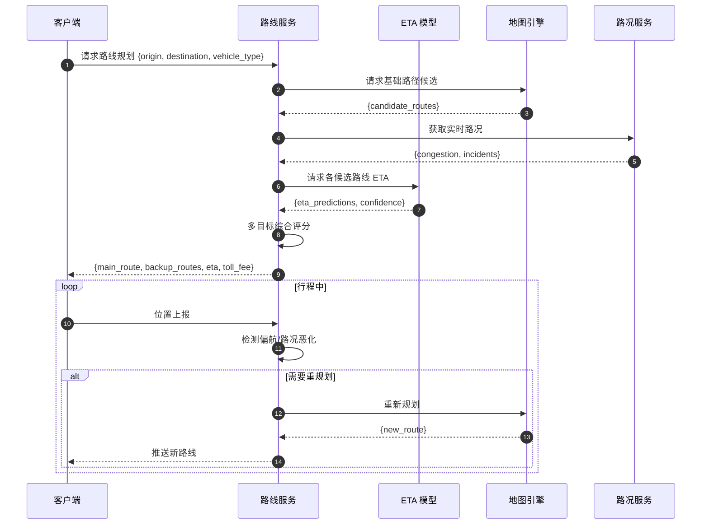

#### 2.2 异常分支与 SOP

| 异常场景 | 触发条件 | 系统行为 | 前端展示 | SOP |
|---|---|---|---|---|
| 地图服务超时 | 第三方地图接口超时 | 返回缓存路线或静态模板 | 提示"路况信息更新中，使用推荐路线" | 监控告警 |
| 路线不可通行 | 临时封路/禁行 | 自动过滤，返回备选路线 | 提示"原路线不可通行，已切换备选路线" | - |
| ETA 偏差大 | 实际到达与 ETA 差异 > 30% | 记录偏差样本，模型迭代 | - | 算法周报分析 |
| 重规划过于频繁 | 10 分钟内重规划 > 3 次 | 抑制重规划，仅提示大偏航 | - | 优化重规划阈值 |

#### 2.3 状态机（路线规划生命周期）

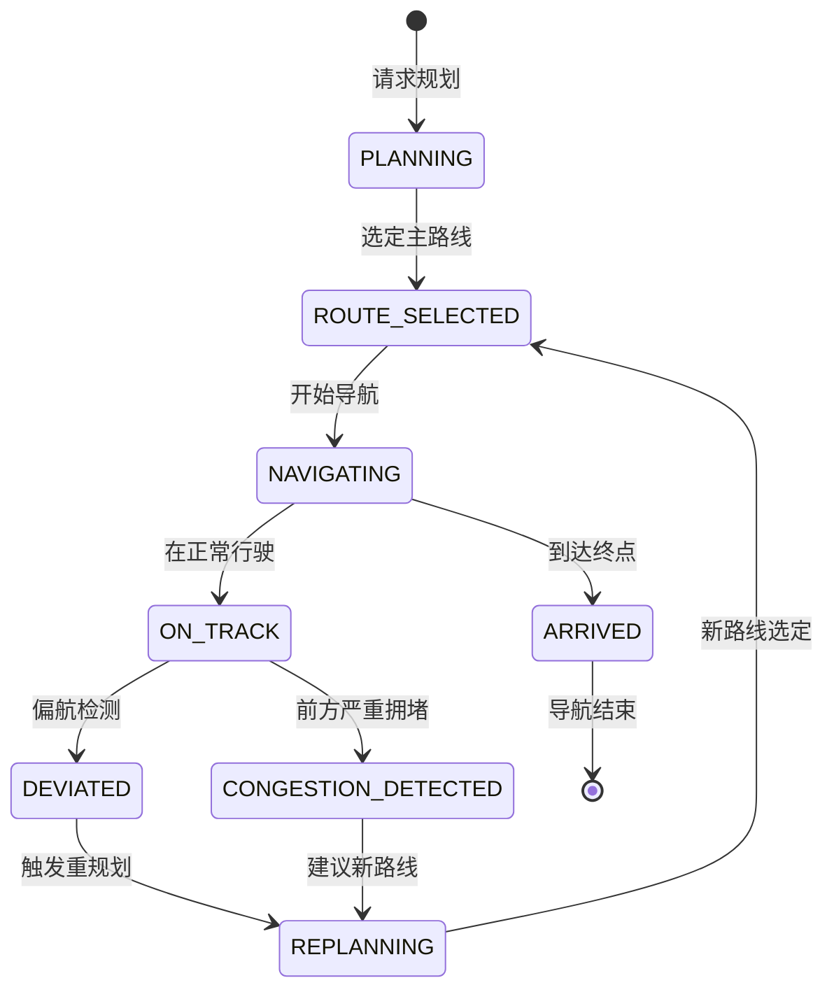

#### 2.4 关键规则清单

1. **多目标评分**：
   - 时效分：预计到达时间（权重 40%）。
   - 成本分：里程 + 过路费（权重 30%）。
   - 稳定分：历史该路线 ETA 方差（权重 20%）。
   - 体验分：道路等级、转弯次数、停车便利性（权重 10%）。
2. **ETA 预测模型**：
   - 输入：路线里程、实时路况、历史同期路况、天气、节假日、车辆类型。
   - 输出：ETA 秒数 + 置信区间。
   - 更新频率：接驾阶段 1 分钟/次，行程中 2 分钟/次。
3. **偏航检测**：
   - 偏航阈值：与规划路线垂直距离 > 100m。
   - 持续偏航 > 30 秒触发提醒。
   - 偏航 > 500m 且非用户主动修改终点，自动重规划。
4. **接驾路线特殊处理**：
   - 优先推荐可临时停车的道路。
   - 若上车点为禁停区域，导航至最近允许停车点，并提示司机"请引导乘客前往上车点"。
5. **降级策略**：地图服务不可用时，使用历史热门路线模板 + 静态路网数据兜底。

### ③ 数据字典（L3）

#### 3.1 实体关系图

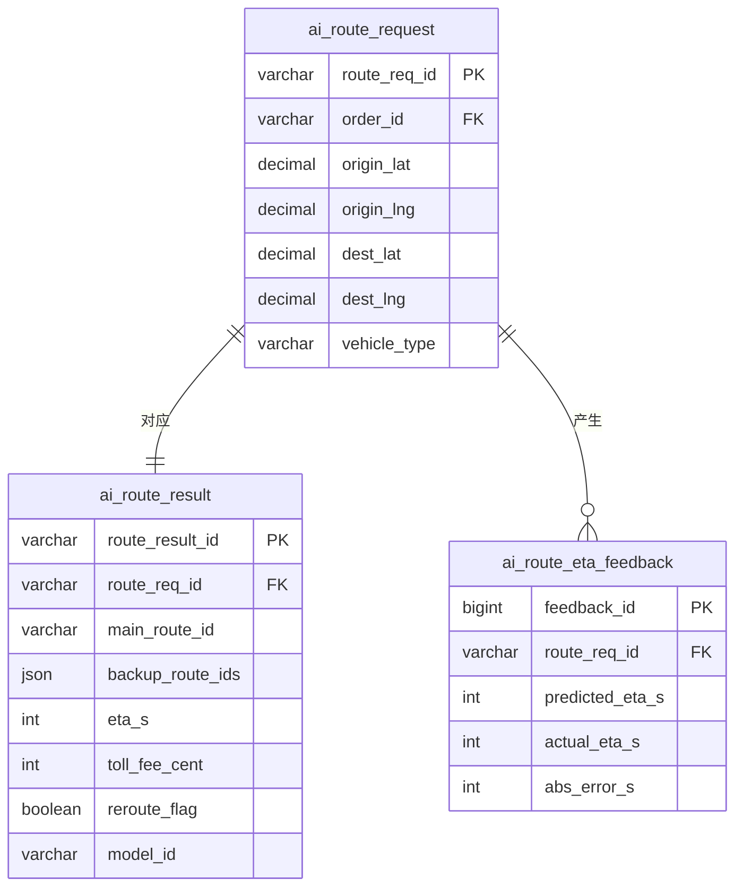

#### 3.2 表结构

##### 表 1：ai_route_request（路线请求表）

- **表名 / 中文名**：`ai_route_request` / 路线请求表
- **业务说明**：路线规划请求记录。
- **分库分表策略**：按 `order_id` 哈希分 16 库，每库 128 表。
- **预估数据量**：日增 1000 万条，存储 30 天。

| 字段名 | 中文 | 类型 | 长度 | 允许空 | 默认值 | 索引 | 示例 | 业务说明 |
|---|---|---|---|---|---|---|---|---|
| route_req_id | 请求 ID | varchar | 32 | 否 | - | PK | rr_001 | - |
| order_id | 订单 ID | varchar | 32 | 是 | NULL | - | ord_001 | - |
| scene | 场景 | varchar | 16 | 否 | - | - | PICKUP | PICKUP/TRIP/ESTIMATE |
| origin_lat | 起点纬度 | decimal | 10,7 | 否 | - | - | 31.23 | - |
| origin_lng | 起点经度 | decimal | 10,7 | 否 | - | - | 121.47 | - |
| dest_lat | 终点纬度 | decimal | 10,7 | 否 | - | - | 31.14 | - |
| dest_lng | 终点经度 | decimal | 10,7 | 否 | - | - | 121.80 | - |
| vehicle_type | 车辆类型 | varchar | 16 | 是 | NULL | - | SEDAN | SEDAN/SUV |
| request_at | 请求时间 | datetime(3) | - | 否 | - | - | 2026-04-21 10:00:00 | - |

##### 表 2：ai_route_result（路线结果表）

- **表名 / 中文名**：`ai_route_result` / 路线结果表
- **业务说明**：路线规划结果。

| 字段名 | 中文 | 类型 | 长度 | 允许空 | 默认值 | 索引 | 示例 | 业务说明 |
|---|---|---|---|---|---|---|---|---|
| route_result_id | 结果 ID | varchar | 32 | 否 | - | PK | rsr_001 | - |
| route_req_id | 请求 ID | varchar | 32 | 否 | - | FK | rr_001 | - |
| main_route_id | 主路线 ID | varchar | 32 | 否 | - | - | rt_001 | - |
| main_route_polyline | 主路线编码 | text | - | 是 | NULL | - | polyline_str | - |
| backup_route_ids | 备选路线 | json | - | 是 | NULL | - | ["rt_002","rt_003"] | JSON |
| eta_s | ETA 秒数 | int | 10 | 否 | - | - | 1800 | - |
| toll_fee_cent | 过路费 | int | 10 | 否 | 0 | - | 500 | 分 |
| distance_m | 里程 | int | 10 | 否 | - | - | 12500 | 米 |
| reroute_flag | 是否重规划 | tinyint | 1 | 否 | 0 | - | 0 | - |
| model_id | 模型 ID | varchar | 32 | 是 | NULL | - | route-eta-v2 | - |
| result_at | 结果时间 | datetime(3) | - | 否 | - | - | 2026-04-21 10:00:00 | - |

##### 表 3：ai_route_eta_feedback（ETA 反馈表）

- **表名 / 中文名**：`ai_route_eta_feedback` / ETA 反馈表
- **业务说明**：ETA 预测与实际对比，用于模型迭代。
- **分库分表策略**：按 `route_req_id` 哈希分 8 库，每库 128 表。

| 字段名 | 中文 | 类型 | 长度 | 允许空 | 默认值 | 索引 | 示例 | 业务说明 |
|---|---|---|---|---|---|---|---|---|
| feedback_id | 反馈 ID | bigint | 20 | 否 | AUTO_INCREMENT | PK | 1 | - |
| route_req_id | 请求 ID | varchar | 32 | 否 | - | FK | rr_001 | - |
| predicted_eta_s | 预测 ETA | int | 10 | 否 | - | - | 1800 | - |
| actual_eta_s | 实际 ETA | int | 10 | 是 | NULL | - | 1920 | - |
| abs_error_s | 绝对误差 | int | 10 | 是 | NULL | - | 120 | - |
| mape | 误差百分比 | decimal | 5,2 | 是 | NULL | - | 6.25 | - |
| feedback_at | 反馈时间 | datetime(3) | - | 是 | NULL | - | 2026-04-21 10:35:00 | - |

#### 3.3 枚举字典

| 枚举名 | 取值集合 | 所属字段 | Owner |
|---|---|---|---|
| route_scene_enum | PICKUP/TRIP/ESTIMATE | ai_route_request.scene | 路线服务 |

#### 3.4 接口出入参示例

**接口**：`POST /api/v1/ai/route/plan`（路线规划）

**Request Body**：
```json
{
  "order_id": "ord_202604210001",
  "scene": "PICKUP",
  "origin": {"lat": 31.2304167, "lng": 121.4737010},
  "destination": {"lat": 31.2300000, "lng": 121.4740000},
  "vehicle_type": "SEDAN",
  "preference": ["FASTEST", "AVOID_TOLL"]
}
```

**Response Body**：
```json
{
  "code": 0,
  "message": "success",
  "data": {
    "route_req_id": "rr_20260421100001",
    "main_route": {
      "route_id": "rt_001",
      "distance_m": 1200,
      "duration_s": 240,
      "toll_fee_cent": 0,
      "polyline": "encoded_polyline_string...",
      "instruction": [
        {"text": "沿中山北路向北行驶800米", "distance_m": 800},
        {"text": "右转进入环球港停车场", "distance_m": 400}
      ]
    },
    "backup_routes": [
      {"route_id": "rt_002", "distance_m": 1350, "duration_s": 280, "toll_fee_cent": 0}
    ],
    "eta": {
      "eta_s": 240,
      "eta_text": "约4分钟",
      "confidence": 0.92
    },
    "model_id": "route-eta-v2"
  }
}
```

### ④ 关联模块

#### 4.1 上游依赖

| 依赖模块 | 提供内容 |
|---|---|
| 地图引擎 | 基础路网与路径计算 |
| 路况服务 | 实时交通状况 |
| ETA 模型 | 到达时间预测 |

#### 4.2 下游被依赖

| 消费方 | 消费内容 |
|---|---|
| 司机端 | 接驾/行程导航 |
| 乘客端 | ETA 展示 |
| 调度服务 | 接驾距离计算 |
| 计费服务 | 里程预估 |

#### 4.3 同级协作

| 协作模块 | 协作内容 |
|---|---|
| 调度算法 | 接驾距离与 ETA 输入排序模型 |
| 轨迹服务 | 偏航检测与重规划触发 |

#### 4.4 外部系统

| 外部系统 | 用途 |
|---|---|
| 高德地图 API | 路网、路况、路径规划 |
| 腾讯地图 API | 备用路径规划 |

---

## 4.4 模型生命周期治理（MLOps）

### 需求元信息（Meta）

| 属性 | 内容 |
|---|---|
| 需求编号 | AI-004 |
| 优先级 | P0 |
| 所属域 | AI 域-MLOps 平台 |
| 责任产品 | AI 平台产品经理 |
| 责任研发 | MLOps 工程组 / 算法平台组 |
| 版本 | v1.0.0 |

### ① 需求场景描述

#### 1.1 角色与场景（Who / When / Where）

| 维度 | 描述 |
|---|---|
| Who | 算法工程师、数据科学家、AI 产品经理、模型审计员 |
| When | 模型训练、评估、发布、监控、回滚全生命周期 |
| Where | MLOps 平台 Web 端 / Jupyter 开发环境 |

#### 1.2 用户痛点与业务价值（Why）

- **痛点 1**：模型上线缺乏流程，"黑盒上线"导致不可恢复故障。
- **痛点 2**：模型效果退化无感知，业务指标下降后才后知后觉。
- **痛点 3**：模型版本混乱，无法复现历史结果。
- **业务价值**：标准化 MLOps 流程将模型上线周期缩短 50%；自动监控与回滚将模型故障止损时间从小时级降至分钟级。

#### 1.3 功能范围

| 类别 | 范围说明 |
|---|---|
| **In Scope** | 数据集管理、实验管理（Experiment Tracking）、模型训练流水线（Pipeline）、模型注册中心、模型评估报告（离线+在线）、灰度发布、在线指标监控、自动回滚、模型版本对比、特征平台（Feature Store）、A/B 测试框架 |
| **边界** | 仅管理平台自研模型；第三方模型接入需评估 |
| **非目标** | 通用大模型预训练（调用外部 API） |

#### 1.4 验收标准

| 指标 | 目标值 | 计算口径 |
|---|---|---|
| 训练任务可追溯率 | >= 99.99% | 含完整元数据 / 训练任务总数 |
| 离线评估门禁通过准确率 | >= 99% | 离线判定与人工复核一致 / 抽样发布决策 |
| 灰度发布稳定达标率 | >= 95% | 灰度稳定无需干预 / 灰度总批次 |
| 自动回滚响应时延 P95 | <= 60s | 阈值命中 → 回滚完成 P95 |

### ② 业务流程

#### 2.1 主流程（mermaid flowchart）

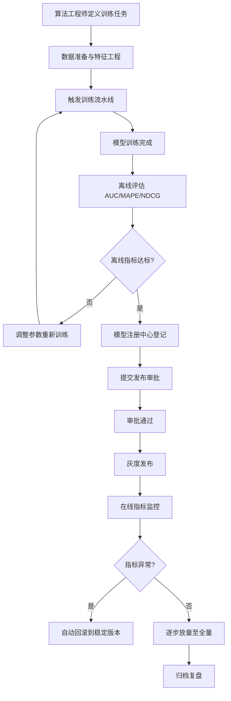

#### 2.2 异常分支与 SOP

| 异常场景 | 触发条件 | 系统行为 | 前端展示 | SOP |
|---|---|---|---|---|
| 训练任务失败 | 资源不足/代码异常 | 自动重试 3 次，失败后告警 | 提示"训练失败，请检查日志" | 算法工程师排查 |
| 离线指标抖动 | 评估集与训练集分布不一致 | 标记警告，需人工确认 | 提示"离线指标异常，请复核" | 数据科学家检查 |
| 灰度在线指标劣化 | 转化/取消率劣化 > 阈值 | 自动回滚 | 提示"模型已自动回滚" | 算法复盘 |
| 特征漂移 | 在线特征分布与训练时差异大 | 触发 PSI 告警 | 提示"特征 PSI 超过阈值" | 重新训练 |
| 模型版本冲突 | 同一任务多版本同时灰度 | 拒绝新灰度，提示冲突 | 提示"已有灰度版本在运行" | 协调放量计划 |

#### 2.3 状态机（模型发布生命周期）

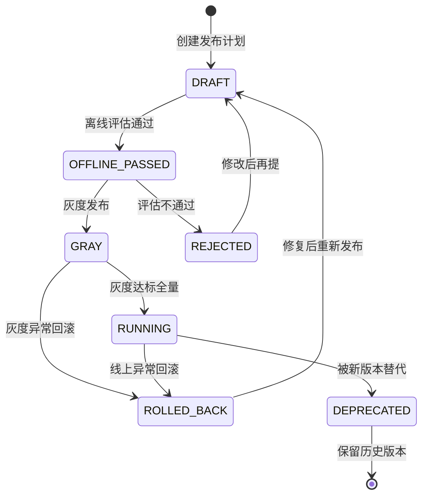

#### 2.4 关键规则清单

1. **模型注册**：所有上线模型必须在模型注册中心登记，包含：模型 ID、版本、训练时间窗、特征版本、代码版本、数据集版本、离线指标。
2. **离线门禁**：
   - 必须完成离线评估报告（AUC、Precision、Recall、F1、MAPE 等）。
   - 离线指标较基线模型劣化 > 2% 禁止发布。
   - 必须通过样本外测试（OOT，Out-of-Time）。
3. **灰度观察**：
   - 默认灰度 5% 流量，观察 24 小时。
   - 观察指标：业务指标（转化/取消/投诉）、系统指标（时延/错误率）、模型指标（PSI/AUC 衰减）。
4. **自动回滚**：
   - 业务指标劣化 > 10%：自动回滚。
   - 模型 PSI > 0.25：自动回滚。
   - 推理时延 P99 > 阈值 2 倍：自动回滚。
   - 回滚需在 60 秒内完成。
5. **特征平台**：
   - 在线推理必须显式绑定 feature_version，禁止隐式读取最新。
   - 特征存储分离：在线特征（Redis）/ 离线特征（Hive）。
   - 特征漂移监控：每日计算 PSI，超过 0.1 告警。

### ③ 数据字典（L3）

#### 3.1 实体关系图

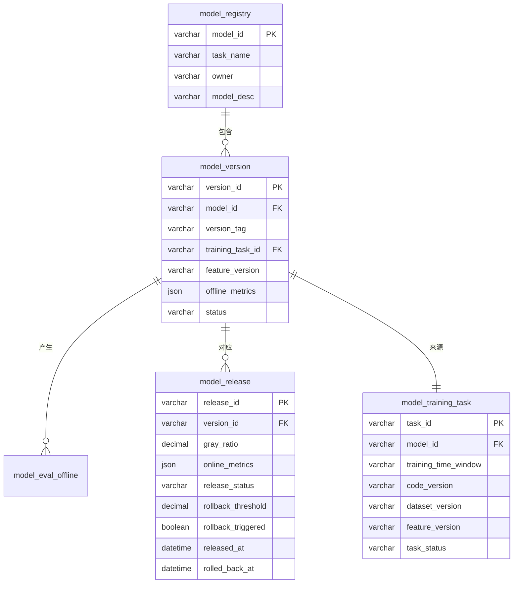

#### 3.2 表结构

##### 表 1：model_registry（模型注册表）

- **表名 / 中文名**：`model_registry` / 模型注册表
- **业务说明**：模型目录管理。
- **分库分表策略**：单库单表。

| 字段名 | 中文 | 类型 | 长度 | 允许空 | 默认值 | 索引 | 示例 | 业务说明 |
|---|---|---|---|---|---|---|---|---|
| model_id | 模型 ID | varchar | 32 | 否 | - | PK | dispatch-rank | - |
| task_name | 任务名称 | varchar | 64 | 否 | - | - | 派单排序模型 | - |
| model_domain | 模型域 | varchar | 16 | 否 | - | - | DISPATCH | DISPATCH/CS/ROUTE/FORECAST |
| owner | 负责人 | varchar | 32 | 否 | - | - | algo_zhang | - |
| model_desc | 模型描述 | varchar | 500 | 是 | NULL | - | 基于 DeepFM 的派单排序 | - |
| latest_version | 最新版本 | varchar | 16 | 是 | NULL | - | v3.2 | - |
| stable_version | 稳定版本 | varchar | 16 | 是 | NULL | - | v3.1 | - |
| created_by | 创建人 | varchar | 32 | 否 | - | - | algo_zhang | - |

##### 表 2：model_version（模型版本表）

- **表名 / 中文名**：`model_version` / 模型版本表
- **业务说明**：模型版本详情。

| 字段名 | 中文 | 类型 | 长度 | 允许空 | 默认值 | 索引 | 示例 | 业务说明 |
|---|---|---|---|---|---|---|---|---|
| version_id | 版本 ID | varchar | 32 | 否 | - | PK | dispatch-rank-v3.2 | - |
| model_id | 模型 ID | varchar | 32 | 否 | - | FK | dispatch-rank | - |
| version_tag | 版本标签 | varchar | 16 | 否 | - | - | v3.2 | - |
| training_task_id | 训练任务 ID | varchar | 32 | 否 | - | FK | train_001 | - |
| feature_version | 特征版本 | varchar | 16 | 否 | - | - | feat_v2.1 | - |
| model_format | 模型格式 | varchar | 16 | 否 | - | - | ONNX | ONNX/PMML/TorchScript |
| model_size_mb | 模型大小 | int | 10 | 是 | NULL | - | 45 | MB |
| model_path | 模型存储路径 | varchar | 512 | 否 | - | - | oss://models/... | - |
| offline_metrics | 离线指标 | json | - | 是 | NULL | - | {"auc":0.92,"f1":0.88} | - |
| eval_report_url | 评估报告 | varchar | 512 | 是 | NULL | - | https://... | - |
| version_status | 版本状态 | varchar | 16 | 否 | DRAFT | - | RUNNING | DRAFT/EVALUATING/APPROVED/RUNNING/ROLLED_BACK/DEPRECATED |
| created_by | 创建人 | varchar | 32 | 否 | - | - | algo_zhang | - |

##### 表 3：model_training_task（模型训练任务表）

- **表名 / 中文名**：`model_training_task` / 模型训练任务表
- **业务说明**：训练任务追踪。

| 字段名 | 中文 | 类型 | 长度 | 允许空 | 默认值 | 索引 | 示例 | 业务说明 |
|---|---|---|---|---|---|---|---|---|
| task_id | 任务 ID | varchar | 32 | 否 | - | PK | train_001 | - |
| model_id | 模型 ID | varchar | 32 | 否 | - | FK | dispatch-rank | - |
| training_time_window | 训练时间窗 | varchar | 32 | 否 | - | - | 2026-03-01~2026-03-31 | - |
| code_version | 代码版本 | varchar | 32 | 否 | - | - | git_commit_abc123 | - |
| dataset_version | 数据集版本 | varchar | 32 | 否 | - | - | ds_v2.1 | - |
| feature_version | 特征版本 | varchar | 16 | 否 | - | - | feat_v2.1 | - |
| hyperparameters | 超参 | json | - | 是 | NULL | - | {"lr":0.001} | - |
| task_status | 任务状态 | varchar | 16 | 否 | PENDING | - | SUCCESS | PENDING/RUNNING/SUCCESS/FAILED/CANCELLED |
| start_at | 开始时间 | datetime(3) | - | 是 | NULL | - | 2026-04-01 00:00:00 | - |
| end_at | 结束时间 | datetime(3) | - | 是 | NULL | - | 2026-04-01 06:00:00 | - |
| resource_cost | 资源消耗 | json | - | 是 | NULL | - | {"gpu_hours":12} | - |

##### 表 4：model_release（模型发布表）

- **表名 / 中文名**：`model_release` / 模型发布表
- **业务说明**：模型发布批次与在线监控。

| 字段名 | 中文 | 类型 | 长度 | 允许空 | 默认值 | 索引 | 示例 | 业务说明 |
|---|---|---|---|---|---|---|---|---|
| release_id | 发布 ID | varchar | 32 | 否 | - | PK | rel_001 | - |
| version_id | 版本 ID | varchar | 32 | 否 | - | FK | dispatch-rank-v3.2 | - |
| gray_ratio | 灰度比例 | decimal | 5,4 | 否 | 0.0500 | - | 0.0500 | - |
| gray_scope | 灰度范围 | json | - | 是 | NULL | - | {"cities":[310100]} | - |
| online_metrics | 在线指标 | json | - | 是 | NULL | - | {"latency_p95":85} | - |
| release_status | 发布状态 | varchar | 16 | 否 | GRAY | - | RUNNING | GRAY/RUNNING/ROLLED_BACK/DEPRECATED |
| rollback_threshold | 回滚阈值 | json | - | 是 | NULL | - | {"cancel_rate_delta":0.1} | - |
| rollback_triggered | 是否回滚 | tinyint | 1 | 否 | 0 | - | 0 | - |
| rollback_reason | 回滚原因 | varchar | 255 | 是 | NULL | - | 取消率劣化 | - |
| released_at | 发布时间 | datetime(3) | - | 是 | NULL | - | 2026-04-21 10:00:00 | - |
| rolled_back_at | 回滚时间 | datetime(3) | - | 是 | NULL | - | 2026-04-21 10:30:00 | - |
| released_by | 发布人 | varchar | 32 | 是 | NULL | - | algo_zhang | - |

#### 3.3 枚举字典

| 枚举名 | 取值集合 | 所属字段 | Owner |
|---|---|---|---|
| model_domain_enum | DISPATCH/CS/ROUTE/FORECAST/RISK | model_registry.model_domain | MLOps |
| version_status_enum | DRAFT/EVALUATING/APPROVED/GRAY/RUNNING/ROLLED_BACK/DEPRECATED | model_version.version_status | MLOps |
| task_status_enum | PENDING/RUNNING/SUCCESS/FAILED/CANCELLED | model_training_task.task_status | MLOps |
| release_status_enum | GRAY/RUNNING/ROLLED_BACK/DEPRECATED | model_release.release_status | MLOps |

#### 3.4 接口出入参示例

**接口**：`POST /api/v1/ai/mlops/model/release`（模型发布）

**Request Body**：
```json
{
  "version_id": "dispatch-rank-v3.2",
  "gray_ratio": 0.05,
  "gray_scope": {
    "cities": [310100],
    "time_window": "2026-04-21T00:00:00+08:00/2026-04-22T00:00:00+08:00"
  },
  "rollback_threshold": {
    "cancel_rate_delta": 0.10,
    "latency_p95_multiplier": 2.0
  },
  "observer_ids": ["algo_zhang", "pm_li"]
}
```

**Response Body**：
```json
{
  "code": 0,
  "message": "success",
  "data": {
    "release_id": "rel_202604210001",
    "release_status": "GRAY",
    "gray_ratio": 0.05,
    "observation_dashboard_url": "https://mlops.huaxiaozhu.com/release/rel_202604210001",
    "estimated_full_release_at": "2026-04-23T00:00:00+08:00"
  }
}
```

### ④ 关联模块

#### 4.1 上游依赖

| 依赖模块 | 提供内容 |
|---|---|
| 特征平台 | 特征版本管理与供给 |
| 数据仓库 | 训练数据 |
| 训练集群（GPU） | 算力资源 |
| 模型仓库（OSS） | 模型存储 |

#### 4.2 下游被依赖

| 消费方 | 消费内容 |
|---|---|
| 在线推理服务 | 模型加载与 serving |
| 各业务域 | 模型应用 |

#### 4.3 同级协作

| 协作模块 | 协作内容 |
|---|---|
| A/B 实验平台 | 模型效果实验 |
| 监控告警平台 | 在线指标监控 |
| 规则中心 | 模型策略与规则策略协同 |

#### 4.4 外部系统

| 外部系统 | 用途 |
|---|---|
| Kubernetes | 训练与推理资源调度 |
| MLflow / Kubeflow | 实验与流水线管理 |
| 阿里云 PAI / 腾讯云 TI | 云原生训练与 serving |

---

## 附录：AI 能力全局枚举汇总

| 枚举名 | 取值集合 | 使用位置 |
|---|---|---|
| session_status_enum | ACTIVE/HANDOFF/RESOLVED/CLOSED/EXPIRED | ai_cs_session.session_status |
| handoff_reason_enum | LOW_CONFIDENCE/HIGH_RISK/USER_REQUEST/SYSTEM_TIMEOUT/EMOTION | ai_cs_session.handoff_reason |
| sender_type_enum | USER/BOT/AGENT/SYSTEM | ai_cs_message.sender_type |
| answer_source_enum | KB/GENERATION/RAG/RULE | ai_cs_message.answer_source |
| intent_category_enum | PAYMENT/ORDER/ACCOUNT/SAFETY/SERVICE/OTHER | ai_cs_intent.intent_category |
| fallback_flag_enum | 0/1 | ai_dispatch_infer.fallback_flag |
| forecast_horizon_enum | 5/15/30/60 | ai_supply_demand_forecast.forecast_horizon_min |
| route_scene_enum | PICKUP/TRIP/ESTIMATE | ai_route_request.scene |
| model_domain_enum | DISPATCH/CS/ROUTE/FORECAST/RISK | model_registry.model_domain |
| version_status_enum | DRAFT/EVALUATING/APPROVED/GRAY/RUNNING/ROLLED_BACK/DEPRECATED | model_version.version_status |
| task_status_enum | PENDING/RUNNING/SUCCESS/FAILED/CANCELLED | model_training_task.task_status |
| release_status_enum | GRAY/RUNNING/ROLLED_BACK/DEPRECATED | model_release.release_status |

---

## 附录：跨系统统一约定

### 时间语义

- 时区：统一存储 UTC，展示按 `Asia/Shanghai`。
- NTP 偏差容忍：`|ntp_skew_ms| <= 500`；超限样本标记 `clock_skew_flag=true`。
- 事件时间 vs 处理时间：`event_time` 用于业务归因，`processing_time` 用于系统监控。
- Late Event：处理时间 - 事件时间 > 300s 记为迟到事件，实时指标不纳入，T+1 修正。

### 可审计日志元组（AI 域）

`trace_id, prediction_id, model_id, feature_version, request_snapshot, response_snapshot, latency_ms, decision, occurred_at`

缺失任一字段记为"不可审计样本"。

### 抽样协议

| 项目 | 约束 |
|---|---|
| 最小样本量 | n >= max(2000, 50 * 分层单元数) |
| 分层维度 | city_id, channel_type, 场景类型, 时段, 新老用户, 终端版本 |
| 置信目标 | 95% 置信水平，关键指标误差带 <= ±1.5% |
| 样本 Owner | 对应模型任务 Owner（AI 产品 + 算法负责人双签） |
| 抽样冻结 | 评估开始前冻结样本集版本与 SQL 哈希 |

### 关键 SLO 基线/目标/生效期/回滚触发

| 指标 | Baseline | Target | 生效阶段 | 回滚触发 |
|---|---|---|---|---|
| 意图识别准确率 | 86% | >=90% | Phase1-GA | 连续 1 天 < 84% |
| 自动应答首响时延 P95 | 950ms | <=800ms | Phase1-GA | 连续 30 分钟 > 1100ms |
| 派单决策成功率 | 99.4% | >=99.9% | Phase1-GA | 连续 10 分钟 < 99.2% |
| 决策时延 P95 | 160ms | <=120ms | Phase1-GA | 连续 10 分钟 > 180ms |
| ETA 准确度 MAPE | 20% | <=15% | Phase1-GA | 连续 1 天 > 22% |
| 自动回滚响应时延 P95 | 90s | <=60s | Phase1-GA | 连续 1 小时 > 120s |
